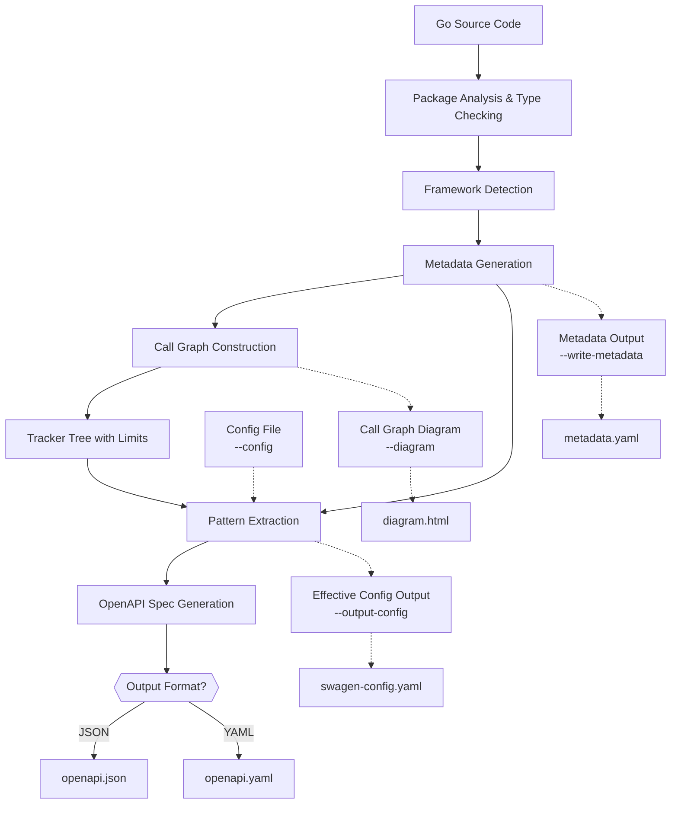

# Swagen: Generate OpenAPI from Go code


> **Disclaimer:**  
> Swagen is under active development and **not yet production-ready**. Feedback, bug reports, and contributions are welcome.

**Swagen** analyzes your Go code and automatically generates an OpenAPI 3.1 spec (YAML or JSON). It detects routes for popular frameworks (Gin, Echo, Chi, Fiber, net/http), follows call graphs to the final handlers, and infers request/response types from real code (struct tags, literals, generics, and more).

**TL;DR**: Point Swagen at your module. Get an OpenAPI spec and, optionally, an interactive call-graph diagram.

## Features

- **Automated OpenAPI**: Generate OpenAPI 3.1 from real Go code.
- **Framework-aware**: Detects Gin, Echo, Chi, Fiber, and net/http automatically.
- **Accurate by analysis**: Builds a call graph to resolve handlers, parameters, bodies, and responses.
- **Configurable**: YAML config plus CLI flags; flags always win.
- **Visualize**: Optional HTML call-graph diagram for debugging.
- **Extensible**: Pattern-based framework config; add new frameworks without changing core logic.

## Golang Feature Support
Swagen focuses on practical coverage for real-world services. Current coverage includes:

- [x] **Alias imports**: supports import aliases in analysis.
- [ ] **Alias types**: type aliases are detected but may need manual typeMapping for desired schema.
- [x] **Assignment and alias tracking**: short `:=`, `=`, multi-assign, tuple returns, latest-wins resolution, alias chains, and shadowing.
- [ ] **Conditional methods**: detecting HTTP methods set via switch/if around net/http `Handle`/`HandleFunc` is not supported.
- [x] **Composite literals / maps / slices / arrays**: recognizes literal and container types for schema mapping.
- [x] **Dependency injection**: supports route grouping mounted via dependency injection.
- [ ] **Duplicate status codes**: paths with the same status code and different schemas are not yet supported.
- [ ] **External type introspection**: types from external packages (e.g., `gin.H`) are not introspected automatically; provide schemas via `externalTypes` in config.
- [x] **Generics (functions)**: detects type parameters and maps concrete types at call sites.
- [ ] **Generics (types)**: generic struct and type instantiation are partially supported.
- [ ] **Inferred status codes**: status codes assigned via variables are not inferred.
- [x] **Interfaces**: captures interface types and methods; unresolved dynamic values are represented generically.
- [x] **Nested calls**: handles chained/method calls and nested expressions.
- [x] **Parameter tracing across calls**: follows arguments across the call graph; maps function parameters to call arguments.
- [ ] **Parent object type tracing**: limited ability to trace the receiver/parent type; `Decode` on non-body targets may be misclassified.
- [x] **Pointers and dereference**: detects `*T` and automatically dereferences when configured.
- [x] **Selectors and field access**: resolves `pkg.Type.Field` and nested selectors where possible.
- [x] **Struct fields**: reads field types, embedded fields, and struct tags (`json`, `xml`, `form`, etc.).


## Architecture Overview



## Key Features

- **Framework Agnostic**: Gin, Echo, Chi, Fiber, and standard net/http
- **Deep Code Analysis**: Complete call graphs to understand API structure
- **Configurable Output**: OpenAPI 3.1 in JSON or YAML
- **Visualization Tools**: Optional call-graph diagrams (Cytoscape)
- **Metadata Export**: Intermediate representation for custom processing

> **Note**: Generating call-graph diagrams and metadata files consumes additional resources and time.

## Installation

### From Source
```bash
git clone https://github.com/ehabterra/swagen.git
cd swagen
go build -o swagen ./cmd/swagen
sudo mv swagen /usr/local/bin/
```

### Using Go Install
```bash
go install github.com/ehabterra/swagen/cmd/swagen@latest
```

## Usage

### Help
```bash
swagen --help
```

### Basic Generation
```bash
swagen -d ./your-project -o openapi.yaml
```

### Advanced Options
```bash
swagen \
  -d ./your-project \
  -o openapi.json \
  -t "My API" \
  -v "1.2.0" \
  -D "Production API" \
  -E "team@example.com" \
  -g callgraph.html \
  -w
```

### **Example Commands**

```sh
# Full flags
swagen --output api.json --dir ./src --title "My API" --api-version 2.0.0

# Mixed flags
swagen -o api.json -d ./src --contact-email admin@example.com

# Short flags only
swagen -o api.json -t "My API" -v 2.0 -w
```

### Programmatic usage

```go
import (
  "os"
  "github.com/ehabterra/swagen/generator"
  "github.com/ehabterra/swagen/spec"
  "gopkg.in/yaml.v3"
)

func main() {
  cfg := spec.DefaultGinConfig() // or spec.LoadSwagenConfig("swagen.yaml")
  gen := generator.NewGenerator(cfg)
  openapi, err := gen.GenerateFromDirectory("./your-project")
  if err != nil { panic(err) }
  data, _ := yaml.Marshal(openapi)
  os.WriteFile("openapi.yaml", data, 0644)
}
```

### **Flag Table**

| **Full Flag**         | **Shorthand** | **Description**                                      | **Default**                     |
|-----------------------|--------------|-----------------------------------------------------|---------------------------------|
| `--output`            | `-o`         | Output file for OpenAPI spec                        | `openapi.json`                  |
| `--dir`               | `-d`         | Directory to parse for Go files                     | `.` (current dir)               |
| `--title`             | `-t`         | Title of the API                                    | `Generated API`                 |
| `--api-version`       | `-v`         | Version of the API                                  | `1.0.0`                        |
| `--description`       | `-D`         | API description                                     | `""`                           |
| `--terms-url`         | `-T`         | Terms of Service URL                                | `""`                           |
| `--contact-name`      | `-N`         | Contact person/organization name                    | `Ehab`                         |
| `--contact-url`       | `-U`         | Contact URL                                         | `https://ehabterra.github.io/` |
| `--contact-email`     | `-E`         | Contact email                                       | `ehabterra@hotmail.com`        |
| `--license-name`      | `-L`         | License name                                        | `""`                           |
| `--license-url`       | `-lu`        | License URL                                         | `""`                           |
| `--openapi-version`   | `-O`         | OpenAPI spec version                                | `3.1.1`                        |
| `--config`            | `-c`         | Path to custom config YAML                          | `""`                           |
| `--output-config`     | `-oc`        | Output effective config to YAML                     | `""`                           |
| `--write-metadata`    | `-w`         | Write metadata.yaml to disk                         | `false`                        |
| `--split-metadata`    | `-s`         | Split metadata into separate files                  | `false`                        |
| `--diagram`           | `-g`         | Save call graph as HTML                             | `""`                           |
| `--max-nodes`         | `-mn`        | Max nodes in call graph tree                        | `10000`                        |
| `--max-children`      | `-mc`        | Max children per node                               | `150`                          |
| `--max-args`          | `-ma`        | Max arguments per function                          | `30`                           |
| `--max-depth`         | `-md`        | Max depth for nested arguments                      | `50`                           |


### Supported Frameworks
Swagen automatically detects these frameworks:
- ✅ Gin
- ✅ Echo
- ✅ Chi
- ✅ Fiber
- ✅ Standard net/http

## Configuration Guide

Swagen is driven by a YAML configuration that defines how to extract routes, bodies, responses, and parameters, and how to map Go types to OpenAPI. Put `swagen.yaml` at your project root. CLI flags override config values.

```yaml
# Example Gin configuration (swagen.yaml)
info:
  title: My Awesome API
  description: |-
    Copyright 2025 Ehab Terra. Licensed under the Apache License 2.0.
  version: 1.0.0
  contact:
    name: Ehab
    url: https://ehabterra.github.io/
    email: ehabterra@hotmail.com
servers:
  - url: https://api.example.com
    description: Production
securitySchemes:
  bearerAuth:
    type: http
    scheme: bearer
    bearerFormat: JWT
security:
  - bearerAuth: []
tags:
  - name: users
    description: User management
externalDocs:
  description: Project docs
  url: https://docs.example.com

framework:
  routePatterns:
    - callRegex: ^(?i)(GET|POST|PUT|DELETE|PATCH|OPTIONS|HEAD)$
      recvTypeRegex: ^github\.com/gin-gonic/gin\.\*(Engine|RouterGroup)$
      handlerArgIndex: 1
      methodFromCall: true
      pathFromArg: true
      handlerFromArg: true
  requestBodyPatterns:
    - callRegex: ^(?i)(BindJSON|ShouldBindJSON|BindXML|BindYAML|BindForm|ShouldBind)$
      typeFromArg: true
      deref: true
    - callRegex: ^Decode$
      typeFromArg: true
      deref: true
    - callRegex: ^Unmarshal$
      typeArgIndex: 1
      typeFromArg: true
      deref: true
  responsePatterns:
    - callRegex: ^(?i)(JSON|String|XML|YAML|ProtoBuf|Data|File|Redirect)$
      typeArgIndex: 1
      statusFromArg: true
      typeFromArg: true
    - callRegex: ^Marshal$
      typeFromArg: true
      deref: true
    - callRegex: ^Encode$
      typeFromArg: true
      deref: true
  paramPatterns:
    - callRegex: ^Param$
      paramIn: path
    - callRegex: ^Query$
      paramIn: query
    - callRegex: ^DefaultQuery$
      paramIn: query
    - callRegex: ^GetHeader$
      paramIn: header
  mountPatterns:
    - callRegex: ^Group$
      recvTypeRegex: ^github\.com/gin-gonic/gin\.\*(Engine|RouterGroup)$
      routerArgIndex: 1
      pathFromArg: true
      routerFromArg: true
      isMount: true

typeMapping:
  - goType: time.Time
    openapiType:
      type: string
      format: date-time

externalTypes:
  - name: github.com/gin-gonic/gin.H
    openapiType:
      type: object
  - name: go.mongodb.org/mongo-driver/bson/primitive.ObjectID
    openapiType:
      type: string
      format: objectid

overrides: []

include:
  files: []
  packages: []
  functions: []
  types: []

exclude:
  files: []
  packages: []
  functions: []
  types: []

defaults:
  requestContentType: application/json
  responseContentType: application/json
  responseStatus: 200
```

### How It Works

Swagen executes a multi-stage process to analyze your code and generate the OpenAPI specification. The workflow is designed to be robust and flexible, handling complex Go projects with ease.

 1. **Initialization & Flag Parsing**: The tool starts, prints license information, and parses all command-line flags provided by the user.

 2. **Module Discovery**: It finds the root of the Go module by searching for the `go.mod` file and changes the working directory to the module root.

 3. **Package Loading & Type-Checking**: Swagen loads and performs a full type-check on all Go packages within the module (`./...`), building a rich understanding of the code's types and syntax.

 4. **Framework Detection**: It analyzes the project's dependencies to automatically detect the web framework being used (e.g., Gin, Chi, Echo, Fiber, or standard `net/http`).

 5. **Configuration Loading**: The tool loads a framework-specific default configuration. If a custom `--config` file is provided, it loads that instead. CLI flags always override settings from any configuration file.

 6. **Metadata Generation**: It traverses the Abstract Syntax Trees (AST) of the parsed packages to generate a detailed `metadata` object. This object contains information about packages, function calls, and string constants. 

 7. **Call Graph Construction**: Using the generated metadata, Swagen constructs a call graph tree. This tree traces the flow of execution from router definitions to the final handler functions, respecting limits set by flags like `--max-nodes` to prevent infinite recursion.

 8. **OpenAPI Mapping**: The call graph and metadata are processed by a framework-specific mapper. This mapper identifies API routes, parameters, request bodies, and responses, translating them into the OpenAPI specification structure.

 9. **Specification Generation**: The final OpenAPI object is marshaled into either YAML or JSON format, based on the output file extension (`.yaml`, `.yml`, or `.json`).

10. **File Output**: The resulting specification file is written to the path specified by the `--output` flag. If requested, an interactive HTML call graph diagram is also generated.

### Configuration Reference

Here is the structure of a `swagen.yaml` file. Only the `framework` and `info` sections are required; everything else is optional.

```yaml
framework:
  routePatterns: []
  requestBodyPatterns: []
  responsePatterns: []
  paramPatterns: []
  mountPatterns: []
typeMapping: []
externalTypes: []
overrides: []
include:
  files: []
  packages: []
  functions: []
  types: []
exclude:
  files: []
  packages: []
  functions: []
  types: []
defaults:
  requestContentType: application/json
  responseContentType: application/json
  responseStatus: 200
info:
  title: My API
  description: API description
  version: 1.0.0
servers:
  - url: https://api.example.com
security: []
securitySchemes: {}
tags: []
externalDocs: null
```

### Framework-Specific Patterns

#### Route Patterns
Route patterns identify how your framework defines HTTP routes:

```yaml
routePatterns:
  - callRegex: ^(?i)(GET|POST|PUT|DELETE|PATCH|OPTIONS|HEAD)$
    recvTypeRegex: ^github\.com/gin-gonic/gin\.\*(Engine|RouterGroup)$
    handlerArgIndex: 1
    methodFromCall: true
    pathFromArg: true
    handlerFromArg: true
```

#### Request Body Patterns
These patterns identify how request bodies are processed:

```yaml
requestBodyPatterns:
  - callRegex: ^(?i)(BindJSON|ShouldBindJSON|BindXML|BindYAML|BindForm|ShouldBind)$
    typeFromArg: true
    deref: true
  - callRegex: ^Decode$
    typeFromArg: true
    deref: true
```

#### Response Patterns
Response patterns identify how responses are formatted:

```yaml
responsePatterns:
  - callRegex: ^(?i)(JSON|String|XML|YAML|ProtoBuf|Data|File|Redirect)$
    typeArgIndex: 1
    statusFromArg: true
    typeFromArg: true
```

#### Parameter Patterns
Parameter patterns identify how parameters are extracted:

```yaml
paramPatterns:
  - callRegex: ^Param$
    paramIn: path
  - callRegex: ^Query$
    paramIn: query
```

#### Mount Patterns
Mount patterns identify router mounting/sub-routing:

```yaml
mountPatterns:
  - callRegex: ^Group$
    recvTypeRegex: ^github\.com/gin-gonic/gin\.\*(Engine|RouterGroup)$
    routerArgIndex: 1
    pathFromArg: true
    routerFromArg: true
    isMount: true
```

### Type Mapping

Map Go types to OpenAPI schemas:

```yaml
typeMapping:
  - goType: time.Time
    openapiType:
      type: string
      format: date-time
```

### External Types

Define external types that should be treated as known:

```yaml
externalTypes:
  - name: github.com/gin-gonic/gin.H
    openapiType:
      type: object
```

### Using Predefined Configurations

Swagen provides predefined configurations for popular frameworks:

```go
import "github.com/ehabterra/swagen/spec"

// Use predefined configuration
config := spec.DefaultGinConfig()  // For Gin framework
// or
config := spec.DefaultChiConfig()   // For Chi router
// or
config := spec.DefaultEchoConfig()  // For Echo framework
// or
config := spec.DefaultFiberConfig() // For Fiber framework
// or
config := spec.DefaultHTTPConfig()  // For net/http
```

### Customizing Configuration

You can customize any predefined configuration:

```go
config := spec.DefaultGinConfig()
config.Info.Title = "My Custom API"
config.Info.Version = "2.0.0"

// Add custom type mappings
config.TypeMapping = append(config.TypeMapping, spec.TypeMapping{
    GoType: "mypackage.CustomType",
    OpenAPIType: &spec.Schema{
        Type:   "string",
        Format: "custom-format",
    },
})
```

### Loading Configuration from File

To load configuration from a YAML file:

```go
import "gopkg.in/yaml.v3"
import "os"

func LoadConfig(filename string) (*spec.SwagenConfig, error) {
    data, err := os.ReadFile(filename)
    if err != nil {
        return nil, err
    }
    
    var config spec.SwagenConfig
    err = yaml.Unmarshal(data, &config)
    if err != nil {
        return nil, err
    }
    
    return &config, nil
}
```

### Example: Complete Gin Configuration

Here's a complete example configuration for the Gin framework:

```yaml
framework:
  routePatterns:
    - callRegex: ^(?i)(GET|POST|PUT|DELETE|PATCH|OPTIONS|HEAD)$
      recvTypeRegex: ^github\.com/gin-gonic/gin\.\*(Engine|RouterGroup)$
      handlerArgIndex: 1
      methodFromCall: true
      pathFromArg: true
      handlerFromArg: true
  requestBodyPatterns:
    - callRegex: ^(?i)(BindJSON|ShouldBindJSON|BindXML|BindYAML|BindForm|ShouldBind)$
      typeFromArg: true
      deref: true
    - callRegex: ^Decode$
      typeFromArg: true
      deref: true
    - callRegex: ^Unmarshal$
      typeArgIndex: 1
      typeFromArg: true
      deref: true
  responsePatterns:
    - callRegex: ^(?i)(JSON|String|XML|YAML|ProtoBuf|Data|File|Redirect)$
      typeArgIndex: 1
      statusFromArg: true
      typeFromArg: true
    - callRegex: ^Marshal$
      typeFromArg: true
      deref: true
    - callRegex: ^Encode$
      typeFromArg: true
      deref: true
  paramPatterns:
    - callRegex: ^Param$
      paramIn: path
    - callRegex: ^Query$
      paramIn: query
    - callRegex: ^DefaultQuery$
      paramIn: query
    - callRegex: ^GetHeader$
      paramIn: header
  mountPatterns:
    - callRegex: ^Group$
      recvTypeRegex: ^github\.com/gin-gonic/gin\.\*(Engine|RouterGroup)$
      routerArgIndex: 1
      pathFromArg: true
      routerFromArg: true
      isMount: true

externalTypes:
  - name: github.com/gin-gonic/gin.H
    openapiType:
      type: object

defaults:
  requestContentType: application/json
  responseContentType: application/json
  responseStatus: 200

info:
  title: My Awesome API
  description: |4-
    Copyright 2025 Ehab Terra. Licensed under the Apache License 2.0. See LICENSE and NOTICE.
  version: 1.0.0
  contact:
    name: Ehab
    url: https://ehabterra.github.io/
    email: ehabterra@hotmail.com
```

### Using the Configuration

Once you have your configuration, pass it to the Swagen generator:

```go
import "github.com/ehabterra/swagen/generator"

func main() {
    config := spec.DefaultGinConfig() // or load from file
    
    gen := generator.NewGenerator(config)
    spec, err := gen.GenerateFromDirectory("./myapp")
    if err != nil {
        panic(err)
    }
    
    // Output OpenAPI spec
    yamlData, _ := yaml.Marshal(spec)
    os.WriteFile("openapi.yaml", yamlData, 0644)
}
```

This configuration system allows Swagen to understand your specific framework patterns and generate accurate OpenAPI specifications from your Go code.


## Development Guide

### Prerequisites
- Go 1.24+ (Didn't test it on version before 1.24)
- Understanding of AST (Abstract Syntax Tree)
- Familiarity with OpenAPI 3.1 specification

### Code Structure
```
├── cmd/swagen
│   └── main.go          # CLI entry point
├── internal/
│   ├── core/            # Framework detection
│   ├── metadata/        # Code analysis and metadata extraction
│   └── spec/            # OpenAPI spec generation
└── testdata/            # Example projects
```

### Building and Testing
```bash
# Run all tests
go test ./... -cover

# Build with debug symbols
go build -gcflags="all=-N -l" ./cmd/swagen/main.go

# Generate test coverage
go test ./... -covermode=atomic -coverprofile=coverage.out
go tool cover -html=coverage.out
go tool cover -func=coverage.out
```

## Contributing

### How to Contribute

1. **Fork** the repository
2. **Create** a feature branch (`git checkout -b feature/amazing-feature`)
3. **Add tests** for new functionality
4. **Run tests** to ensure everything works (`make test`)
5. **Update coverage** badge (`make update-badge`)
6. **Commit** your changes (`git commit -m 'Add amazing feature'`)
7. **Push** to the branch (`git push origin feature/amazing-feature`)
8. **Open** a Pull Request

### Adding Framework Support
1. Create a new detector in `internal/core/detectors/`
2. Add default configuration in `internal/spec/configs/`
3. Update the framework detection logic in `main.go`
4. Add test cases in `testdata/`

### Code Quality

- All code should have tests
- Aim to maintain or improve test coverage
- Follow Go coding standards
- Add documentation for new features

## Performance Considerations

Swagen implements several safeguards to prevent excessive resource usage:

| Parameter | Default Value | Description |
|-----------|---------------|-------------|
| MaxNodesPerTree | 10,000 | Maximum nodes in call graph |
| MaxChildrenPerNode | 150 | Children per node |
| MaxArgsPerFunction | 30 | Arguments per function |
| MaxNestedArgsDepth | 50 | Argument nesting depth |

Adjust these with CLI flags if needed for large codebases.

## License

Apache License 2.0 - See [LICENSE](LICENSE) for details.

---

> **Note**: The actual diagram should visualize the complete workflow from source code analysis to OpenAPI generation. The project includes example configurations for different frameworks in the `testdata` directory. For complex projects, consider using the `--split-metadata` flag to analyze intermediate results.
