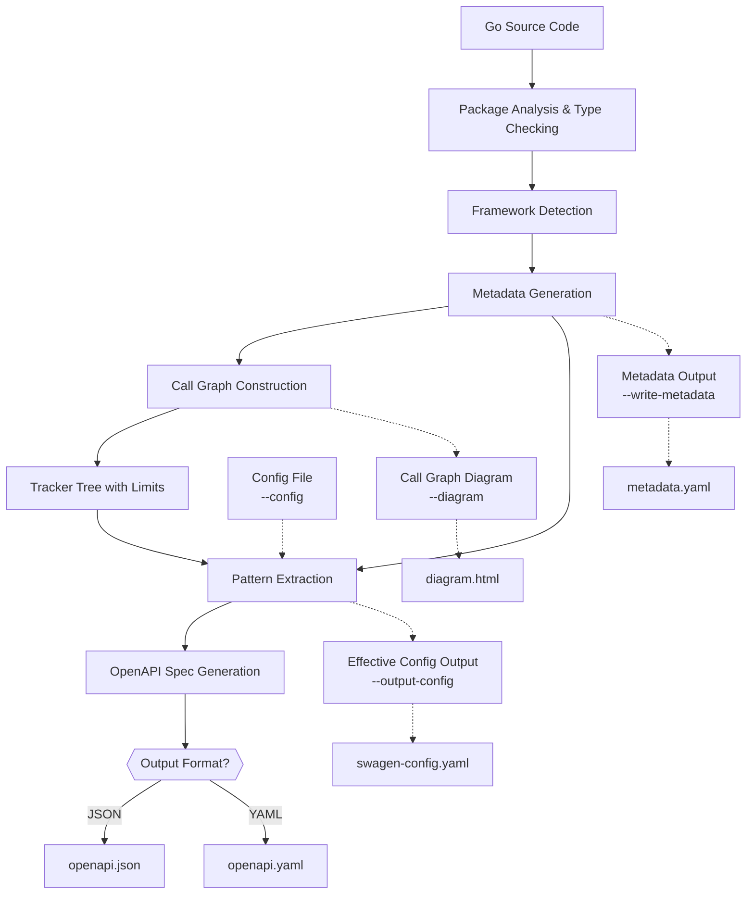

# Swagen: Generate OpenAPI from Go code


> **Disclaimer:**  
> Swagen is under active development and **not yet production-ready**. Feedback, bug reports, and contributions are welcome.

**Swagen** analyzes your Go code and automatically generates an OpenAPI 3.1 spec (YAML or JSON). It detects routes for popular frameworks (Gin, Echo, Chi, Fiber, net/http), follows call graphs to the final handlers, and infers request/response types from real code (struct tags, literals, generics, and more).

**TL;DR**: Point Swagen at your module. Get an OpenAPI spec and, optionally, an interactive call-graph diagram.

## Demo Video

<iframe width="560" height="315" src="https://youtu.be/fMHDshOeQVs" frameborder="0" allowfullscreen></iframe>

## Features

- **Automated OpenAPI**: Generate OpenAPI 3.1 from real Go code.
- **Framework-aware**: Detects Gin, Echo, Chi, Fiber, and net/http automatically.
- **Accurate by analysis**: Builds a call graph to resolve handlers, parameters, bodies, and responses.
- **Configurable**: YAML config plus CLI flags; flags always win.
- **Visualize**: Optional HTML call-graph diagram for debugging.
- **Extensible**: Pattern-based framework config; add new frameworks without changing core logic.
- **Smart Type Resolution**: Automatically resolves underlying primitive types for aliases and enums. <strong style="color:green;">✨NEW</strong>
- **Comprehensive Error Handling**: Robust handling of edge cases and invalid inputs. <strong style="color:green;">✨NEW</strong>

> **Note**: Generating call-graph diagrams and metadata files consumes additional resources and time.

## Framework Support

### Gorilla Mux
- [x] **Route registration**: Detects `HandleFunc` and `Handle` calls with path and handler arguments
- [x] **Handler function detection**: Identifies handler functions passed as arguments to route registration
- [x] **HTTP method extraction**: Automatically extracts HTTP methods from handler function names or explicit method calls
- [x] **Path parameter detection**: Recognizes path parameters in route patterns (e.g., `/users/{id}`)
- [x] **Subrouter support**: Handles nested routing with `PathPrefix` and `Subrouter`
- [ ] **Parameter extraction**: Path parameters are not yet fully resolved to handler function parameters
- [ ] **Conditional routing**: Dynamic route registration based on runtime conditions is not supported

### Other Frameworks
- [x] **Gin**: Full support for route registration, middleware, and parameter handling
- [x] **Chi**: Full support for route mounting, grouping, and parameter extraction
- [x] **Echo**: Full support for route registration and parameter handling
- [x] **Fiber**: Full support for route registration and parameter handling
- [x] **Standard net/http**: Basic support for `HandleFunc` and `Handle` calls

## Golang Feature Support
Swagen focuses on practical coverage for real-world services. Current coverage includes:

- [x] **Alias imports**: supports import aliases in analysis.
- [x] **Alias types**: type aliases are detected and resolved to underlying primitive types. <strong style="color:green;">✨NEW</strong>
- [x] **Enum resolution**: automatically resolves enum types to their underlying primitive types (string, int, etc.). <strong style="color:green;">✨NEW</strong>
- [x] **Assignment and alias tracking**: short `:=`, `=`, multi-assign, tuple returns, latest-wins resolution, alias chains, and shadowing.
- [ ] **Conditional methods**: detecting HTTP methods set via switch/if around net/http `Handle`/`HandleFunc` is not supported.
- [x] **Composite literals / maps / slices / arrays**: recognizes literal and container types for schema mapping.
- [x] **Dependency injection**: supports route grouping mounted via dependency injection.
- [ ] **Duplicate status codes**: paths with the same status code and different schemas are not yet supported.
- [ ] **External type introspection**: types from external packages (e.g., `gin.H`) are not introspected automatically; provide schemas via `externalTypes` in config.
- [x] **Generics (functions)**: detects type parameters and maps concrete types at call sites.
- [ ] **Generics (types)**: generic struct and type instantiation are partially supported.
- [ ] **Inferred status codes**: status codes assigned via variables are not inferred.
- [x] **Interfaces**: captures interface types and methods; unresolved dynamic values are represented generically.
- [x] **Chain calls**: efficiently processes method chaining and establishes parent-child relationships in the call graph. <strong style="color:green;">✨NEW</strong>
- [x] **Nested calls**: handles chained/method calls and nested expressions.
- [x] **Parameter tracing across calls**: follows arguments across the call graph; maps function parameters to call arguments.
- [ ] **Interface param resolution**: interface type parameters in functions are not yet fully resolved to concrete types.
- [ ] **Parent object type tracing**: limited ability to trace the receiver/parent type; `Decode` on non-body targets may be misclassified.
- [x] **Pointers and dereference**: detects `*T` and automatically dereferences when configured.
- [x] **Selectors and field access**: resolves `pkg.Type.Field` and nested selectors where possible.
- [x] **Struct fields**: reads field types, embedded fields, and struct tags (`json`, `xml`, `form`, etc.).
- [x] **Nested struct types**: supports anonymous nested structs within struct fields, preserving complete type information for accurate schema generation. <strong style="color:green;">✨NEW</strong>
- [x] **Function and method return types**: automatically resolves and captures return types from function signatures, enabling accurate type resolution in pattern matchers. <strong style="color:green;">✨NEW</strong>
- [x] **CGO support**: includes a flag to skip CGO packages during analysis, useful for projects with complex C dependencies. <strong style="color:green;">✨NEW</strong>

### Type Resolution Examples

Swagen automatically resolves underlying types for aliases and enums:

```go
// Enum types are resolved to their underlying primitive type
type AllowedUserType string

const (
    UserTypeAdmin AllowedUserType = "admin"
    UserTypeCustomer AllowedUserType = "user"
)

// In your struct, AllowedUserTypes will be resolved to []string
type Permission struct {
    ID                string
    Resource          string
    Operation         string
    AllowedUserTypes  []domain.AllowedUserType  // Resolves to []string
}

// Generated OpenAPI schema:
// AllowedUserTypes:
//   type: array
//   items:
//     type: string
//     enum: ["admin", "user"]
```

```go
// Pointer aliases are also resolved
type UserID *int64

type User struct {
    ID UserID  // Resolves to integer
}

// Generated OpenAPI schema:
// ID:
//   type: integer
//   format: int64
```

## Architecture Overview



### How It Works

Swagen executes a multi-stage process to analyze your code and generate the OpenAPI specification. The workflow is designed to be robust and flexible, handling complex Go projects with ease.

 1. **Initialization & Flag Parsing**: The tool starts, prints license information, and parses all command-line flags provided by the user.

 2. **Module Discovery**: It finds the root of the Go module by searching for the `go.mod` file and changes the working directory to the module root.

 3. **Package Loading & Type-Checking**: Swagen loads and performs a full type-check on all Go packages within the module (`./...`), building a rich understanding of the code's types and syntax.

 4. **Framework Detection**: It analyzes the project's dependencies to automatically detect the web framework being used (e.g., Gin, Chi, Echo, Fiber, or standard `net/http`).

 5. **Configuration Loading**: The tool loads a framework-specific default configuration. If a custom `--config` file is provided, it loads that instead. CLI flags always override settings from any configuration file.

 6. **Metadata Generation**: It traverses the Abstract Syntax Trees (AST) of the parsed packages to generate a detailed `metadata` object. This object contains information about packages, function calls, and string constants. 

 7. **Call Graph Construction**: Using the generated metadata, Swagen constructs a call graph tree. This tree traces the flow of execution from router definitions to the final handler functions, respecting limits set by flags like `--max-nodes` to prevent infinite recursion.

 8. **OpenAPI Mapping**: The call graph and metadata are processed by a framework-specific mapper. This mapper identifies API routes, parameters, request bodies, and responses, translating them into the OpenAPI specification structure.

 9. **Specification Generation**: The final OpenAPI object is marshaled into either YAML or JSON format, based on the output file extension (`.yaml`, or `.json`).

10. **File Output**: The resulting specification file is written to the path specified by the `--output` flag. If requested, an interactive HTML call graph diagram is also generated.

## Quick Start

### Installation

📖 **For detailed installation instructions, see [INSTALLATION.md](docs/INSTALLATION.md)**

#### Option 1: Go Install (Recommended)
```bash
go install github.com/ehabterra/swagen/cmd/swagen@latest
```

#### Option 2: From Source
```bash
# Clone the repository
git clone https://github.com/ehabterra/swagen.git
cd swagen

# Build and install
make install-local    # Install to ~/go/bin (no sudo required)
# OR
make install          # Install to /usr/local/bin (requires sudo)
```

#### Option 3: Using Installation Script
```bash
# Download and run the installation script
curl -sSL https://raw.githubusercontent.com/ehabterra/swagen/main/scripts/install.sh | bash -s go-install
```

**Note**: Make sure your Go bin directory is in your PATH. Add this to your shell profile:
```bash
export PATH=$HOME/go/bin:$PATH
```

#### Building from Source (Development)
```bash
# Clone the repository
git clone https://github.com/ehabterra/swagen.git
cd swagen

# Build the binary
make build

# Or build directly with Go
go build -o swagen ./cmd/swagen
```

### Basic Usage

```bash
# Generate OpenAPI spec from your Go project
./swagen --output openapi.yaml

# Generate with custom config
./swagen --config my-config.yaml --output openapi.yaml

# Generate with call graph diagram
./swagen --output openapi.yaml --diagram

# Generate metadata for debugging
./swagen --output openapi.yaml --write-metadata
```

### Programmatic usage

```go
import (
  "os"
  "github.com/ehabterra/swagen/generator"
  "github.com/ehabterra/swagen/spec"
  "gopkg.in/yaml.v3"
)

func main() {
  cfg := spec.DefaultGinConfig() // or spec.LoadSwagenConfig("swagen.yaml")
  gen := generator.NewGenerator(cfg)
  openapi, err := gen.GenerateFromDirectory("./your-project")
  if err != nil { panic(err) }
  data, _ := yaml.Marshal(openapi)
  os.WriteFile("openapi.yaml", data, 0644)
}
```

### **Flag Table**

| **Full Flag**         | **Shorthand** | **Description**                                      | **Default**                     |
|-----------------------|--------------|-----------------------------------------------------|---------------------------------|
| `--output`            | `-o`         | Output file for OpenAPI spec                        | `openapi.json`                  |
| `--dir`               | `-d`         | Directory to parse for Go files                     | `.` (current dir)               |
| `--title`             | `-t`         | Title of the API                                    | `Generated API`                 |
| `--api-version`       | `-v`         | Version of the API                                  | `1.0.0`                        |
| `--description`       | `-D`         | API description                                     | `""`                           |
| `--terms-url`         | `-T`         | Terms of Service URL                                | `""`                           |
| `--contact-name`      | `-N`         | Contact person/organization name                    | `Ehab`                         |
| `--contact-url`       | `-U`         | Contact URL                                         | `https://ehabterra.github.io/` |
| `--contact-email`     | `-E`         | Contact email                                       | `ehabterra@hotmail.com`        |
| `--license-name`      | `-L`         | License name                                        | `""`                           |
| `--license-url`       | `-lu`        | License URL                                         | `""`                           |
| `--openapi-version`   | `-O`         | OpenAPI spec version                                | `3.1.1`                        |
| `--config`            | `-c`         | Path to custom config YAML                          | `""`                           |
| `--output-config`     | `-oc`        | Output effective config to YAML                     | `""`                           |
| `--write-metadata`    | `-w`         | Write metadata.yaml to disk                         | `false`                        |
| `--split-metadata`    | `-s`         | Split metadata into separate files                  | `false`                        |
| `--diagram`           | `-g`         | Save call graph as HTML                             | `""`                           |
| `--max-nodes`         | `-mn`        | Max nodes in call graph tree                        | `10000`                        |
| `--max-children`      | `-mc`        | Max children per node                               | `150`                          |
| `--max-args`          | `-ma`        | Max arguments per function                          | `30`                           |
| `--max-depth`         | `-md`        | Max depth for nested arguments                      | `50`                           |


### Example Output

```yaml
openapi: 3.1.0
info:
  title: User Management API
  version: 1.0.0
  description: API for managing users and permissions
paths:
  /users:
    get:
      summary: List users
      parameters:
        - name: page
          in: query
          schema:
            type: integer
            minimum: 1
            default: 1
        - name: limit
          in: query
          schema:
            type: integer
            minimum: 1
            maximum: 100
            default: 20
      responses:
        '200':
          description: List of users
          content:
            application/json:
              schema:
                type: object
                properties:
                  users:
                    type: array
                    items:
                      $ref: '#/components/schemas/User'
                  pagination:
                    $ref: '#/components/schemas/Pagination'
    post:
      summary: Create user
      requestBody:
        required: true
        content:
          application/json:
            schema:
              $ref: '#/components/schemas/CreateUserRequest'
      responses:
        '201':
          description: User created successfully
          content:
            application/json:
              schema:
                $ref: '#/components/schemas/User'
        '400':
          description: Invalid request data
  /users/{id}:
    get:
      summary: Get user by ID
      parameters:
        - name: id
          in: path
          required: true
          schema:
            type: string
            format: uuid
      responses:
        '200':
          description: User details
          content:
            application/json:
              schema:
                $ref: '#/components/schemas/User'
        '404':
          description: User not found
components:
  schemas:
    User:
      type: object
      properties:
        id:
          type: string
          format: uuid
        name:
          type: string
        email:
          type: string
          format: email
        status:
          type: string
          enum: ["active", "inactive", "pending"]
        createdAt:
          type: string
          format: date-time
        permissions:
          type: array
          items:
            type: string
            enum: ["admin", "user", "driver", "store_manager", "picker"]
      required: ["id", "name", "email"]
    CreateUserRequest:
      type: object
      properties:
        name:
          type: string
        email:
          type: string
          format: email
        permissions:
          type: array
          items:
            type: string
      required: ["name", "email"]
    Pagination:
      type: object
      properties:
        page:
          type: integer
          minimum: 1
        limit:
          type: integer
          minimum: 1
        total:
          type: integer
        totalPages:
          type: integer
```

## Configuration

Swagen uses YAML configuration files to define framework patterns and behavior. Here are examples for different frameworks:

### Gin Framework Configuration

```yaml
# Example Gin configuration (swagen.yaml)
info:
  title: My API
  version: 1.0.0
  description: A comprehensive API for user management

framework:
  routePatterns:
    - callRegex: ^(?i)(GET|POST|PUT|DELETE|PATCH|OPTIONS|HEAD)$
      recvTypeRegex: ^github\.com/gin-gonic/gin\.\*(Engine|RouterGroup)$
      handlerArgIndex: 1
      methodFromCall: true
      pathFromArg: true
      handlerFromArg: true
  requestBodyPatterns:
    - callRegex: ^(?i)(BindJSON|ShouldBindJSON|BindXML|BindYAML|BindForm|ShouldBind)$
      typeFromArg: true
      deref: true
    - callRegex: ^Decode$
      typeFromArg: true
      deref: true
    - callRegex: ^Unmarshal$
      typeArgIndex: 1
      typeFromArg: true
      deref: true
  responsePatterns:
    - callRegex: ^(?i)(JSON|String|XML|YAML|ProtoBuf|Data|File|Redirect)$
      typeArgIndex: 1
      statusFromArg: true
      typeFromArg: true
    - callRegex: ^Marshal$
      typeFromArg: true
      deref: true
    - callRegex: ^Encode$
      typeFromArg: true
      deref: true
  paramPatterns:
    - callRegex: ^Param$
      paramIn: path
    - callRegex: ^Query$
      paramIn: query
    - callRegex: ^DefaultQuery$
      paramIn: query
    - callRegex: ^GetHeader$
      paramIn: header
  mountPatterns:
    - callRegex: ^Group$
      recvTypeRegex: ^github\.com/gin-gonic/gin\.\*(Engine|RouterGroup)$
      routerArgIndex: 1
      pathFromArg: true
      routerFromArg: true
      isMount: true

# Type mappings for custom types and external packages
typeMapping:
  - goType: time.Time
    openapiType:
      type: string
      format: date-time
  - goType: uuid.UUID
    openapiType:
      type: string
      format: uuid
  - goType: decimal.Decimal
    openapiType:
      type: string
      format: decimal

# External types that can't be introspected automatically
externalTypes:
  - name: github.com/gin-gonic/gin.H
    openapiType:
      type: object
      additionalProperties: true
  - name: github.com/your-package/CustomResponse
    openapiType:
      type: object
      properties:
        success:
          type: boolean
        data:
          type: object
        message:
          type: string
```

### Echo Framework Configuration

```yaml
# Example Echo configuration
framework:
  routePatterns:
    - callRegex: ^(?i)(GET|POST|PUT|DELETE|PATCH|OPTIONS|HEAD)$
      recvTypeRegex: ^github\.com/labstack/echo\.\*(Echo|Group)$
      handlerArgIndex: 1
      methodFromCall: true
      pathFromArg: true
      handlerFromArg: true
  requestBodyPatterns:
    - callRegex: ^(?i)(Bind|BindJSON|BindXML|BindYAML)$
      typeFromArg: true
      deref: true
  responsePatterns:
    - callRegex: ^(?i)(JSON|String|XML|YAML|Blob|File|Stream)$
      typeArgIndex: 1
      statusFromArg: true
      typeFromArg: true
  paramPatterns:
    - callRegex: ^Param$
      paramIn: path
    - callRegex: ^QueryParam$
      paramIn: query
    - callRegex: ^FormValue$
      paramIn: formData
```

### Advanced Configuration Examples

#### Custom Type Resolution

```yaml
# Handle custom domain types
typeMapping:
  - goType: domain.UserStatus
    openapiType:
      type: string
      enum: ["active", "inactive", "pending"]
  - goType: domain.Priority
    openapiType:
      type: integer
      enum: [1, 2, 3, 4, 5]
  - goType: []domain.Tag
    openapiType:
      type: array
      items:
        type: string
```

#### External Package Types

```yaml
# Define schemas for external packages
externalTypes:
  - name: github.com/your-org/shared.Response
    openapiType:
      type: object
      properties:
        code:
          type: integer
        message:
          type: string
        data:
          type: object
          additionalProperties: true
  - name: github.com/your-org/shared.Pagination
    openapiType:
      type: object
      properties:
        page:
          type: integer
          minimum: 1
        limit:
          type: integer
          minimum: 1
          maximum: 100
        total:
          type: integer
```

## Development Guide

### Prerequisites
- Go 1.24+ (Didn't test it on version before 1.24)
- Understanding of AST (Abstract Syntax Tree)
- Familiarity with OpenAPI 3.1 specification

### Project Structure
```
swagen/
├── cmd/
│   └── swagen/           # CLI entry point
│       └── main.go
├── generator/            # High-level generator interface
│   ├── generator.go
│   └── generator_test.go
├── internal/
│   ├── core/            # Framework detection and core logic
│   ├── engine/          # Processing engine
│   ├── metadata/        # Code analysis and metadata extraction
│   └── spec/            # OpenAPI spec generation and mapping
├── spec/                # Public spec package
├── testdata/            # Example projects for testing
├── scripts/             # Build and utility scripts
├── docs/                # Documentation files
└── .github/             # GitHub workflows and templates
```

### Building and Testing
```bash
# Run all tests
make test

# Run tests with coverage
make coverage

# Run comprehensive mapper tests
go test ./internal/spec -v -run "Test.*Comprehensive"

# Build the binary
make build

# Update coverage badge
make update-badge
```

### Testing

Swagen includes comprehensive test suites covering:
- **Unit tests** for all packages
- **Integration tests** for framework detection and OpenAPI generation
- **Comprehensive mapper tests** for edge cases and type resolution
- **Framework-specific tests** for Gin, Echo, Chi, and Fiber

Run specific test categories:
```bash
# Test mapper functionality
go test ./internal/spec -v

# Test metadata extraction
go test ./internal/metadata -v

# Test with coverage
go test ./... -cover
```

## Contributing

### How to Contribute

1. **Fork** the repository
2. **Create** a feature branch (`git checkout -b feature/amazing-feature`)
3. **Add tests** for new functionality
4. **Run tests** to ensure everything works (`make test`)
5. **Update coverage** badge (`make update-badge`)
6. **Commit** your changes (`git commit -m 'Add amazing feature'`)
7. **Push** to the branch (`git push origin feature/amazing-feature`)
8. **Open** a Pull Request

### Adding Framework Support
1. Update the framework detection logic in `internal/core/detector.go`
2. Add default configuration in `internal/spec/config.go`
3. Update the framework detection logic in `cmd/swagen/main.go`
4. Add test cases in `testdata/`

### Code Quality

- All code should have tests
- Aim to maintain or improve test coverage
- Follow Go coding standards
- Add documentation for new features

## Performance Considerations

Swagen implements several safeguards to prevent excessive resource usage:

| Parameter | Default Value | Description |
|-----------|---------------|-------------|
| MaxNodesPerTree | 10,000 | Maximum nodes in call graph |
| MaxChildrenPerNode | 150 | Children per node |
| MaxArgsPerFunction | 30 | Arguments per function |
| MaxNestedArgsDepth | 50 | Argument nesting depth |

Adjust these with CLI flags if needed for large codebases.

## Documentation

- **[docs/INSTALLATION.md](docs/INSTALLATION.md)**: Detailed installation instructions
- **[docs/RELEASE_WORKFLOW.md](docs/RELEASE_WORKFLOW.md)**: Automated release process with GitHub Actions
- **[docs/SOLUTION_SUMMARY.md](docs/SOLUTION_SUMMARY.md)**: Solution to test file changes issue
- **[docs/TRACKER_TREE_USAGE.md](docs/TRACKER_TREE_USAGE.md)**: Guide to using TrackerTree for call graph analysis
- **[docs/CYTOGRAPHE_README.md](docs/CYTOGRAPHE_README.md)**: Documentation for the call graph visualization feature
- **[internal/metadata/README.md](internal/metadata/README.md)**: Metadata package documentation
- **[internal/spec/README.md](internal/spec/README.md)**: Spec generation package documentation

## License

Apache License 2.0 - See [LICENSE](LICENSE) for details.

---

> **Note**: The actual diagram should visualize the complete workflow from source code analysis to OpenAPI generation. The project includes example configurations for different frameworks in the `testdata` directory. For complex projects, consider using the `--split-metadata` flag to analyze intermediate results.
