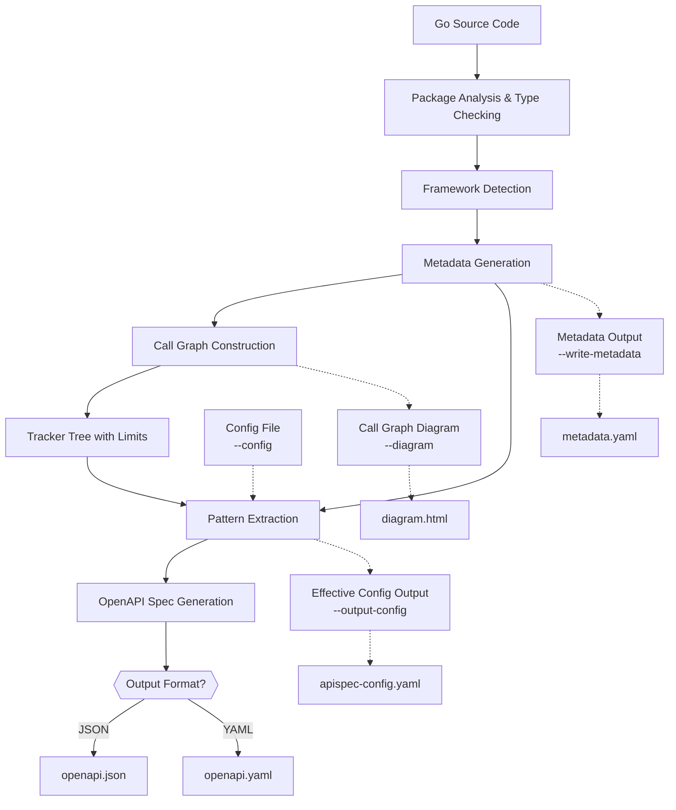

# APISpec: Generate OpenAPI from Go code

[](https://github.com/ehabterra/apispec)
[](https://goreportcard.com/report/github.com/ehabterra/apispec)
[](https://go.dev/)
[](https://github.com/ehabterra/apispec/blob/main/LICENSE)
[](https://github.com/ehabterra/apispec/actions/workflows/ci.yml)
[](https://github.com/ehabterra/apispec/actions/workflows/test.yml)
[](https://github.com/ehabterra/apispec/actions/workflows/lint.yml)
[](https://pkg.go.dev/github.com/ehabterra/apispec)
[](https://github.com/ehabterra/apispec/releases)

<!-- markdownlint-disable MD033 -->
<div align="center">
  
</div>
<!-- markdownlint-enable MD033 -->

**APISpec** analyzes your Go source and generates an OpenAPI 3.1 spec (YAML or JSON). It detects routes for popular frameworks (Gin, Echo, Chi, Fiber, Gorilla Mux, `net/http`), follows the call graph to the real handlers, and infers request/response types from actual code — struct tags, literals, generics, and more.

**TL;DR**: Point APISpec at your module. Get an OpenAPI spec — plus, optionally, an interactive call-graph diagram and a browser-based config UI.

## Table of Contents

- [Demo](#demo)
- [Why APISpec](#why-apispec)
- [Quick Start](#quick-start)
- [The Tools](#the-tools)
  - [`apispec` — CLI generator](#apispec--cli-generator)
  - [`apispecui` — Browser-based config & preview](#apispecui--browser-based-config--preview)
  - [`apidiag` — Interactive call-graph server (standalone)](#apidiag--interactive-call-graph-server-standalone)
- [Framework Support](#framework-support)
- [Go Language Support](#go-language-support)
- [How It Works](#how-it-works)
- [Configuration](#configuration)
- [Programmatic Usage](#programmatic-usage)
- [Performance & Limits](#performance--limits)
- [Development](#development)
- [Documentation](#documentation)
- [License](#license)

## Demo

[](https://youtu.be/lkKO-a0-ZTU)

Click the image to watch the full demo on YouTube.

## Why APISpec

- **Generated from real code.** Routes, parameters, request bodies, and responses are inferred by analyzing the AST and walking the call graph — not from comments or hand-written annotations that drift out of sync.
- **Framework-aware.** Out-of-the-box detection for Gin, Echo, Chi, Fiber, Gorilla Mux, and `net/http`.
- **Extensible.** Framework behavior is described as regex-based patterns in YAML, so adding or tweaking a framework doesn't require touching core logic.
- **Type-aware.** Resolves aliases and enums to their underlying primitives, maps validator tags (`go-playground/validator`) to OpenAPI constraints, and handles generics, arrays (`[16]byte`, `[...]int`), pointer dereferencing, and external package types.
- **Visualizable.** Optional HTML call-graph diagram and a separate paginated diagram server for large codebases.

## Quick Start

### Install

```bash
go install github.com/ehabterra/apispec/cmd/apispec@latest

# Make sure your Go bin is on PATH:
export PATH=$HOME/go/bin:$PATH
```

Other install methods (Homebrew-style scripts, building from source, packaging the binary) are documented in [docs/INSTALLATION.md](docs/INSTALLATION.md).

### Generate an OpenAPI spec

Run from inside your Go module:

```bash
# YAML output (framework auto-detected)
apispec --output openapi.yaml

# JSON output
apispec --output openapi.json

# With a custom config and a call-graph diagram
apispec --config apispec.yaml --output openapi.yaml --diagram diagram.html
```

That's it for most projects. See [Configuration](#configuration) for tuning and [The Tools](#the-tools) for the companion utilities.

## The Tools

APISpec ships three binaries that share the same analysis engine.

| Binary       | Purpose                                                                | Entry point                  |
|--------------|------------------------------------------------------------------------|------------------------------|
| `apispec`    | Generate an OpenAPI 3.1 spec from a Go module                          | `cmd/apispec`                |
| `apispecui`  | Browser UI: configure APISpec, preview the spec, *and* explore the call graph at `/diagram` | `cmd/apispecui` |
| `apidiag`    | Standalone interactive call-graph server (same engine, headless)       | `cmd/apidiag`                |

### `apispec` — CLI generator

The main generator. Auto-detects the framework, loads a default config (overridable with `--config`), and writes an OpenAPI spec.

```bash
# Basic
apispec --output openapi.yaml

# Generate metadata for debugging
apispec --output openapi.yaml --write-metadata

# Limit tuning for very large projects
apispec --output openapi.yaml \
        --max-nodes 100000 --max-children 1000 --max-recursion-depth 15

# Performance profiling
apispec --output openapi.yaml --cpu-profile --mem-profile

# Skip CGO packages (on by default)
apispec --output openapi.yaml --skip-cgo
```

#### Flag reference

| Flag                        | Shorthand | Description                                            | Default                         |
|-----------------------------|-----------|--------------------------------------------------------|---------------------------------|
| `--output`                  | `-o`      | Output path for the OpenAPI spec                       | `openapi.json`                  |
| `--dir`                     | `-d`      | Directory to parse                                     | `.`                             |
| `--title`                   | `-t`      | API title                                              | `Generated API`                 |
| `--api-version`             | `-v`      | API version                                            | `1.0.0`                         |
| `--description`             | `-D`      | API description                                        | `""`                            |
| `--terms`                   | `-T`      | Terms of service URL                                   | `""`                            |
| `--contact-name`            | `-N`      | Contact name                                           | `Ehab`                          |
| `--contact-url`             | `-U`      | Contact URL                                            | `https://ehabterra.github.io/`  |
| `--contact-email`           | `-E`      | Contact email                                          | `ehabterra@hotmail.com`         |
| `--license-name`            | `-L`      | License name                                           | `""`                            |
| `--license-url`             | `-lu`     | License URL                                            | `""`                            |
| `--openapi-version`         | `-O`      | OpenAPI spec version                                   | `3.1.1`                         |
| `--config`                  | `-c`      | Path to custom config YAML                             | `""`                            |
| `--output-config`           | `-oc`     | Write the effective config to a YAML file              | `""`                            |
| `--write-metadata`          | `-w`      | Write `metadata.yaml` to disk                          | `false`                         |
| `--split-metadata`          | `-s`      | Write metadata as multiple files                       | `false`                         |
| `--diagram`                 | `-g`      | Write call-graph HTML to this path                     | `""`                            |
| `--paginated-diagram`       | `-pd`     | Use paginated rendering for the diagram                | `false`                         |
| `--diagram-page-size`       | `-dps`    | Nodes per page in paginated diagram (50–500)           | `100`                           |
| `--max-nodes`               | `-mn`     | Max nodes in the call graph                            | `50000`                         |
| `--max-children`            | `-mc`     | Max children per node                                  | `500`                           |
| `--max-args`                | `-ma`     | Max arguments per function                             | `100`                           |
| `--max-nested-args`         | `-md`     | Max depth for nested arguments                         | `100`                           |
| `--max-recursion-depth`     | `-mrd`    | Max recursion depth (anti-loop)                        | `10`                            |
| `--skip-cgo`                |           | Skip CGO packages                                      | `true`                          |
| `--include-file`            |           | Include files matching pattern (repeatable)            | `""`                            |
| `--include-package`         |           | Include packages matching pattern (repeatable)         | `""`                            |
| `--include-function`        |           | Include functions matching pattern (repeatable)        | `""`                            |
| `--include-type`            |           | Include types matching pattern (repeatable)            | `""`                            |
| `--exclude-file`            |           | Exclude files matching pattern (repeatable)            | `""`                            |
| `--exclude-package`         |           | Exclude packages matching pattern (repeatable)         | `""`                            |
| `--exclude-function`        |           | Exclude functions matching pattern (repeatable)        | `""`                            |
| `--exclude-type`            |           | Exclude types matching pattern (repeatable)            | `""`                            |
| `--analyze-framework-dependencies` | `-afd` | Walk into framework packages during analysis     | `true`                          |
| `--auto-include-framework-packages` | `-aifp` | Auto-include known framework packages          | `true`                          |
| `--auto-exclude-tests`      | `-aet`    | Skip `*_test.go` files                                 | `true`                          |
| `--auto-exclude-mocks`      | `-aem`    | Skip mock files                                        | `true`                          |
| `--cpu-profile`             |           | Enable CPU profiling                                   | `false`                         |
| `--mem-profile`             |           | Enable memory profiling                                | `false`                         |
| `--block-profile`           |           | Enable block profiling                                 | `false`                         |
| `--mutex-profile`           |           | Enable mutex profiling                                 | `false`                         |
| `--trace-profile`           |           | Enable trace profiling                                 | `false`                         |
| `--custom-metrics`          |           | Enable custom metrics collection                       | `false`                         |
| `--profile-dir`             |           | Directory for profiling output                         | `profiles`                      |
| `--version`                 | `-V`      | Print version and exit                                 | `false`                         |

CLI flags always override values from a config file.

See also: [`cmd/apispec/README.md`](cmd/apispec/README.md).

### `apispecui` — Browser-based config & preview

`apispecui` is a small local web server that lets you configure APISpec interactively, generate a spec on demand, immediately preview it through embedded **Swagger UI**, **Redoc**, or **Scalar** viewers, *and* explore the project's call graph at `/diagram` — the same interactive, paginated visualization that `apidiag` provides, hosted on the same port and project.

```bash
# Build and run
go build -o apispecui ./cmd/apispecui
./apispecui --dir ./my-go-project

# Open http://localhost:8088 — config UI
# Open http://localhost:8088/diagram — call-graph visualization
```

Endpoints exposed:

| Path                        | Purpose                                                |
|-----------------------------|--------------------------------------------------------|
| `/`                         | Configuration UI                                       |
| `/swagger`                  | Swagger UI preview                                     |
| `/redoc`                    | Redoc preview                                          |
| `/scalar`                   | Scalar preview                                         |
| `/diagram`                  | Interactive call-graph / tracker-tree visualization    |
| `/api/spec.json`            | Last-generated spec (JSON)                             |
| `/api/spec.yaml`            | Last-generated spec (YAML)                             |
| `/api/config.yaml`          | Current effective config                               |
| `/api/generate` (POST)      | Trigger spec generation with the current config        |
| `/api/diagram/*`            | Paginated diagram API (same surface as `apidiag`)      |

The diagram lazily loads metadata on the first request and re-loads when the project directory is switched via the UI, so a single `apispecui` process covers both spec preview and graph debugging. The standalone `apidiag` binary is still shipped for headless use.

Flags: `--host` (default `localhost`), `--port` (default `8088`), `--dir`/`-d` (project root, default `.`), `--config`/`-c` (initial config), `--verbose`.

### `apidiag` — Interactive call-graph server (standalone)

The same diagram server, packaged as its own binary. Use it when you want a dedicated graph explorer without the config UI, or to run it on its own host/port. Internally both binaries share `internal/diagserver`.

```bash
go install github.com/ehabterra/apispec/cmd/apidiag@latest
apidiag --dir ./my-go-project --port 8080
# Open http://localhost:8080
```

Features include package/function/file filtering, multiple export formats (SVG, PNG, PDF, JSON), and a JSON HTTP API for programmatic access.

See [`cmd/apidiag/README.md`](cmd/apidiag/README.md) for full documentation and a [demo video](https://youtu.be/UshBJ5-ayzA).

## Framework Support

| Framework         | Routes & methods | Path params | Groups / mounting | Request body | Responses |
|-------------------|:----------------:|:-----------:|:-----------------:|:------------:|:---------:|
| **Gin**           | ✅               | ✅          | ✅                | ✅           | ✅        |
| **Echo**          | ✅               | ✅          | ✅                | ✅           | ✅        |
| **Chi**           | ✅               | ✅          | ✅ (incl. `render`) | ✅         | ✅        |
| **Fiber**         | ✅               | ✅          | ✅                | ✅           | ✅        |
| **Gorilla Mux**   | ✅               | ✅ *(detected, not yet wired into handler params)* | ✅ (`PathPrefix`, `Subrouter`) | ✅ | ✅ |
| **`net/http`**    | ✅ (`HandleFunc`, `Handle`) | basic | basic | ✅ | ✅ |

Conditional registration (dynamic routes built at runtime) is generally not supported.

## Go Language Support

APISpec aims for practical coverage of real-world Go services. A quick survey of what's handled:

**Supported**

- Import and type aliases (resolved to underlying primitives).
- Enum resolution from constants, `enum` tags, or `oneof` validator tags.
- Assignment & alias tracking: `:=`, `=`, multi-assign, tuple returns, alias chains, latest-wins shadowing.
- Composite literals, maps, slices, fixed-size and variable-length arrays (`[16]byte`, `[5]int`, `[...]int`).
- Pointers and automatic dereferencing.
- Selectors and nested field access (`pkg.Type.Field`).
- Struct fields, embedded fields, tag-based metadata (`json`, `xml`, `form`, `validate`, …).
- Anonymous nested struct types preserve full schema information.
- Function & method return types resolved from signatures.
- Function literals (anonymous handlers).
- Generics on functions (concrete types mapped at call sites).
- Interface types and methods (unresolved dynamic values rendered generically).
- Parameter tracing across the call graph; arguments mapped to parameters.
- Method chaining and nested call expressions.
- Conditional response status codes — when a status variable is reassigned across `if`/`else` branches with distinct HTTP codes, APISpec emits one response per status, sharing the body schema.
- External package types automatically resolved to underlying primitives (with `externalTypes` for custom overrides).
- `go-playground/validator` tags mapped to OpenAPI constraints.
- CGO packages can be skipped to avoid build errors.
- Dependency-injected route groups.

**Partial / not yet supported**

- Generic *types* (parametric structs) — partially supported.
- Interface-typed function parameters — not fully resolved to concrete types.
- Same path + same status code with different schemas — not yet supported.
- Receiver/parent type tracing is limited; `Decode` on non-body targets may be misclassified (see [Request body source disambiguation](#request-body-source-disambiguation)).
- HTTP methods set via switch/if around `net/http.Handle`/`HandleFunc` — not detected.
- `dive` validator tag (array-element validation) — planned.

### Selected capability highlights

<details>
<summary><strong>Type alias and enum resolution</strong></summary>

```go
type AllowedUserType string

const (
    UserTypeAdmin    AllowedUserType = "admin"
    UserTypeCustomer AllowedUserType = "user"
)

type Permission struct {
    AllowedUserTypes []domain.AllowedUserType // → []string in the schema
}

type UserID *int64
type User struct {
    ID UserID // → integer / int64
}
```

</details>

<details>
<summary><strong>Array support</strong></summary>

```go
type User struct {
    ID     [16]byte   // string, format: byte, maxLength: 16
    Scores [5]int     // array, minItems/maxItems: 5
    Tags   [10]string // array, minItems/maxItems: 10
}

type Config struct {
    Values [...]int   // array, no size constraint
}
```

</details>

<details>
<summary><strong>External type resolution</strong></summary>

External package types (e.g. `uuid.UUID`) are resolved to primitives automatically; internal project types are kept as `$ref` schemas. Pointers to external types resolve to the same primitive schema. Complex external types can be described explicitly via `externalTypes` in config.

</details>

<details>
<summary><strong>Validator tag support</strong></summary>

| Validator tag        | OpenAPI mapping                       |
|----------------------|---------------------------------------|
| `required`           | `required: true`                      |
| `omitempty`          | `required: false`                     |
| `min=N`              | `minimum: N`                          |
| `max=N`              | `maximum: N`                          |
| `len=N`              | `minLength: N, maxLength: N`          |
| `email`              | `format: email`                       |
| `url`                | `format: uri`                         |
| `uuid`               | `format: uuid`                        |
| `oneof=a b`          | `enum: [a, b]`                        |
| `alphanum`           | `pattern: "^[a-zA-Z0-9]+$"`           |
| `alpha`              | `pattern: "^[a-zA-Z]+$"`              |
| `numeric`            | `pattern: "^[0-9]+$"`                 |
| `containsany=chars`  | `pattern: ".*[chars].*"`              |
| `e164`               | `pattern: "^\\+[1-9]\\d{1,14}$"`      |
| `dive`               | ❌ not yet supported                  |

</details>

<details>
<summary><strong>Function literals as handlers</strong></summary>

```go
router.POST("/users", func(c *gin.Context) {
    var user CreateUserRequest
    if err := c.ShouldBindJSON(&user); err != nil {
        c.JSON(400, gin.H{"error": err.Error()})
        return
    }
    c.JSON(201, user)
})
```

The body and response types are analyzed even for anonymous handlers.

</details>

## How It Works


```mermaid
graph TD
    A[Go Source Code] --> B[Package Analysis & Type Checking]
    B --> C[Framework Detection]
    C --> D[Metadata Generation]
    D --> E[Call Graph Construction]
    E --> F[Tracker Tree with Limits]

    G[Config File<br/>--config] -.-> H[Pattern Extraction]
    F --> H
    D --> H

    H --> I[OpenAPI Spec Generation]
    I --> J{{Output Format?}}
    J -->|JSON| K[openapi.json]
    J -->|YAML| L[openapi.yaml]

    E -.-> M[Call Graph Diagram<br/>--diagram]
    M -.-> N[diagram.html]

    H -.-> O[Effective Config Output<br/>--output-config]
    O -.-> P[apispec-config.yaml]

    D -.-> Q[Metadata Output<br/>--write-metadata]
    Q -.-> R[metadata.yaml]
```

The pipeline:

1. **Parse flags** and locate the module root (`go.mod`).
2. **Load and type-check** all packages in the module.
3. **Detect the framework** from dependencies.
4. **Load configuration** — framework default, then `--config`, then CLI overrides.
5. **Generate metadata** by walking the ASTs (packages, calls, constants).
6. **Build the call graph** from route registrations down to the real handlers, bounded by `--max-nodes`, `--max-children`, `--max-recursion-depth`.
7. **Map patterns** — framework-specific patterns identify routes, params, bodies, and responses.
8. **Serialize** the OpenAPI object to YAML or JSON (chosen by the `--output` extension).
9. **(Optional)** Write the call-graph HTML, the effective config, and/or the metadata file.

## Configuration

APISpec uses YAML configuration files to describe framework patterns and OpenAPI metadata. For most projects the bundled defaults are enough; provide `--config` only when you need to extend or override them.

### Minimal example (Gin)

```yaml
info:
  title: My API
  version: 1.0.0
  description: A comprehensive API for user management

framework:
  routePatterns:
    - callRegex: ^(?i)(GET|POST|PUT|DELETE|PATCH|OPTIONS|HEAD)$
      recvTypeRegex: ^github\.com/gin-gonic/gin\.\*(Engine|RouterGroup)$
      handlerArgIndex: 1
      methodFromCall: true
      pathFromArg: true
      handlerFromArg: true
  requestBodyPatterns:
    - callRegex: ^(?i)(BindJSON|ShouldBindJSON|BindXML|BindYAML|BindForm|ShouldBind)$
      typeFromArg: true
      deref: true
  responsePatterns:
    - callRegex: ^(?i)(JSON|String|XML|YAML|ProtoBuf|Data|File|Redirect)$
      typeArgIndex: 1
      statusFromArg: true
      typeFromArg: true
  paramPatterns:
    - callRegex: ^Param$
      paramIn: path
    - callRegex: ^Query$
      paramIn: query
    - callRegex: ^GetHeader$
      paramIn: header
```

### Custom type mapping

```yaml
typeMapping:
  - goType: time.Time
    openapiType: { type: string, format: date-time }
  - goType: uuid.UUID
    openapiType: { type: string, format: uuid }
  - goType: domain.UserStatus
    openapiType:
      type: string
      enum: [active, inactive, pending]
```

### External package types

External types are usually resolved automatically. Use `externalTypes` only when you need a custom schema:

```yaml
externalTypes:
  - name: github.com/gin-gonic/gin.H
    openapiType:
      type: object
      additionalProperties: true
  - name: github.com/your-org/shared.Response
    openapiType:
      type: object
      properties:
        code:    { type: integer }
        message: { type: string }
        data:    { type: object, additionalProperties: true }
```

### Request body source disambiguation

Generic decoders like `json.Decode`, `json.Unmarshal`, and `render.DecodeJSON` are used both for request bodies *and* for unrelated decoding (config files, internal payloads). The `requestContext` block tells APISpec which receivers represent a request context and which method names yield the body. A decoder call is classified as a request-body decoder only when its source argument can be traced — through selectors, idents, assignments, and parameter boundaries — back to a body accessor on a request-context root.

```yaml
framework:
  requestContext:
    typeRegexes:
      - ^net/http\.\*Request$
      - ^github\.com/gin-gonic/gin\.\*Context$
    bodyAccessors:
      - ^Body$
      - ^GetRawData$
```

When omitted, APISpec falls back to its prior receiver-only matching, so existing configs keep working unchanged.

## Programmatic Usage

```go
import (
    "os"

    "github.com/ehabterra/apispec/generator"
    "github.com/ehabterra/apispec/spec"
    "gopkg.in/yaml.v3"
)

func main() {
    cfg := spec.DefaultGinConfig() // or spec.LoadAPISpecConfig("apispec.yaml")
    gen := generator.NewGenerator(cfg)

    openapi, err := gen.GenerateFromDirectory("./your-project")
    if err != nil {
        panic(err)
    }
    data, _ := yaml.Marshal(openapi)
    _ = os.WriteFile("openapi.yaml", data, 0644)
}
```

## Performance & Limits

APISpec applies safeguards to prevent runaway analysis. Defaults:

| Parameter            | Default  | CLI flag                   |
|----------------------|----------|----------------------------|
| Max nodes / tree     | 50,000   | `--max-nodes`              |
| Max children / node  | 500      | `--max-children`           |
| Max args / function  | 100      | `--max-args`               |
| Max nested arg depth | 100      | `--max-nested-args`        |
| Max recursion depth  | 10       | `--max-recursion-depth`    |

When a limit is reached, APISpec logs a clear warning, e.g.:

```text
Warning: MaxNodesPerTree limit (50000) reached, truncating tree at node example.com/pkg.Function
Warning: MaxChildrenPerNode limit (500) reached for node example.com/pkg.Function, truncating children
Warning: MaxRecursionDepth limit (10) reached for node example.com/pkg.Function
```

### Profiling

```bash
apispec -d ./my-project --cpu-profile --mem-profile --custom-metrics
go tool pprof profiles/cpu.prof
go tool pprof profiles/mem.prof
go tool trace   profiles/trace.out
```

Supported: CPU, memory, block, mutex, trace, and custom metrics (`--custom-metrics` writes `metrics.json`).

## Development

### Prerequisites

- Go **1.26+**
- Familiarity with Go AST analysis and OpenAPI 3.1

### Project layout

```text
apispec/
├── cmd/
│   ├── apispec/       # CLI generator
│   ├── apispecui/     # Browser UI + spec preview
│   └── apidiag/       # Paginated call-graph server
├── generator/         # High-level generator interface
├── internal/
│   ├── core/          # Framework detection & shared logic
│   ├── diagserver/    # Shared call-graph HTTP server (used by apidiag + apispecui)
│   ├── engine/        # Processing engine
│   ├── metadata/      # AST analysis & metadata extraction
│   └── spec/          # OpenAPI generation & mapping
├── pkg/patterns/      # Public pattern helpers
├── spec/              # Public spec package (configs, types)
├── testdata/          # Example projects used in tests
├── scripts/           # Build & utility scripts
└── docs/              # Long-form documentation
```

### Build & test

```bash
make build              # build all binaries
make test               # run all tests
make coverage           # tests with coverage
make update-badge       # refresh the coverage badge
go test ./internal/spec -v -run "Test.*Comprehensive"
```

### Adding a framework

1. Add detection to `internal/core/detector.go`.
2. Add the default config (route/request/response/param patterns) under `internal/spec/`.
3. Register the framework in `cmd/apispec/main.go`.
4. Add a fixture project under `testdata/` and a test case.

### Contributing

1. Fork the repository.
2. Create a feature branch: `git checkout -b feature/amazing-feature`.
3. Add tests covering your change.
4. Run `make test` and (if coverage moves) `make update-badge`.
5. Open a pull request.

See [CONTRIBUTING.md](CONTRIBUTING.md) and [CODE_OF_CONDUCT.md](CODE_OF_CONDUCT.md) for details.

## Documentation

- [docs/INSTALLATION.md](docs/INSTALLATION.md) — installation methods
- [docs/RELEASE_WORKFLOW.md](docs/RELEASE_WORKFLOW.md) — release process
- [docs/TRACKER_TREE_USAGE.md](docs/TRACKER_TREE_USAGE.md) — TrackerTree internals
- [docs/CYTOGRAPHE_README.md](docs/CYTOGRAPHE_README.md) — call-graph visualization
- [docs/INTERFACE_RESOLUTION.md](docs/INTERFACE_RESOLUTION.md) — interface resolution notes
- [cmd/apispec/README.md](cmd/apispec/README.md) — CLI reference
- [cmd/apidiag/README.md](cmd/apidiag/README.md) — diagram server
- [internal/metadata/README.md](internal/metadata/README.md) — metadata package
- [internal/spec/README.md](internal/spec/README.md) — spec-generation package

## License

Apache License 2.0 — see [LICENSE](LICENSE).
