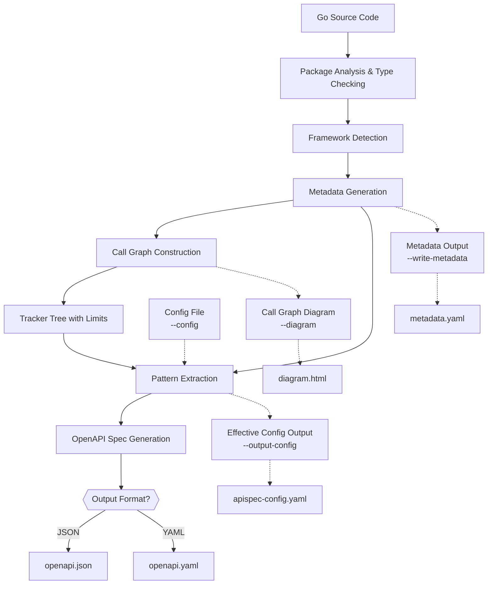

# APISpec: Generate OpenAPI from Go code

[](https://github.com/ehabterra/apispec)
[](https://go.dev/)
[](https://github.com/ehabterra/apispec/blob/main/LICENSE)
[](https://github.com/ehabterra/apispec/actions/workflows/ci.yml)
[](https://github.com/ehabterra/apispec/actions/workflows/test.yml)
[](https://github.com/ehabterra/apispec/actions/workflows/lint.yml)
[](https://pkg.go.dev/github.com/ehabterra/apispec)
[](https://github.com/ehabterra/apispec/releases)

<!-- markdownlint-disable MD033 -->
<div align="center">
  
</div>
<!-- markdownlint-enable MD033 -->

**APISpec** analyzes your Go source and generates an OpenAPI 3.1 spec (YAML or JSON). It detects routes for popular frameworks (Gin, Echo, Chi, Fiber, Gorilla Mux, `net/http`), follows the call graph to the real handlers, and infers request/response types from actual code — struct tags, literals, generics, and more.

**Point APISpec at your module. Get an OpenAPI spec** — plus, optionally, an interactive call-graph diagram and a browser-based config UI.

- **No annotations required.** Routes, parameters and bodies come from the AST and the call graph, not from comments you have to keep in sync. (Doc comments you already write become `summary`/`description` when they're there.)
- **Six routers out of the box** — Gin, Echo, Chi, Fiber, Gorilla Mux and `net/http`, including mixed multi-framework binaries.
- **Your own router, detected automatically.** House wrapper types and house contexts (`func (r *Router) Get(...)`, `ctx.JSON/Bind/Query`) need no configuration.
- **Type-aware schemas.** Generics, aliases, enums from constants, arrays, pointers, embedded and inline structs, external package types, and `go-playground/validator` constraints.
- **Auth-aware.** Bearer/JWT, basic and apiKey schemes, with middleware followed through router-wide `Use`, group closures, per-route chains and handler wrappers.
- **Deterministic output.** Regenerating an unchanged project yields a byte-identical file, so the spec can be committed and diffed in CI without false failures.
- **Debuggable when a route is missed.** Call-graph diagram, metadata dump, and an insight report that says *why* a response has no body.
- **Extensible without forking.** Framework behaviour is regex patterns in YAML; adding a router touches no core logic.

📖 **Documentation:** [apispec.ehabterra.com](https://apispec.ehabterra.com) — installation,
CLI reference, configuration, CI drift checking, and per-framework walkthroughs that show the
spec APISpec actually produces for each router.

Coming from an annotation-based tool? See [APISpec vs swaggo/swag](https://apispec.ehabterra.com/vs/swaggo/),
or [the wider landscape](https://apispec.ehabterra.com/alternatives/) if you are still choosing.

## Table of Contents

- [Demo](#demo)
- [Quick Start](#quick-start)
- [Framework Support](#framework-support)
- [What APISpec Understands](#what-apispec-understands)
- [The Tools](#the-tools)
- [Configuration](#configuration)
- [How It Works](#how-it-works)
- [Programmatic Usage](#programmatic-usage)
- [Performance & Limits](#performance--limits)
- [Development](#development)
- [Documentation](#documentation)
- [Forks & derivatives](#forks--derivatives)
- [License](#license)

## Demo


[](https://youtu.be/PEG8gDXeOGE)

▶︎ **Full 2-minute walkthrough on YouTube** — Install → Generate → Explore → Configure → Insight.

<sub>Earlier end-to-end demo (e-commerce app): <a href="https://youtu.be/lkKO-a0-ZTU">youtu.be/lkKO-a0-ZTU</a></sub>

## Quick Start

### Install

```bash
# Homebrew (macOS/Linux) — nothing to compile; pulls in Go, which apispec needs to run
brew install ehabterra/tap/apispec      # the CLI
brew install ehabterra/tap/apispecui    # the web UI

# or with Go
go install github.com/ehabterra/apispec/cmd/apispec@latest
go install github.com/ehabterra/apispec/cmd/apispecui@latest

# Make sure your Go bin is on PATH:
export PATH=$HOME/go/bin:$PATH
```

Both tools are published the same way — Homebrew, pre-built binaries for six
platforms, `go install`, from source, or the install script. See
[docs/INSTALLATION.md](docs/INSTALLATION.md), or the
[installation guide on the site](https://apispec.ehabterra.com/docs/#install).

### Generate an OpenAPI spec

Run from inside your Go module:

```bash
# YAML output (framework auto-detected)
apispec --output openapi.yaml

# JSON output
apispec --output openapi.json

# With a custom config and a call-graph diagram
apispec --config apispec.yaml --output openapi.yaml --diagram diagram.html
```

That's it for most projects. See [Configuration](#configuration) for tuning and [The Tools](#the-tools) for the companion utilities.

## Framework Support

| Framework         | Routes & methods | Path params | Groups / mounting | Request body | Responses | Auth |
|-------------------|:----------------:|:-----------:|:-----------------:|:------------:|:---------:|:----:|
| **[Gin](https://apispec.ehabterra.com/gin-openapi-generator/)**           | ✅               | ✅          | ✅                | ✅           | ✅        | ✅   |
| **[Echo](https://apispec.ehabterra.com/echo-openapi-generator/)**          | ✅               | ✅          | ✅                | ✅           | ✅        | ✅   |
| **[Chi](https://apispec.ehabterra.com/chi-openapi-generator/)**           | ✅               | ✅          | ✅ (incl. `render`) | ✅         | ✅        | ✅   |
| **[Fiber](https://apispec.ehabterra.com/fiber-openapi-generator/)**         | ✅               | ✅          | ✅                | ✅           | ✅        | ✅   |
| **[Gorilla Mux](https://apispec.ehabterra.com/gorilla-mux-openapi-generator/)**   | ✅               | ✅ (`mux.Vars(r)["id"]`, incl. helper-wrapped & `{id:regex}` → `pattern`) | ✅ (`PathPrefix`, `Subrouter`) | ✅ | ✅ | ✅ |
| **[`net/http`](https://apispec.ehabterra.com/net-http-openapi-generator/)**    | ✅ (`HandleFunc`, `Handle`; Go 1.22 method-aware patterns) | ✅ (`{id}` wildcards + `r.PathValue`) | basic | ✅ | ✅ | ✅ |

Conditional registration (dynamic routes built at runtime) is generally not supported.

### Mixed / multi-framework projects

One binary often serves more than one routing surface — a framework API next to
plain `net/http` ops endpoints, a gin API beside a gorilla/mux admin router, or
a half-migrated codebase. APISpec handles this automatically:

- **All recognised frameworks are detected** (import scan), not just the first
  one. The first-seen framework is the *primary* — its defaults and info apply.
- **Every additional framework's patterns are merged in**, restricted to its
  receiver-scoped patterns, so each framework's registrations are documented.
- **The stdlib `net/http` surface is always layered underneath** — it never
  appears in `go.mod`, so it can't be "detected" as a second framework; instead
  a receiver-scoped subset of its config is always merged.

Receiver scoping is what makes the merge safe: a pattern like *`Handle` on
`*mux.Router`* can never claim another framework's calls, so it is inert unless
that framework is actually routing. Unscoped patterns are *not* merged from
secondaries, because gin's `Handle(method, path, h)` and mux's `Handle(path, h)`
would each misparse the other's calls.

| Scenario | Supported? |
|---|---|
| Framework API + plain `net/http` ServeMux endpoints in one binary | ✅ both documented |
| Two frameworks side by side (e.g. gin API + mux admin router) | ✅ both documented, correct verbs |
| Raw `*http.Request` reads (headers, query, `PathValue`) inside framework handlers | ✅ documented as parameters |
| A framework router **mounted under** a `net/http` mux (`root.Handle("/api/", http.StripPrefix("/api", chiRouter))`) | ✅ the mount prefix composes across the boundary (`/api/users`) |
| Mounts wired through a *secondary* framework's own `Mount`-style calls | ✅ those patterns are receiver-scoped in their home configs, so they survive the merge |
| Which framework is *primary* changing the output (it is decided by file-walk order) | ✅ it doesn't — every framework keeps its own patterns and type mappings whichever one leads, pinned by a rename-invariance test that compares the two specs in full |
| A user-supplied `--config` | framework **patterns** are never auto-augmented — what you write is what matches. Library *presets* still apply on top (auth-scheme mappings by import, and CLI entrypoint fields) |

## What APISpec Understands

APISpec aims for practical coverage of real-world Go services.

### Routing & handlers

- Route groups, sub-routers, mounts and prefixes, including dependency-injected groups.
- Function literals (anonymous handlers) and handler factories — a route registered as a *call* that returns the framework's handler type (`g.POST("/users", h.Create())`), including when dispatched through an interface implemented in another package.
- **House routers and house contexts, detected automatically** — a project that puts its own type in front of the framework is documented with no configuration. See [Automatic wrapper detection](#automatic-wrapper-detection).
- Go 1.22 `net/http.ServeMux` method-aware routing — `mux.HandleFunc("GET /users/{id}", …)` splits into method + path, `{id}` wildcards become path parameters, and ServeMux-only syntax (`{path...}`, `{$}`) is normalised to OpenAPI templating.
- Method dispatch in the handler — one handler registered without a verb that branches on `r.Method` is split into one operation per HTTP method, each with its own body, responses and operationId. Every handler shape splits: a plain function, a closure written at the registration site, and a method (pointer or value receiver, in any package). A body written a call deeper (`case http.MethodGet: h.Get(w, r)`) is attributed to the arm that reached it, and a registration that named its verb stays one operation, scoped to the matching arm.
- **CLI-dispatched services** — routing code hanging off a command library's callback (`&cli.Command{Action: runWeb}`, `&cobra.Command{RunE: runServe}`) has no call edge from your code. APISpec treats those fields as entrypoints and documents everything below them. Presets ship for urfave/cli v1/v2/v3, spf13/cobra and peterbourgon/ff; a house dispatcher declares its own via [`entrypointPatterns`](#entrypoints-cli-dispatched-services).
- Route registration behind a func-typed struct field invoked in-module — package-level command vars, cross-package function values, method values and inline closures.

### Requests

- Request bodies from `json.Decode`/`Unmarshal`, framework binders, and custom wrapper helpers (`util.ReadRequest(c, &dto)` → `ctx.Bind(dto)`), traced through the wrapper's parameters.
- Form and file-upload bodies — a file part or an explicit `ParseMultipartForm` makes it `multipart/form-data` with the file as `string`/`binary`; plain form values alone stay `application/x-www-form-urlencoded`. Form reads on `GET` are documented as query parameters instead.
- Parameters in path, query, header, cookie and form position.
- Which decoder calls count as request bodies is configurable — see [Request body source disambiguation](#request-body-source-disambiguation).

### Responses

- Conditional status codes — when a status variable is reassigned across branches with distinct HTTP codes, one response per status is emitted, sharing the body schema.
- Wrapper/envelope specialisation — when a payload flows through a shared helper whose field is `interface{}`/`any`, the concrete per-route type is recovered from the call site and emitted as an `allOf` of the base envelope plus a `data` override.
- Map-literal envelopes — a response written as a map composite literal with constant string keys is documented as an object with those `properties`, each value resolved to its own type instead of collapsing to `additionalProperties`.
- Interface-typed bodies resolved to the concrete type statically assigned, returned, or bound at the call site — including embedded-interface handler dispatch. When several concrete types are possible on different branches the interface is kept rather than guessed.

### Types & schemas

- Import and type aliases, resolved to underlying primitives.
- Enum resolution from constants, `enum` tags, or `oneof` validator tags — attributed per declared type, never borrowed between two types sharing an underlying type.
- Assignment & alias tracking: `:=`, `=`, multi-assign, tuple returns, alias chains, latest-wins shadowing.
- Composite literals, maps, slices, fixed-size and variable-length arrays (`[16]byte`, `[5]int`, `[...]int`), pointers and automatic dereferencing, selectors and nested field access.
- Struct fields, embedded fields, and tag-based metadata (`json`, `xml`, `form`, `validate`, …).
- Inline (anonymous) struct types as request/response bodies and as nested fields — captured structurally from `go/types`, so the inline schema shows real properties and resolves named field types to `$ref`s.
- Generics on functions and parametric types — `Page[User]` and `Page[Product]` get distinct schemas, and written, multi-parameter, nested and compiler-*inferred* instantiations all resolve.
- Function-local named types used as bodies, emitted as real component schemas rather than dangling `$ref`s.
- External package types resolved to underlying primitives, with `externalTypes` for custom overrides.
- `go-playground/validator` tags mapped to OpenAPI constraints, routed by field type (`min` on a string → `minLength`, on a number → `minimum`, on a slice → `minItems`), with `dive` applying post-`dive` rules to elements.
- Go doc comments on handlers → operation `summary`/`description`; on types and fields → schema and property `description`.
- CGO packages can be skipped to avoid build errors.

### Auth

Authentication and security detection is framework-agnostic and config-driven —
see [Security & authentication detection](#security--authentication-detection).
Protected routes get a per-operation `security` requirement and the scheme is
registered under `components.securitySchemes`; explicitly-public routes render
`security: []`.

### Not supported (yet)

- **Two bodies under one status that never state that status.** Alternative
  bodies on branches that *do* write their status compose into an `anyOf`; two
  that merely fall back to the framework's implicit status keep the first one
  and drop the rest. Within an `r.Method` split, an `anyOf` that two arms share
  is documented on **both** operations rather than divided between them.
- Only `go-playground/validator`-style `validate:` tags are read; Gin/Echo
  `binding:` tags and comparison validators (`gt`/`gte`/`lt`/`lte`) are not yet
  mapped.
- **A path that exists only as a runtime value.** Routes registered from a
  **table** (`for _, r := range routes { adapter.Add(r.Method, r.Path, r.Handler) }`)
  or by a house router chained through a returned object
  (`Combo("/x").Get(h).Post(h)`) cannot be located, so they are **reported and
  left out** rather than documented at the placeholder standing in for the
  expression. Each one names the registration site on stderr, and
  `Generator.UnresolvedPaths()` returns the list, so the gap is countable
  instead of silent. A path that is only *partly* unresolved keeps its
  operation, with the placeholder flagged: an unresolved prefix
  (`/{mountPoint}/clear`), an unresolved segment before a literal tail
  (`/{dynamicBase}/dyn`), and an unreadable tail under a prefix that IS known
  (`/repo/{owner}/{name}/info/lfs/{path}` — a catch-all seen through a wrapper)
  are all real endpoints, documented approximately. A path held *entirely* in a
  local variable is reported rather than documented even when its value is a
  literal, since variables are not yet traced for paths
  ([#431](https://github.com/ehabterra/apispec/issues/431)).
- **A payload erased inside a generic envelope** — a helper that re-wraps the
  value as `APIResponse[any]{Data: data}` documents `data` as an open object
  ([#163](https://github.com/ehabterra/apispec/issues/163)).
  A plain `any`/`interface{}` **parameter** is not affected: that resolves, and
  keeps resolving when one helper serves several routes with different types.
  A cross-package type used as a **type argument** also loses its package in the
  component name (`app_Page_Product`, where the same type returned directly is
  `app_inner_Product`).
- Command libraries that dispatch through a **factory map** (`mitchellh/cli`,
  `hashicorp/cli`) or **reflection-invoked methods** (`alecthomas/kong`) — the
  command body is never reached from your code, so nothing it registers is
  documented.

### Examples

<details>
<summary><strong>Type alias and enum resolution</strong></summary>

```go
type AllowedUserType string

const (
    UserTypeAdmin    AllowedUserType = "admin"
    UserTypeCustomer AllowedUserType = "user"
)

type Permission struct {
    AllowedUserTypes []domain.AllowedUserType // → []string in the schema
}

type UserID *int64
type User struct {
    ID UserID // → integer / int64
}
```

A field's enum is built from the constants declared with **that** type. Two types sharing an underlying type (`type Status string` and `type Band string`) are different types, so one never lends its values to the other — and where the values genuinely cannot be attributed to one type, no enum is emitted rather than a guess.

</details>

<details>
<summary><strong>Array support</strong></summary>

```go
type User struct {
    ID     [16]byte   // string, format: byte, maxLength: 16
    Scores [5]int     // array, minItems/maxItems: 5
    Tags   [10]string // array, minItems/maxItems: 10
}

type Config struct {
    Values [...]int   // array, no size constraint
}
```

</details>

<details>
<summary><strong>Validator tag support</strong></summary>

| Validator tag        | OpenAPI mapping                       |
|----------------------|---------------------------------------|
| `required`           | `required: true`                      |
| `omitempty`          | `required: false`                     |
| `min=N`              | `minimum: N`                          |
| `max=N`              | `maximum: N`                          |
| `len=N`              | `minLength: N, maxLength: N`          |
| `email`              | `format: email`                       |
| `url`                | `format: uri`                         |
| `uuid`               | `format: uuid`                        |
| `oneof=a b`          | `enum: [a, b]`                        |
| `alphanum`           | `pattern: "^[a-zA-Z0-9]+$"`           |
| `alpha`              | `pattern: "^[a-zA-Z]+$"`              |
| `numeric`            | `pattern: "^[0-9]+$"`                 |
| `containsany=chars`  | `pattern: ".*[chars].*"`              |
| `e164`               | `pattern: "^\\+[1-9]\\d{1,14}$"`      |
| `dive`               | rules after it apply to the **elements** (`items.*`) |

Struct-level (cross-field) rules on a blank marker field (`` _ struct{} `validate:"gtefield=Min"` ``) surface as a schema `description` note.

</details>

<details>
<summary><strong>Go 1.22 <code>net/http.ServeMux</code> method-aware routing</strong></summary>

```go
mux := http.NewServeMux()
mux.HandleFunc("GET /users/{id}", getUser) // method + wildcard
mux.HandleFunc("POST /users", createUser)

func getUser(w http.ResponseWriter, r *http.Request) {
    id := r.PathValue("id") // → path parameter "id"
    // ...
}
```

`GET /users/{id}` becomes a `GET` operation on `/users/{id}` with an `id` path
parameter, and `POST /users` becomes a `POST` with its request body inferred as
usual. ServeMux-only syntax is normalised: trailing wildcards `{path...}`
collapse to `{path}` and the `{$}` end-of-path anchor is dropped.

</details>

<details>
<summary><strong>Inline anonymous struct request / response bodies</strong></summary>

```go
func createOrder(w http.ResponseWriter, r *http.Request) {
    var req struct {
        Items []itemReq `json:"items"`
    }
    if err := render.DecodeJSON(r.Body, &req); err != nil {
        http.Error(w, "invalid JSON", http.StatusBadRequest)
        return
    }
    // ...
}
```

APISpec captures the local `struct{...}` type structurally from `go/types`,
emits an inline `object` schema on the `requestBody`, and promotes named field
types (`itemReq` here) to their own components with `$ref`. Nested anonymous
structs stay inlined.

</details>

<details>
<summary><strong>Wrapper / envelope response specialisation</strong></summary>

Many services wrap every response in a shared envelope whose payload field is
`interface{}` — so the concrete type is only knowable at the call site:

```go
type Envelope struct {
    Message string      `json:"message"`
    Data    interface{} `json:"data"`
    Code    int         `json:"code"`
}

func RespondWithSuccess(w http.ResponseWriter, message string, data interface{}, code int) {
    _ = json.NewEncoder(w).Encode(NewEnvelope(message, data, code))
}

func listOrders(w http.ResponseWriter, r *http.Request) {
    common.RespondWithSuccess(w, "ok", orders.Order{...}, http.StatusOK)
}
```

APISpec follows the assignment + constructor + parameter chain to recover the
caller-site payload type, then composes a per-route schema:

```yaml
allOf:
  - $ref: '#/components/schemas/Envelope'   # base wrapper (message, code, …)
  - type: object
    properties:
      data:
        $ref: '#/components/schemas/Order'   # recovered per-route payload
```

Only genuinely generic fields (`interface{}`/`any`) are overridden; concrete
fields like `message`/`code` keep rendering from the base schema. The recovered
payload type is always registered as a component, so the `data` `$ref` never
dangles.

</details>

<!-- markdownlint-disable MD033 -->
<a id="security--authentication-detection"></a>
<!-- markdownlint-enable MD033 -->

<details>
<summary><strong>Security / authentication detection</strong></summary>

APISpec detects auth middleware and marks the routes it protects, framework-agnostically. Detection has two halves, both config-driven:

- **Scope** (`framework.securityPatterns`) — recognises *how* middleware is applied and how far it reaches: `router` (chi/echo/gin/mux `Use`), `subtree` (group/route closures), `route` (chi `With`, per-route middleware args), and `wrapper` (a handler wrapped by an auth function).
- **Identity → scheme** (`securityMappings`) — resolves *which middleware* to one or more OpenAPI security requirements, by function name, package, and/or receiver type.

```go
r := chi.NewRouter()
r.Get("/health", health)              // open

r.Group(func(r chi.Router) {
    r.Use(jwtauth.Verifier(tokenAuth)) // subtree-wide auth
    r.Get("/me", me)                   // → security: [{ bearerAuth: [] }]
})

r.With(authMiddleware).Get("/admin", admin) // per-route chain → protected
```

Common JWT/auth libraries are recognised with **zero config** via an import detector (echo-jwt, appleboy/gin-jwt, gofiber/contrib/jwt, golang-jwt validation calls, and more). Explicitly-public routes (skipper / `AllowUnauthenticated` style middleware) render `security: []`.

When a custom middleware can't be mapped to a scheme automatically, `apispec` **warns and lists** the unresolved middleware; `apispecui` surfaces the same list with a picker to assign a scheme interactively. To map one yourself:

```yaml
securityMappings:
  - functionNameRegex: ^authMiddleware$
    recvTypeRegex: Handler           # optional: method-value middleware
    schemes:
      - { bearerAuth: [] }           # entries here are ANDed
  # OR alternatives (any one satisfies):
  - functionNameRegex: ^New$
    pkgRegex: github\.com/golang-jwt/.*
    schemesAnyOf:
      - [ { bearerAuth: [] } ]
      - [ { apiKeyAuth: [] } ]
  # Mark a middleware as making routes explicitly public:
  - functionNameRegex: ^AllowPublic$
    public: true
  # Mark a middleware as known non-auth so it's not reported as unresolved
  # (logging, CORS, recovery, request-id, …). Mutually exclusive with
  # schemes, schemesAnyOf, and public:
  - functionNameRegex: ^(Logger|Recoverer|RequestID)$
    pkgRegex: github\.com/go-chi/chi/v5/middleware
    skip: true
```

Well-known non-auth middleware from the major frameworks' own middleware packages (chi, echo, gin/gin-contrib, fiber, gorilla/handlers) is **skipped automatically** by import-gated presets, so the unresolved list stays focused on middleware that's genuinely yours to map. In `apispecui`, each item in the unresolved list also has a one-click **Skip** button.

</details>

## The Tools

APISpec ships three binaries that share the same analysis engine.

| Binary       | Purpose                                                                | Entry point                  |
|--------------|------------------------------------------------------------------------|------------------------------|
| `apispec`    | Generate an OpenAPI 3.1 spec from a Go module                          | `cmd/apispec`                |
| `apispecui`  | Browser UI: configure APISpec, preview the spec, *and* explore the call graph at `/diagram` | `cmd/apispecui` |
| `apidiag`    | Standalone interactive call-graph server (same engine, headless)       | `cmd/apidiag`                |

### `apispec` — CLI generator

The main generator. Auto-detects the framework, loads a default config (overridable with `--config`), and writes an OpenAPI spec.

```bash
# Basic
apispec --output openapi.yaml

# Generate metadata for debugging
apispec --output openapi.yaml --write-metadata

# Limit tuning for very large projects
apispec --output openapi.yaml --max-nodes 100000 --max-children 1000

# Performance profiling
apispec --output openapi.yaml --cpu-profile --mem-profile
```

CLI flags always override values from a config file, and a positional argument
overrides `--dir` (`apispec ./api -o spec.yaml`).

<details>
<summary><strong>Full flag reference</strong></summary>

| Flag                        | Shorthand | Description                                            | Default                         |
|-----------------------------|-----------|--------------------------------------------------------|---------------------------------|
| `--output`                  | `-o`      | Output path for the OpenAPI spec                       | `openapi.json`                  |
| `--dir`                     | `-d`      | Directory to parse                                     | `.`                             |
| `--title`                   | `-t`      | API title                                              | `Generated API`                 |
| `--api-version`             | `-v`      | API version                                            | `1.0.0`                         |
| `--description`             | `-D`      | API description                                        | `""`                            |
| `--terms`                   | `-T`      | Terms of service URL                                   | `""`                            |
| `--contact-name`            | `-N`      | Contact name                                           | `Ehab`                          |
| `--contact-url`             | `-U`      | Contact URL                                            | `https://ehabterra.github.io/`  |
| `--contact-email`           | `-E`      | Contact email                                          | `ehabterra@hotmail.com`         |
| `--license-name`            | `-L`      | License name                                           | `""`                            |
| `--license-url`             | `-lu`     | License URL                                            | `""`                            |
| `--openapi-version`         | `-O`      | OpenAPI spec version                                   | `3.1.1`                         |
| `--config`                  | `-c`      | Path to custom config YAML                             | `""`                            |
| `--output-config`           | `-oc`     | Write the effective config to a YAML file              | `""`                            |
| `--write-metadata`          | `-w`      | Write `metadata.yaml` to disk                          | `false`                         |
| `--split-metadata`          | `-s`      | Write metadata as multiple files                       | `false`                         |
| `--diagram`                 | `-g`      | Write call-graph HTML to this path                     | `""`                            |
| `--paginated-diagram`       | `-pd`     | Use paginated rendering for the diagram                | `false`                         |
| `--diagram-page-size`       | `-dps`    | Nodes per page in paginated diagram (50–500)           | `100`                           |
| `--max-nodes`               | `-mn`     | Max nodes in the walk that finds route registrations   | `50000`                         |
| `--max-nodes-per-route`     |           | Max nodes expanded below one route registration (lazy engine) | `1000000`                |
| `--max-children`            | `-mc`     | Max children per node                                  | `500`                           |
| `--max-args`                | `-ma`     | Max arguments per function                             | `100`                           |
| `--max-nested-args`         | `-md`     | Max depth for nested arguments                         | `100`                           |
| `--max-recursion-depth`     | `-mrd`    | Max recursion depth (anti-loop)                        | `10`                            |
| `--max-instances-per-key`   |           | Max copies of one callee within an instance scope (lazy engine) | `100`                  |
| `--legacy-tracker`          |           | **Deprecated**, to be removed in a future release. Use the legacy (eager) tracker tree; documents fewer routes than the default and is slower | `false`        |
| `--skip-cgo`                |           | Skip CGO packages                                      | `true`                          |
| `--include-file`            |           | Include files matching pattern (repeatable)            | `""`                            |
| `--include-package`         |           | Include packages matching pattern (repeatable)         | `""`                            |
| `--include-function`        |           | Include functions matching pattern (repeatable)        | `""`                            |
| `--include-type`            |           | Include types matching pattern (repeatable)            | `""`                            |
| `--exclude-file`            |           | Exclude files matching pattern (repeatable)            | `""`                            |
| `--exclude-package`         |           | Exclude packages matching pattern (repeatable)         | `""`                            |
| `--exclude-function`        |           | Exclude functions matching pattern (repeatable)        | `""`                            |
| `--exclude-type`            |           | Exclude types matching pattern (repeatable)            | `""`                            |
| `--analyze-framework-dependencies` | `-afd` | Walk into framework packages during analysis     | `true`                          |
| `--auto-include-framework-packages` | `-aifp` | Auto-include known framework packages          | `true`                          |
| `--auto-exclude-tests`      | `-aet`    | Skip `*_test.go` files                                 | `true`                          |
| `--auto-exclude-mocks`      | `-aem`    | Skip mock files                                        | `true`                          |
| `--cpu-profile`             |           | Enable CPU profiling                                   | `false`                         |
| `--mem-profile`             |           | Enable memory profiling                                | `false`                         |
| `--block-profile`           |           | Enable block profiling                                 | `false`                         |
| `--mutex-profile`           |           | Enable mutex profiling                                 | `false`                         |
| `--trace-profile`           |           | Enable trace profiling                                 | `false`                         |
| `--custom-metrics`          |           | Enable custom metrics collection                       | `false`                         |
| `--profile-dir`             |           | Directory for profiling output                         | `profiles`                      |
| `--cpu-profile-path`        |           | CPU profile filename (within `--profile-dir`)          | `cpu.prof`                      |
| `--mem-profile-path`        |           | Memory profile filename                                | `mem.prof`                      |
| `--block-profile-path`      |           | Block profile filename                                 | `block.prof`                    |
| `--mutex-profile-path`      |           | Mutex profile filename                                 | `mutex.prof`                    |
| `--trace-profile-path`      |           | Trace filename                                         | `trace.out`                     |
| `--metrics-path`            |           | Custom metrics filename                                | `metrics.json`                  |
| `--verbose`                 | `-vb`     | Verbose output (derived patterns, entrypoints, skips)  | `false`                         |
| `--version`                 | `-V`      | Print version and exit                                 | `false`                         |

</details>

See also: [`cmd/apispec/README.md`](cmd/apispec/README.md).

### `apispecui` — Browser-based config & preview

`apispecui` is a small local web server that lets you configure APISpec interactively, generate a spec on demand, immediately preview it through embedded **Swagger UI**, **Redoc**, or **Scalar** viewers, *and* explore the project's call graph at `/diagram`.

```bash
# Install it the same way as apispec (see Install above)
brew install ehabterra/tap/apispecui
# or: go install github.com/ehabterra/apispec/cmd/apispecui@latest

apispecui --dir ./my-go-project

# Open http://localhost:8088 — config UI
# Open http://localhost:8088/diagram — call-graph visualization
```

Flags: `--host` (default `localhost`), `--port` (default `8088`), `--dir`/`-d` (project root, default `.`), `--config`/`-c` (initial config), `--verbose`.

Two things worth knowing before a first run on a large project:

- **Analysis engine** edits the expansion limits (see [Performance & Limits](#performance--limits)), with the engine's defaults shown as placeholders. A project whose call tree is bigger than the default budget needs them raised.
- When expansion does stop early, the result says so — *"Expansion stopped at the 50000-node limit, so routes beyond that point are missing"* — so a truncated run doesn't read as a complete one with a short route list.

**Insight** (the ◷ tab) reports how the spec was produced, not just what is in it: which frameworks were detected and which one's patterns lead, what the CLI entry-point gate decided, and — per status code — how many responses describe their fields, are a free-form object, were found with an unresolved type, or document no body at all. That last split is the useful one: an empty body at `200` means the write was never followed, while an unresolved type means it was found and needs a type mapping.

**Framework selection matches the CLI.** The UI composes the same multi-framework config the CLI does — the detected primary, every other detected framework merged in receiver-scoped, and the `net/http` surface underneath — so a mixed project documents the same routes either way. The selector chooses which framework *leads*; the rest still merge under it, and the form lists them ("Also detected: gin").

Key endpoints (`cmd/apispecui/main.go` registers more — config load/save, generation progress and cancel, project browsing, health):

| Path                        | Purpose                                                |
|-----------------------------|--------------------------------------------------------|
| `/`                         | Configuration UI                                       |
| `/swagger`                  | Swagger UI preview                                     |
| `/redoc`                    | Redoc preview                                          |
| `/scalar`                   | Scalar preview                                         |
| `/diagram`                  | Interactive call-graph / tracker-tree visualization    |
| `/api/spec.json`            | Last-generated spec (JSON)                             |
| `/api/spec.yaml`            | Last-generated spec (YAML)                             |
| `/api/config.yaml`          | Current effective config                               |
| `/api/generate` (POST)      | Trigger spec generation with the current config        |
| `/api/detect` (GET)         | Detected frameworks + a pre-filled config for the project |
| `/api/insight/overview`     | Whole-API insight report for the last-generated spec   |
| `/api/insight/endpoint`     | Per-route insight report (`?method=&path=`, optional `?trace=tracker\|callgraph`) |
| `/api/insight/source`       | Source window around a trace position (`?pos=file:line`), restricted to the analyzed module, GOROOT and the module cache |
| `/api/insight/export`       | The report as Markdown, or `?format=json` (`?scope=endpoint` for one route, `?redact=1` to redact paths) |
| `/api/diagram/*`            | Paginated diagram API (same surface as `apidiag`)      |

### `apidiag` — Interactive call-graph server (standalone)

The same diagram server, packaged as its own binary. Use it when you want a dedicated graph explorer without the config UI, or to run it on its own host/port. Internally both binaries share `internal/diagserver`.

```bash
go install github.com/ehabterra/apispec/cmd/apidiag@latest
apidiag --dir ./my-go-project --port 8080
# Open http://localhost:8080
```

Features include package/function/file filtering, multiple export formats (SVG, PNG, PDF, JSON), and a JSON HTTP API for programmatic access.

See [`cmd/apidiag/README.md`](cmd/apidiag/README.md) for full documentation and a [demo video](https://youtu.be/UshBJ5-ayzA).

## Configuration

APISpec uses YAML configuration files to describe framework patterns and OpenAPI metadata. For most projects the bundled defaults are enough; provide `--config` only when you need to extend or override them.

📖 See [`docs/CONFIGURATION.md`](docs/CONFIGURATION.md) for the full field-by-field configuration reference.

### Minimal example (Gin)

```yaml
info:
  title: My API
  version: 1.0.0
  description: A comprehensive API for user management

framework:
  routePatterns:
    - callRegex: ^(?i)(GET|POST|PUT|DELETE|PATCH|OPTIONS|HEAD)$
      recvTypeRegex: ^github\.com/gin-gonic/gin\.\*(Engine|RouterGroup)$
      handlerArgIndex: 1
      methodFromCall: true
      pathFromArg: true
      handlerFromArg: true
    # A registrar whose verb travels as an ARGUMENT, and may name several:
    # `Methods("GET,POST", "/search", h)` registers both.
    - callRegex: ^Methods$
      recvTypeRegex: ^example\.com/app\.\*?Router$
      methodFromArg: true
      methodArgIndex: 0
      pathFromArg: true
      pathArgIndex: 1
      handlerFromArg: true
      handlerArgIndex: 2
  requestBodyPatterns:
    - callRegex: ^(?i)(BindJSON|ShouldBindJSON|BindXML|BindYAML|BindForm|ShouldBind)$
      typeFromArg: true
      deref: true
  responsePatterns:
    - callRegex: ^(?i)(JSON|String|XML|YAML|ProtoBuf|Data|File|Redirect)$
      typeArgIndex: 1
      statusFromArg: true
      typeFromArg: true
  paramPatterns:
    - callRegex: ^Param$
      paramIn: path
    - callRegex: ^Query$
      paramIn: query
    - callRegex: ^GetHeader$
      paramIn: header
```

### Scoping a pattern to where the call is made

Every pattern type also accepts `callerPkgPatterns`, `callerRecvTypePatterns`,
`calleePkgPatterns` and `calleeRecvTypePatterns` — lists of regexes narrowing a
pattern by *where a call is made*, not only by what is called. Two packages can
register routes with the identical call, and that is the only fact separating
them:

```yaml
framework:
  routePatterns:
    - callRegex: ^(?i)(Get|Post|Put|Delete)$
      recvTypeRegex: ^github\.com/go-chi/chi(/v\d)?\.\*?(Router|Mux)$
      methodFromCall: true
      pathFromArg: true
      handlerFromArg: true
      handlerArgIndex: 1
      callerPkgPatterns:
        - /internal/api$      # operator endpoints stay out of the spec
```

Any entry in a list admits the call, an empty list constrains nothing, and all
four are include filters. See
[`docs/CONFIGURATION.md`](docs/CONFIGURATION.md#scoping-a-pattern-to-where-the-call-is-made).

### Entrypoints (CLI-dispatched services)

A function parked in a struct field and called back by a library has no call edge
from your code, so nothing reaches the routes it registers. `entrypointPatterns`
names those fields. Presets for urfave/cli, cobra and ffcli apply automatically
from your imports — you only need this for a **house dispatcher**:

```yaml
framework:
  entrypointPatterns:
    # "a function stored in Cmd.Handle is invoked by something outside this
    #  module — root it if nothing else reaches it"
    - fieldRegex: ^Handle$
      recvTypeRegex: ^example\.com/internal/cli\.Cmd$
```

The owner type is matched as metadata renders it (`example.com/internal/cli.Cmd`),
and nothing is needed from the owning package — which is why this works for types
declared in a third-party library that APISpec never analyses. Leaving the owner
unconstrained is treated as a misconfiguration rather than a wildcard, since it
would claim every same-named field in the project.

Only entrypoints that are otherwise unreachable *and* whose subtree actually
registers routes are rooted, so a CLI with 50 subcommands pays for the one that
serves HTTP. Run with `--verbose` to see what it did:

```text
Entrypoints: 53 declared, 1 rooted (0 already reachable, 52 register no routes)
```

### Automatic wrapper detection

Plenty of projects do not call the framework directly. They put their own router in front of it, and answer through their own context:

```go
func (r *Router) Get(pattern string, h ...any) { r.Methods("GET", pattern, h...) }
func (r *Router) Methods(methods, pattern string, h ...any) {
	r.chiRouter.Method(methods, r.getPattern(pattern), unwrap(h))     // the framework call is in HERE
}

func (c *Ctx) JSON(status int, body any) { c.Resp.WriteHeader(status); json.NewEncoder(c.Resp).Encode(body) }
func (c *Ctx) Bind(dst any) error       { return json.NewDecoder(c.Req.Body).Decode(dst) }
```

The framework's own patterns cannot see any of it: by the time the chi call happens, the path and handler are the wrapper's *parameters*, not literals. APISpec derives the patterns instead, from one fact — **a method of a project type that forwards its own parameters into a call APISpec already recognises**:

| written as | derived as |
|---|---|
| `Get(pattern, h...)` → `Methods("GET", …)` → chi | a route pattern, verb from the method name |
| `Methods(verb, pattern, h...)` | a route pattern, verb from the argument (`GET,POST` registers both) |
| `Group(prefix, func(){…})` | a mount pattern — the prefix applies to everything inside |
| `Ctx.JSON(status, body)` | a response pattern, status and body merged from the two calls it makes |
| `Ctx.Bind(dst)` | a request-body pattern |
| `Ctx.Query(name)` | a parameter pattern, location taken from what it reads |

Derivation is transitive (verb methods → one registrar → the framework, and a context that encodes through the project's own json package), and it follows a value through a call, an index or a chain of assignments — so a router that unwraps a variadic `...any` resolves like one that forwards directly.

What it deliberately does **not** do is guess:

- a method that names its route with literals (`func (s *Server) routes() { r.Get("/users", h) }`) is a registration, not a way of registering, and derives nothing;
- a plain function is skipped — there is no type to scope a pattern to;
- a dependency's method is skipped — describing it would not document your project;
- a derivation that cannot resolve every role it needs is **reported but not applied**, because a pattern missing its path produces routes at the wrong path.

Everything derived is listed with `--verbose` and lands in `--output-config`, so it can be reviewed, pinned into a config file, or corrected:

```text
Router wrappers: example.com/app.*Router [Delete Get Post Put] route via example.com/app.Methods (applied);
                 example.com/app.*Router [Group] mount via prefix held by example.com/app.*Router (applied);
                 example.com/app.*Ctx [JSON] response via net/http.WriteHeader (applied);
                 example.com/app.*Combo [Get] route via example.com/app.Get (incomplete, not applied)
```

### Custom type mapping

```yaml
typeMapping:
  - goType: time.Time
    openapiType: { type: string, format: date-time }
  - goType: uuid.UUID
    openapiType: { type: string, format: uuid }
  - goType: domain.UserStatus
    openapiType:
      type: string
      enum: [active, inactive, pending]
```

### External package types

External types are usually resolved automatically. Use `externalTypes` only when you need a custom schema:

```yaml
externalTypes:
  - name: github.com/gin-gonic/gin.H
    openapiType:
      type: object
      additionalProperties: true
  - name: github.com/your-org/shared.Response
    openapiType:
      type: object
      properties:
        code:    { type: integer }
        message: { type: string }
        data:    { type: object, additionalProperties: true }
```

### Schema descriptions from Go doc comments

Doc comments on the types and struct fields your handlers exchange become the
`description` of the matching schema and property. This is on by default; turn it
off when internal comments should not reach a published spec:

```yaml
excludeTypeComments: true
```

```go
// Item is a catalogue item.
type Item struct {
	// ID is the unique identifier of the item.
	ID    string  `json:"id"`
	Price float64 `json:"price"` // trailing comments are collected too
}
```

```yaml
components:
  schemas:
    myapp_Item:
      type: object
      description: Item is a catalogue item.
      properties:
        id:
          type: string
          description: ID is the unique identifier of the item.
        price:
          type: number
          description: trailing comments are collected too
```

Text is kept **verbatim**, including the leading identifier Go convention puts
there. A `json:"-"` field stays absent — a comment never resurrects a field the
encoder skips. Applies to every type kind: structs, interfaces, aliases and
named container types.

### Request body source disambiguation

Generic decoders like `json.Decode`, `json.Unmarshal`, and `render.DecodeJSON` are used both for request bodies *and* for unrelated decoding (config files, internal payloads). The `requestContext` block tells APISpec which receivers represent a request context and which method names yield the body. A decoder call is classified as a request-body decoder only when its source argument can be traced — through selectors, idents, assignments, and parameter boundaries — back to a body accessor on a request-context root.

```yaml
framework:
  requestContext:
    typeRegexes:
      - ^net/http\.\*Request$
      - ^github\.com/gin-gonic/gin\.\*Context$
    bodyAccessors:
      - ^Body$
      - ^GetRawData$
```

When omitted, APISpec falls back to its prior receiver-only matching, so existing configs keep working unchanged.

### Security / authentication

Most auth setups are detected with no config (see [Security & authentication detection](#security--authentication-detection)). When you use a custom middleware, map its identity to a scheme with `securityMappings`, and — if needed — describe how it's applied with `framework.securityPatterns`:

```yaml
framework:
  securityPatterns:
    - callRegex: ^Use$
      recvTypeRegex: chi\.Router
      scope: router            # router | subtree | route | wrapper
      middlewareArgIndex: 0
      middlewareVariadic: true

securityMappings:
  - functionNameRegex: ^authMiddleware$
    schemes:
      - { bearerAuth: [] }

securitySchemes:               # only needed for schemes not auto-registered
  bearerAuth:
    type: http
    scheme: bearer
    bearerFormat: JWT
```

## How It Works


```mermaid
graph TD
    A[Go Source Code] --> B[Package Analysis & Type Checking]
    B --> C[Framework Detection]
    C --> D[Metadata Generation]
    D --> E[Call Graph Construction]
    E --> F[Tracker Tree with Limits]

    G[Config File<br/>--config] -.-> H[Pattern Extraction]
    F --> H
    D --> H

    H --> I[OpenAPI Spec Generation]
    I --> J{{Output Format?}}
    J -->|JSON| K[openapi.json]
    J -->|YAML| L[openapi.yaml]

    E -.-> M[Call Graph Diagram<br/>--diagram]
    M -.-> N[diagram.html]

    H -.-> O[Effective Config Output<br/>--output-config]
    O -.-> P[apispec-config.yaml]

    D -.-> Q[Metadata Output<br/>--write-metadata]
    Q -.-> R[metadata.yaml]
```

1. **Locate the module** — resolve the input directory up to its `go.mod`, apply include/exclude filters, and fix the import path that namespaces every `$ref`.
2. **Load and type-check** every in-scope package with `go/packages`, so the rest of the pipeline reads resolved types rather than guessing from names.
3. **Detect the framework** from the module's dependencies and pick its default pattern set.
4. **Merge the configuration**: framework default → `--config` → CLI overrides → auto-applied security/auth presets. `--output-config` writes the result.
5. **Generate metadata** — one normalized, string-interned model of packages, types, functions, call edges, assignments and call arguments. Nothing downstream touches the raw AST again.
6. **Build the tracker tree** — expand each route registration down to the handler and the calls inside it, bounded by the [limits](#performance--limits).
7. **Extract patterns** — match the configured patterns against the tree to find each route's method, path, parameters, body and responses, and resolve each to a concrete Go type.
8. **Map to OpenAPI** — paths, operations, content, component schemas and security, with dedup and `$ref` promotion.
9. **Serialize** to YAML or JSON, deterministically.
10. **Emit side outputs** — diagram, effective config, metadata dump, and diagnostics for anything the analysis couldn't resolve.

📖 Stage-by-stage detail: [docs/PIPELINE.md](docs/PIPELINE.md). Debugging a missing route: [docs/DEBUGGING.md](docs/DEBUGGING.md).

## Programmatic Usage

```go
import (
    "os"

    "github.com/ehabterra/apispec/generator"
    "github.com/ehabterra/apispec/spec"
    "gopkg.in/yaml.v3"
)

func main() {
    cfg := spec.DefaultGinConfig() // or spec.LoadAPISpecConfig("apispec.yaml")
    gen := generator.NewGenerator(cfg)

    openapi, err := gen.GenerateFromDirectory("./your-project")
    if err != nil {
        panic(err)
    }
    data, _ := yaml.Marshal(openapi)
    _ = os.WriteFile("openapi.yaml", data, 0644)
}
```

## Performance & Limits

APISpec bounds its own analysis so a deep or cyclic call graph produces a
truncation warning instead of a hang. The defaults suit most projects; very
large ones may need the node budgets raised.

| Parameter            | Default   | CLI flag                  | Effect when exhausted                 |
|----------------------|-----------|---------------------------|---------------------------------------|
| Max nodes / tree     | 50,000    | `--max-nodes`             | routes are **missing** — raise it      |
| Max nodes / route    | 1,000,000 | `--max-nodes-per-route`   | one named route is **less detailed**   |
| Max children / node  | 500       | `--max-children`          | children of a node truncated           |
| Max args / function  | 100       | `--max-args`              | arguments truncated                    |
| Max instances / key  | 100       | `--max-instances-per-key` | a shared helper's copies capped, so some response bodies may be empty |

Every truncation is logged with the node it happened at, so a short spec is
never silent.

The default analysis engine is **lazy**: subtrees are expanded on demand, only
along the paths a query actually touches.

> **Deprecated — `--legacy-tracker` (the eager tracker tree) will be removed in a
> future release.** It reads like a safe fallback and is not one: on a real
> ~280-route service it documents **194 routes** — 31% missing, with no warning —
> and runs 1.6× slower, and across the fixture suite it resolves four wiring
> shapes incorrectly. Selecting it prints a deprecation warning. If the default
> engine is missing something, please
> [open an issue](https://github.com/ehabterra/apispec/issues) rather than
> switching — switching will usually document *fewer* routes, not more.

📖 Engine comparison, the reasoning behind each limit, measured trade-offs, and
profiling: [docs/PERFORMANCE.md](docs/PERFORMANCE.md).

## Development

### Prerequisites

- Go **1.26+**
- Familiarity with Go AST analysis and OpenAPI 3.1

### Project layout

```text
apispec/
├── cmd/
│   ├── apispec/       # CLI generator
│   ├── apispecui/     # Browser UI + spec preview
│   └── apidiag/       # Paginated call-graph server
├── generator/         # High-level generator interface
├── internal/
│   ├── core/          # Framework detection & shared logic
│   ├── diagserver/    # Shared call-graph HTTP server (used by apidiag + apispecui)
│   ├── engine/        # Processing engine
│   ├── metadata/      # AST analysis & metadata extraction
│   └── spec/          # OpenAPI generation & mapping
├── pkg/patterns/      # Public pattern helpers
├── spec/              # Public spec package (configs, types)
├── testdata/          # Example projects used in tests
├── scripts/           # Build & utility scripts
└── docs/              # Long-form documentation
```

### Build & test

```bash
make build              # build all binaries
make test               # run all tests
make coverage           # tests with coverage
make update-badge       # refresh the coverage badge
go test ./internal/spec -v -run "Test.*Comprehensive"
```

The binaries (`apispec`, `apispecui`, `apidiag`) are gitignored build artifacts. After switching branches, rebuild
*and restart* a running `apispecui` — it keeps the code it started with, and a
browser refresh will not pick up a new build.

### Adding a framework

1. Add a registry entry to `internal/core/frameworks.go` (detection patterns, import patterns, detection rank).
2. Add the default config (route/request/response/param patterns) under `internal/spec/`, and map it in `internal/spec/framework_config.go`.
3. Add a fixture project under `testdata/` and a test case.

### Contributing

1. Fork the repository.
2. Create a feature branch: `git checkout -b feature/amazing-feature`.
3. Add tests covering your change.
4. Run `make test` and (if coverage moves) `make update-badge`.
5. Open a pull request.

See [CONTRIBUTING.md](CONTRIBUTING.md) and [CODE_OF_CONDUCT.md](CODE_OF_CONDUCT.md) for details.

## Documentation

- [docs/DEBUGGING.md](docs/DEBUGGING.md) — **my route is missing: how to debug** (effective config, metadata dump, call-graph diagram, insight reports)
- [docs/INSTALLATION.md](docs/INSTALLATION.md) — installation methods
- [docs/CONFIGURATION.md](docs/CONFIGURATION.md) — full configuration reference
- [docs/PIPELINE.md](docs/PIPELINE.md) — the analysis pipeline, stage by stage
- [docs/PERFORMANCE.md](docs/PERFORMANCE.md) — engines, limits, and profiling
- [docs/RELEASE_WORKFLOW.md](docs/RELEASE_WORKFLOW.md) — release process
- [docs/TRACKER_TREE_USAGE.md](docs/TRACKER_TREE_USAGE.md) — TrackerTree internals
- [docs/CYTOGRAPHE_README.md](docs/CYTOGRAPHE_README.md) — call-graph visualization
- [docs/INTERFACE_RESOLUTION.md](docs/INTERFACE_RESOLUTION.md) — interface resolution notes
- [cmd/apispec/README.md](cmd/apispec/README.md) — CLI reference
- [cmd/apidiag/README.md](cmd/apidiag/README.md) — diagram server
- [internal/metadata/README.md](internal/metadata/README.md) — metadata package
- [internal/spec/README.md](internal/spec/README.md) — spec-generation package

## Forks & derivatives

APISpec is Apache-2.0, so anyone is free to build on it — and someone has:

- **[antst/go-apispec](https://github.com/antst/go-apispec)** — a fork of this project by Anton
  Starikov, also Apache-2.0, with a substantially reworked analysis pipeline. Credit to him for
  taking the idea further and spending the time to make it his own; that is exactly what the
  licence is for.

Building on APISpec yourself? Open an issue or a discussion — downstream projects are welcome here.

## License

Apache License 2.0 — see [LICENSE](LICENSE).
