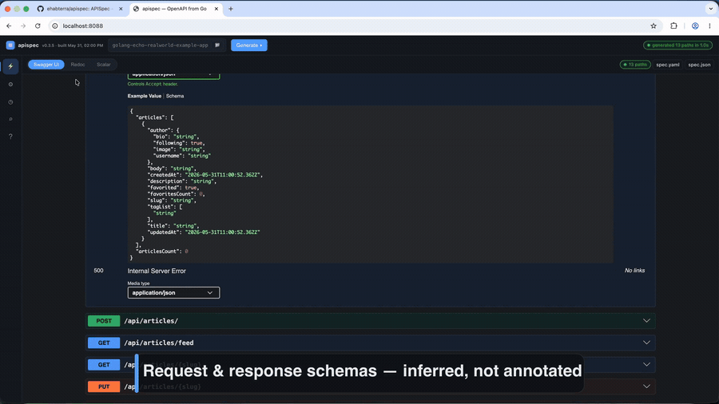
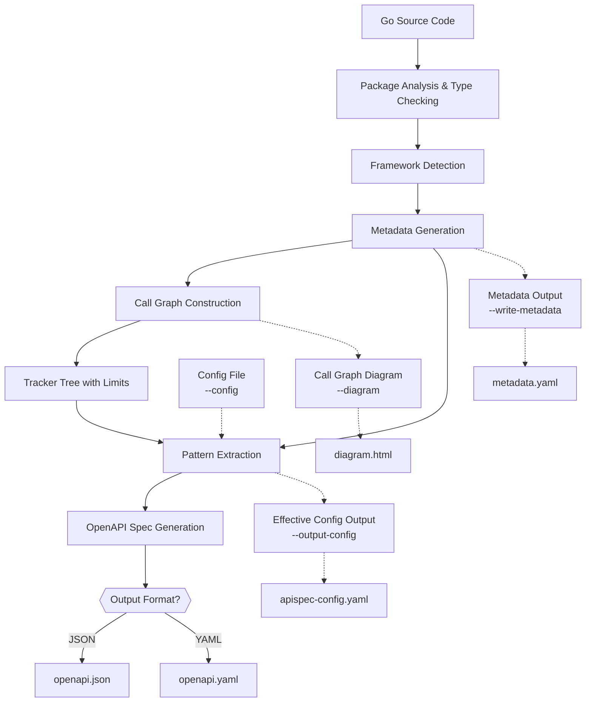

# APISpec: Generate OpenAPI from Go code

[](https://github.com/ehabterra/apispec)
[](https://go.dev/)
[](https://github.com/ehabterra/apispec/blob/main/LICENSE)
[](https://github.com/ehabterra/apispec/actions/workflows/ci.yml)
[](https://github.com/ehabterra/apispec/actions/workflows/test.yml)
[](https://github.com/ehabterra/apispec/actions/workflows/lint.yml)
[](https://pkg.go.dev/github.com/ehabterra/apispec)
[](https://github.com/ehabterra/apispec/releases)

<!-- markdownlint-disable MD033 -->
<div align="center">
  
</div>
<!-- markdownlint-enable MD033 -->

**APISpec** analyzes your Go source and generates an OpenAPI 3.1 spec (YAML or JSON). It detects routes for popular frameworks (Gin, Echo, Chi, Fiber, Gorilla Mux, `net/http`), follows the call graph to the real handlers, and infers request/response types from actual code — struct tags, literals, generics, and more.

**At a glance**

- **No annotations required** — nothing to add to your code: routes, parameters and bodies come from the AST and the call graph, not from a parallel set of comments you have to keep in sync. (Doc comments you already write are used for `summary`/`description` when they are there.)
- **OpenAPI 3.1** output as YAML or JSON.
- **Six routers out of the box** — Gin, Echo, Chi, Fiber, Gorilla Mux, and `net/http` (including Go 1.22 `ServeMux` method-aware patterns, `{id}` wildcards and `r.PathValue`), plus mixed multi-framework projects in one binary.
- **Your own router, detected automatically** — house wrapper types and house contexts (`func (r *Router) Get(...)`, `ctx.JSON/Bind/Query`) need no configuration.
- **Request bodies** from `json.Decode`/`Unmarshal`, framework binders, custom wrapper helpers, and form / multipart file uploads (`multipart/form-data` vs `x-www-form-urlencoded`).
- **Responses and status codes** per branch — conditional statuses, envelopes, generic wrappers, map-literal payloads, and interface-typed bodies resolved to the concrete type actually written.
- **Parameters** in path, query, header, cookie and form position.
- **Auth and security detection** — bearer/JWT, basic and apiKey schemes, with middleware followed through router-wide `Use`, group closures, per-route chains and handler wrappers.
- **Type-aware schemas** — generics (including inferred instantiations), aliases, enums from constants, fixed-size arrays, pointers, embedded and inline structs, and external package types.
- **Validation constraints** from `go-playground/validator` tags — `required`, formats, patterns, and length/value/item bounds routed by field type.
- **Doc comments** on handlers become the operation `summary` and `description`.
- **Deterministic output** — regenerating an unchanged project yields a byte-identical file, so the spec can be committed and diffed in CI without false failures.
- **Debuggable when a route is missed** — call-graph diagram, metadata dump, and an insight report that says *why* a response has no body rather than only that it doesn't.
- **Extensible without forking** — framework behaviour is regex patterns in YAML; adding a router touches no core logic.

**TL;DR**: Point APISpec at your module. Get an OpenAPI spec — plus, optionally, an interactive call-graph diagram and a browser-based config UI.

📖 **Documentation:** [apispec.ehabterra.com](https://apispec.ehabterra.com) — installation,
CLI reference, configuration, CI drift checking, and per-framework walkthroughs that show the
spec APISpec actually produces for each router.

Coming from an annotation-based tool? See [APISpec vs swaggo/swag](https://apispec.ehabterra.com/vs/swaggo/),
or [the wider landscape](https://apispec.ehabterra.com/alternatives/) if you are still choosing.

## Table of Contents

- [Demo](#demo)
- [Why APISpec](#why-apispec)
- [Quick Start](#quick-start)
- [The Tools](#the-tools)
  - [`apispec` — CLI generator](#apispec--cli-generator)
  - [`apispecui` — Browser-based config & preview](#apispecui--browser-based-config--preview)
  - [`apidiag` — Interactive call-graph server (standalone)](#apidiag--interactive-call-graph-server-standalone)
- [Framework Support](#framework-support)
- [Go Language Support](#go-language-support)
- [How It Works](#how-it-works)
  - [The pipeline, step by step](#the-pipeline-step-by-step)
- [Configuration](#configuration)
  - [Scoping a pattern to where the call is made](#scoping-a-pattern-to-where-the-call-is-made)
  - [Automatic wrapper detection](#automatic-wrapper-detection)
- [Programmatic Usage](#programmatic-usage)
- [Performance & Limits](#performance--limits)
- [Development](#development)
- [Documentation](#documentation)
- [Forks & derivatives](#forks--derivatives)
- [License](#license)

## Demo



[](https://youtu.be/PEG8gDXeOGE)

▶︎ **Full 2-minute walkthrough on YouTube** — Install → Generate → Explore → Configure → Insight.

<sub>Earlier end-to-end demo (e-commerce app): <a href="https://youtu.be/lkKO-a0-ZTU">youtu.be/lkKO-a0-ZTU</a></sub>

## Why APISpec

- **Generated from real code.** Routes, parameters, request bodies, and responses are inferred by analyzing the AST and walking the call graph — not from comments or hand-written annotations that drift out of sync.
- **Framework-aware.** Out-of-the-box detection for Gin, Echo, Chi, Fiber, Gorilla Mux, and `net/http`.
- **Auth-aware.** Detects which routes are protected and by what scheme — framework-agnostic, driven by the same config-pattern system. Recognises common JWT/auth libraries with zero config, follows middleware through groups, per-route chains, and handler wrappers, and warns (with a UI picker in `apispecui`) when a custom middleware needs a scheme mapping.
- **Extensible.** Framework behavior is described as regex-based patterns in YAML, so adding or tweaking a framework doesn't require touching core logic.
- **Type-aware.** Resolves aliases and enums to their underlying primitives, maps validator tags (`go-playground/validator`) to OpenAPI constraints, and handles generics, arrays (`[16]byte`, `[...]int`), pointer dereferencing, and external package types.
- **Visualizable.** Optional HTML call-graph diagram and a separate paginated diagram server for large codebases.

## Quick Start

### Install

```bash
# Homebrew (macOS/Linux) — nothing to compile; pulls in Go, which apispec needs to run
brew install ehabterra/tap/apispec      # the CLI
brew install ehabterra/tap/apispecui    # the web UI

# or with Go
go install github.com/ehabterra/apispec/cmd/apispec@latest
go install github.com/ehabterra/apispec/cmd/apispecui@latest

# Make sure your Go bin is on PATH:
export PATH=$HOME/go/bin:$PATH
```

Both tools are published the same way — Homebrew, pre-built binaries for six
platforms, `go install`, from source, or the install script. See
[docs/INSTALLATION.md](docs/INSTALLATION.md), or the
[installation guide on the site](https://apispec.ehabterra.com/docs/#install).

### Generate an OpenAPI spec

Run from inside your Go module:

```bash
# YAML output (framework auto-detected)
apispec --output openapi.yaml

# JSON output
apispec --output openapi.json

# With a custom config and a call-graph diagram
apispec --config apispec.yaml --output openapi.yaml --diagram diagram.html
```

That's it for most projects. See [Configuration](#configuration) for tuning and [The Tools](#the-tools) for the companion utilities.

## The Tools

APISpec ships three binaries that share the same analysis engine.

| Binary       | Purpose                                                                | Entry point                  |
|--------------|------------------------------------------------------------------------|------------------------------|
| `apispec`    | Generate an OpenAPI 3.1 spec from a Go module                          | `cmd/apispec`                |
| `apispecui`  | Browser UI: configure APISpec, preview the spec, *and* explore the call graph at `/diagram` | `cmd/apispecui` |
| `apidiag`    | Standalone interactive call-graph server (same engine, headless)       | `cmd/apidiag`                |

### `apispec` — CLI generator

The main generator. Auto-detects the framework, loads a default config (overridable with `--config`), and writes an OpenAPI spec.

```bash
# Basic
apispec --output openapi.yaml

# Generate metadata for debugging
apispec --output openapi.yaml --write-metadata

# Limit tuning for very large projects
apispec --output openapi.yaml \
        --max-nodes 100000 --max-children 1000 --max-recursion-depth 15

# Performance profiling
apispec --output openapi.yaml --cpu-profile --mem-profile

# Skip CGO packages (on by default)
apispec --output openapi.yaml --skip-cgo
```

#### Flag reference

| Flag                        | Shorthand | Description                                            | Default                         |
|-----------------------------|-----------|--------------------------------------------------------|---------------------------------|
| `--output`                  | `-o`      | Output path for the OpenAPI spec                       | `openapi.json`                  |
| `--dir`                     | `-d`      | Directory to parse                                     | `.`                             |
| `--title`                   | `-t`      | API title                                              | `Generated API`                 |
| `--api-version`             | `-v`      | API version                                            | `1.0.0`                         |
| `--description`             | `-D`      | API description                                        | `""`                            |
| `--terms`                   | `-T`      | Terms of service URL                                   | `""`                            |
| `--contact-name`            | `-N`      | Contact name                                           | `Ehab`                          |
| `--contact-url`             | `-U`      | Contact URL                                            | `https://ehabterra.github.io/`  |
| `--contact-email`           | `-E`      | Contact email                                          | `ehabterra@hotmail.com`         |
| `--license-name`            | `-L`      | License name                                           | `""`                            |
| `--license-url`             | `-lu`     | License URL                                            | `""`                            |
| `--openapi-version`         | `-O`      | OpenAPI spec version                                   | `3.1.1`                         |
| `--config`                  | `-c`      | Path to custom config YAML                             | `""`                            |
| `--output-config`           | `-oc`     | Write the effective config to a YAML file              | `""`                            |
| `--write-metadata`          | `-w`      | Write `metadata.yaml` to disk                          | `false`                         |
| `--split-metadata`          | `-s`      | Write metadata as multiple files                       | `false`                         |
| `--diagram`                 | `-g`      | Write call-graph HTML to this path                     | `""`                            |
| `--paginated-diagram`       | `-pd`     | Use paginated rendering for the diagram                | `false`                         |
| `--diagram-page-size`       | `-dps`    | Nodes per page in paginated diagram (50–500)           | `100`                           |
| `--max-nodes`               | `-mn`     | Max nodes in the walk that finds route registrations   | `50000`                         |
| `--max-nodes-per-route`     |           | Max nodes expanded below one route registration (lazy engine) | `1000000`                |
| `--max-children`            | `-mc`     | Max children per node                                  | `500`                           |
| `--max-args`                | `-ma`     | Max arguments per function                             | `100`                           |
| `--max-nested-args`         | `-md`     | Max depth for nested arguments                         | `100`                           |
| `--max-recursion-depth`     | `-mrd`    | Max recursion depth (anti-loop)                        | `10`                            |
| `--max-instances-per-key`   |           | Max copies of one callee within an instance scope (lazy engine) | `100`                  |
| `--legacy-tracker`          |           | Use the legacy (eager) tracker tree instead of the default lazy tracker | `false`        |
| `--skip-cgo`                |           | Skip CGO packages                                      | `true`                          |
| `--include-file`            |           | Include files matching pattern (repeatable)            | `""`                            |
| `--include-package`         |           | Include packages matching pattern (repeatable)         | `""`                            |
| `--include-function`        |           | Include functions matching pattern (repeatable)        | `""`                            |
| `--include-type`            |           | Include types matching pattern (repeatable)            | `""`                            |
| `--exclude-file`            |           | Exclude files matching pattern (repeatable)            | `""`                            |
| `--exclude-package`         |           | Exclude packages matching pattern (repeatable)         | `""`                            |
| `--exclude-function`        |           | Exclude functions matching pattern (repeatable)        | `""`                            |
| `--exclude-type`            |           | Exclude types matching pattern (repeatable)            | `""`                            |
| `--analyze-framework-dependencies` | `-afd` | Walk into framework packages during analysis     | `true`                          |
| `--auto-include-framework-packages` | `-aifp` | Auto-include known framework packages          | `true`                          |
| `--auto-exclude-tests`      | `-aet`    | Skip `*_test.go` files                                 | `true`                          |
| `--auto-exclude-mocks`      | `-aem`    | Skip mock files                                        | `true`                          |
| `--cpu-profile`             |           | Enable CPU profiling                                   | `false`                         |
| `--mem-profile`             |           | Enable memory profiling                                | `false`                         |
| `--block-profile`           |           | Enable block profiling                                 | `false`                         |
| `--mutex-profile`           |           | Enable mutex profiling                                 | `false`                         |
| `--trace-profile`           |           | Enable trace profiling                                 | `false`                         |
| `--custom-metrics`          |           | Enable custom metrics collection                       | `false`                         |
| `--profile-dir`             |           | Directory for profiling output                         | `profiles`                      |
| `--version`                 | `-V`      | Print version and exit                                 | `false`                         |

CLI flags always override values from a config file.

See also: [`cmd/apispec/README.md`](cmd/apispec/README.md).

### `apispecui` — Browser-based config & preview

`apispecui` is a small local web server that lets you configure APISpec interactively, generate a spec on demand, immediately preview it through embedded **Swagger UI**, **Redoc**, or **Scalar** viewers, *and* explore the project's call graph at `/diagram` — the same interactive, paginated visualization that `apidiag` provides, hosted on the same port and project.

Two things worth knowing before a first run on a large project:

- **Analysis engine** edits the expansion limits (see [Limits](#limits)), with the engine's defaults shown as placeholders. A project whose call tree is bigger than the default budget needs them raised.
- When expansion does stop early, the result says so — *"Expansion stopped at the 50000-node limit, so routes beyond that point are missing"* — so a truncated run no longer reads as a complete one with a short route list.

**Insight** (the ◷ tab) reports how the spec was produced, not just what is in it: which frameworks were detected and which one's patterns lead, what the CLI entry-point gate decided, and — per status code — how many responses describe their fields, are a free-form object, were found with an unresolved type, or document no body at all. The last split is the useful one: an empty body at `200` means the write was never followed, while an unresolved type means it was found and needs a type mapping.

```bash
# Install it the same way as apispec (see Install above)
brew install ehabterra/tap/apispecui
# or: go install github.com/ehabterra/apispec/cmd/apispecui@latest

apispecui --dir ./my-go-project

# Open http://localhost:8088 — config UI
# Open http://localhost:8088/diagram — call-graph visualization

# From a clone instead:
make build-ui && ./apispecui --dir ./my-go-project
```

Endpoints exposed:

| Path                        | Purpose                                                |
|-----------------------------|--------------------------------------------------------|
| `/`                         | Configuration UI                                       |
| `/swagger`                  | Swagger UI preview                                     |
| `/redoc`                    | Redoc preview                                          |
| `/scalar`                   | Scalar preview                                         |
| `/diagram`                  | Interactive call-graph / tracker-tree visualization    |
| `/api/spec.json`            | Last-generated spec (JSON)                             |
| `/api/spec.yaml`            | Last-generated spec (YAML)                             |
| `/api/config.yaml`          | Current effective config                               |
| `/api/generate` (POST)      | Trigger spec generation with the current config        |
| `/api/detect` (GET)         | Detected frameworks + a pre-filled config for the project |
| `/api/diagram/*`            | Paginated diagram API (same surface as `apidiag`)      |

The diagram lazily loads metadata on the first request and re-loads when the project directory is switched via the UI, so a single `apispecui` process covers both spec preview and graph debugging. The standalone `apidiag` binary is still shipped for headless use.

**Framework selection matches the CLI.** The UI composes the same
multi-framework config the CLI does — the detected primary, every other detected
framework merged in receiver-scoped, and the `net/http` surface underneath — so a
mixed project documents the same routes either way. The selector chooses which
framework *leads*; the rest still merge under it, and the form lists them
("Also detected: gin"). This matters more than it sounds: which framework is
primary comes from file-walk order, so a single stray file importing another
router can make a gin project detect as `mux`.

> **Note:** both binaries are gitignored build artifacts. After switching
> branches, rebuild *and restart* the server — a running `apispecui` keeps the
> code it started with, and a browser refresh will not pick up a new build.

Flags: `--host` (default `localhost`), `--port` (default `8088`), `--dir`/`-d` (project root, default `.`), `--config`/`-c` (initial config), `--verbose`.

### `apidiag` — Interactive call-graph server (standalone)

The same diagram server, packaged as its own binary. Use it when you want a dedicated graph explorer without the config UI, or to run it on its own host/port. Internally both binaries share `internal/diagserver`.

```bash
go install github.com/ehabterra/apispec/cmd/apidiag@latest
apidiag --dir ./my-go-project --port 8080
# Open http://localhost:8080
```

Features include package/function/file filtering, multiple export formats (SVG, PNG, PDF, JSON), and a JSON HTTP API for programmatic access.

See [`cmd/apidiag/README.md`](cmd/apidiag/README.md) for full documentation and a [demo video](https://youtu.be/UshBJ5-ayzA).

## Framework Support

| Framework         | Routes & methods | Path params | Groups / mounting | Request body | Responses | Auth |
|-------------------|:----------------:|:-----------:|:-----------------:|:------------:|:---------:|:----:|
| **[Gin](https://apispec.ehabterra.com/gin-openapi-generator/)**           | ✅               | ✅          | ✅                | ✅           | ✅        | ✅   |
| **[Echo](https://apispec.ehabterra.com/echo-openapi-generator/)**          | ✅               | ✅          | ✅                | ✅           | ✅        | ✅   |
| **[Chi](https://apispec.ehabterra.com/chi-openapi-generator/)**           | ✅               | ✅          | ✅ (incl. `render`) | ✅         | ✅        | ✅   |
| **[Fiber](https://apispec.ehabterra.com/fiber-openapi-generator/)**         | ✅               | ✅          | ✅                | ✅           | ✅        | ✅   |
| **[Gorilla Mux](https://apispec.ehabterra.com/gorilla-mux-openapi-generator/)**   | ✅               | ✅ (`mux.Vars(r)["id"]`, incl. helper-wrapped & `{id:regex}` → `pattern`) | ✅ (`PathPrefix`, `Subrouter`) | ✅ | ✅ | ✅ |
| **[`net/http`](https://apispec.ehabterra.com/net-http-openapi-generator/)**    | ✅ (`HandleFunc`, `Handle`; Go 1.22 method-aware patterns) | ✅ (`{id}` wildcards + `r.PathValue`) | basic | ✅ | ✅ | ✅ |

Conditional registration (dynamic routes built at runtime) is generally not supported.

### Mixed / multi-framework projects

One binary often serves more than one routing surface — a framework API next
to plain `net/http` ops endpoints (expvar/pprof-style), a gin API beside a
gorilla/mux admin router, or a half-migrated codebase. APISpec handles this
automatically:

- **All recognised frameworks are detected** (import scan), not just the
  first one. The first-seen framework is the *primary* — its defaults and
  info apply.
- **Every additional framework's patterns are merged in**, restricted to its
  receiver-scoped patterns, so each framework's registrations are documented.
- **The stdlib `net/http` surface is always layered underneath** — it never
  appears in `go.mod` and its import is universal, so it can't be "detected"
  as a second framework; instead a receiver-scoped subset of its config is
  always merged.

**Why receiver-scoped only?** A scoped pattern (e.g. *`Handle` on
`*mux.Router`*) can never claim another framework's calls, so merging is
safe by construction — inert unless that framework is actually routing.
Unscoped patterns are *not* merged from secondaries because precedence can't
make them safe: gin's `Handle(method, path, h)` and mux's `Handle(path, h)`
would each misparse the other's calls, and `net/http`'s JSON response
catch-all would misread fiber's status-less `c.JSON(obj)`.

**What this does and doesn't mean:**

| Scenario | Supported? |
|---|---|
| Framework API + plain `net/http` ServeMux endpoints in one binary | ✅ both documented |
| Two frameworks side by side (e.g. gin API + mux admin router) | ✅ both documented, correct verbs |
| Raw `*http.Request` reads (headers, query, `PathValue`) inside framework handlers | ✅ documented as parameters |
| A framework router **mounted under** a `net/http` mux (`root.Handle("/api/", http.StripPrefix("/api", chiRouter))`) | ✅ the mount prefix composes across the boundary (`/api/users`) |
| Mounts wired through a *secondary* framework's own `Mount`-style calls | ✅ those patterns are receiver-scoped in their home configs, so they survive the merge |
| Which framework is *primary* changing the output (it is decided by file-walk order) | ✅ it doesn't — every framework keeps its own patterns and type mappings whether or not it leads, pinned by a rename-invariance test |
| A user-supplied `--config` | framework **patterns** are never auto-augmented — what you write is what matches. Library *presets* still apply on top (auth-scheme mappings by import, and CLI entrypoint fields), since those add knowledge about dependencies rather than changing your patterns |

## Go Language Support

APISpec aims for practical coverage of real-world Go services. A quick survey of what's handled:

**Supported**

- Import and type aliases (resolved to underlying primitives).
- Enum resolution from constants, `enum` tags, or `oneof` validator tags.
- Assignment & alias tracking: `:=`, `=`, multi-assign, tuple returns, alias chains, latest-wins shadowing.
- Composite literals, maps, slices, fixed-size and variable-length arrays (`[16]byte`, `[5]int`, `[...]int`).
- Pointers and automatic dereferencing.
- Selectors and nested field access (`pkg.Type.Field`).
- Struct fields, embedded fields, tag-based metadata (`json`, `xml`, `form`, `validate`, …).
- Inline (anonymous) struct types — used as request/response bodies via local `var req struct{...}` declarations *and* as nested struct fields. Captured structurally from `go/types`, so the inline schema shows real properties, honours JSON tags, and resolves named field types to `$ref`s.
- Function & method return types resolved from signatures.
- Function literals (anonymous handlers).
- Generics on functions (concrete types mapped at call sites).
- Generic *types* (parametric structs) — an envelope instantiated with concrete arguments resolves to its own component with the type argument substituted into the parametric field (`Items []T` → array of `$ref User`, `Data T` → `$ref User`), and distinct instantiations of the same generic (`Page[User]` vs `Page[Product]`) get distinct schemas rather than collapsing onto a shared placeholder. Covers written instantiations (`Page[User]{…}`), multi-parameter generics (`Pair[User, Product]`), nested generics (`Envelope[Page[User]]`), compiler-**inferred** instantiations from a generic constructor (`NewEnvelope(product)` → `Envelope[Product]`), and a generic type used as a struct field (`Wrapper{ Page Page[User] }`) — on both request and response bodies, where the same instantiation keys to a single shared component. See `testdata/generic_structs/`. *Not yet:* payloads whose type argument only exists behind a helper that erases it to `interface{}`/`any` (`respondWithSuccess(w, data any)` writing `APIResponse[any]{Data: data}`) render as a generic object — the argument is genuinely `interface{}` at the encode site; and aliases / defined types over an instantiation (`type UserPage = Page[User]`) are not expanded. Cross-package type arguments resolve but the component name drops the argument's package.
- Interface types and methods (unresolved dynamic values rendered generically).
- Parameter tracing across the call graph; arguments mapped to parameters.
- Method chaining and nested call expressions.
- Conditional response status codes — when a status variable is reassigned across `if`/`else` branches with distinct HTTP codes, APISpec emits one response per status, sharing the body schema.
- Wrapper/envelope response specialisation — when a handler's payload flows through a shared helper whose field is declared `interface{}`/`any` (e.g. `RespondWithSuccess(w, msg, data, code)` → `NewEnvelope{Data: data}`), APISpec recovers the concrete per-route payload type from the call site and emits an `allOf` of the base envelope `$ref` plus a `data` override, instead of a generic `object`.
- Map-literal envelopes — a response written as a map composite literal with constant string keys (`json.NewEncoder(w).Encode(map[string]any{"cost_codes": items, "meta": m})`) is documented as an object with those `properties`, each value resolved to its own type — so the payload keeps its `$ref` instead of collapsing to `additionalProperties: {type: object}`, which is all the *type* `map[string]any` can say. A key that is not a constant (a variable key) leaves `additionalProperties` alongside the keys that did resolve, rather than claiming the unknown ones cannot occur; a map with no literal at the write (built at runtime) or with non-string keys is unchanged. See `testdata/map_literal_envelope/`.
- Interface-typed response bodies — when a handler encodes an interface-typed variable (`var a Animal = Dog{}; json.NewEncoder(w).Encode(a)`, or `var a Animal; a = Dog{}`), the schema documents the **concrete** type statically assigned to it (`Dog`) rather than the empty interface. When the handler assigns more than one concrete type on different branches the result is ambiguous, so the interface is kept (honest over wrong). A concrete value returned through a function whose declared return type is the interface (`Encode(makeAnimal())` where `makeAnimal() Animal { return Dog{} }`) resolves via the callee's return value. A value passed into a helper through an interface parameter — named (`writeAnimal(w, v Animal)`) or `interface{}`/`any` — resolves to the concrete argument bound at the call site. Embedded-interface handler dispatch (the DI/clean-architecture `Handlers{ AuthorHandler }` pattern) also resolves to the concrete implementation. See `testdata/interface_response/`. In every case, when the concrete type is genuinely ambiguous (several concrete types on different branches) the interface is kept rather than guessed.
- External package types automatically resolved to underlying primitives (with `externalTypes` for custom overrides).
- `go-playground/validator` (`validate:`) tags mapped to OpenAPI constraints — `required`, formats (`email`, `uuid`, …), patterns, and length/value/item constraints that route by field type: `min`/`max` on a string → `minLength`/`maxLength`, on a number → `minimum`/`maximum`, on a slice → `minItems`/`maxItems`. The `dive` tag applies post-`dive` rules to slice/map **elements** (`items.*`). Struct-level (cross-field) rules on a blank marker field (`_ struct{} \`validate:"gtefield=Min"\``) surface as a schema `description` note. A decoded JSON request body is marked `required: true`.
- Handler Go doc comments mapped to the operation `summary` (first line) and `description` (remaining lines).
- CGO packages can be skipped to avoid build errors.
- Dependency-injected route groups.
- Go 1.22 `net/http.ServeMux` method-aware routing — patterns that carry the verb on the registration (`mux.HandleFunc("GET /users/{id}", getUser)`) are split into method + path, `{id}` wildcards become path parameters, and `r.PathValue("id")` is recognised as a path parameter. ServeMux-only syntax (`{path...}` trailing wildcards, the `{$}` end-of-path anchor) is normalised to OpenAPI templating. See `testdata/servemux/`.
- Method dispatch in the handler — a single handler registered without a verb (`http.HandleFunc("/users", h)`) that branches on `r.Method` (`switch r.Method { case http.MethodGet: … }` or an `if r.Method == …` chain) is split into one operation per HTTP method, with each branch's request body and responses attributed to its own method (by source position) and unique operationIds. `http.MethodXxx` constants, plain `"GET"` literals, and multi-method cases (`case http.MethodGet, http.MethodHead:`) all resolve. See `testdata/method_switch/`. *Not yet:* two branches returning the same status code with different bodies (the shared status slot keeps one), and dispatch inside a receiver-method handler.
- Handler factories — a route registered as a *call* that returns the framework's handler type (`g.POST("/users", h.Create())` where `Create() echo.HandlerFunc { return func(c) {…} }`), including when the handler is dispatched through an interface whose implementation lives in a different package.
- Function-local named types used as request/response bodies (`type Login struct{…}` declared inside a handler) — captured from the function body and emitted as real component schemas rather than dangling `$ref`s.
- Request bodies bound through a custom wrapper (`util.ReadRequest(c, &dto)` → `ctx.Bind(dto)`) — the concrete type is traced through the wrapper's parameters.
- Form and file-upload request bodies — form reads on a body-bearing method become a request body (query parameters on `GET`, where Go's `FormValue` reads the URL). The media type follows how the handler parses the body: a file part (`r.FormFile("avatar")`, `c.FormFile(…)`) or an explicit `r.ParseMultipartForm` / `c.MultipartForm()` makes it `multipart/form-data` with the file as `type: string, format: binary`, and plain form values alone stay `application/x-www-form-urlencoded`. See `testdata/multipart_upload/`, `testdata/multipart_upload_gin/`.
- **CLI-dispatched services** — when the routing code hangs off a command library's callback (`&cli.Command{Action: runWeb}`, `&cobra.Command{RunE: runServe}`), the dispatcher that invokes it lives inside the library, so no call edge reaches the registration and such a project used to document **nothing**. APISpec treats those fields as *entrypoints*, roots the function they hold, and documents everything below it. Presets ship for **urfave/cli** v1/v2/v3, **spf13/cobra** (`Run`/`RunE` and the Pre/Post hooks) and **peterbourgon/ff** (ffcli `Exec`), keyed on the project's imports; a house dispatcher declares its own field via `entrypointPatterns`. Only entrypoints that are otherwise unreachable *and* whose subtree actually registers routes are rooted, so a CLI with 50 subcommands pays for the one that serves HTTP. See `testdata/cli_entrypoint_routes/` (real urfave/cli), `testdata/cobra_entrypoint_routes/` (real cobra).
- Route registration behind a **func-typed struct field** invoked in-module (`app.Commands = []*Command{{Action: runWeb}}`, and the same shape for any house dispatcher) — the field's recorded values are followed into the functions they hold, including a package-level command var, a cross-package function value, a method value, and an inline closure. See `testdata/cli_action_routes/`, `testdata/cli_action_cross_package/`.
- **House routers and house contexts, detected automatically** — a project that puts its own type in front of the framework (`func (r *Router) Get(pattern string, h ...any)` delegating to chi, and a `Ctx` whose `JSON`/`Bind`/`Query` methods answer, decode and read parameters) is documented with **no configuration**. See [Automatic wrapper detection](#automatic-wrapper-detection).
- Authentication / security detection — see [Security & authentication detection](#security--authentication). Protected routes get a per-operation `security` requirement and the scheme is registered under `components.securitySchemes`; explicitly-public routes render `security: []`. Middleware is followed across router-wide `Use`, group/subtree closures, per-route chains (chi `With`), and handler wrappers (`net/http`, mux), including look-through into wrapper bodies that call a known auth library.

**Partial / not yet supported**

- Same path + same status code with different schemas — not yet supported.
- Receiver/parent type tracing is limited; `Decode` on non-body targets may be misclassified (see [Request body source disambiguation](#request-body-source-disambiguation)).
- Only `go-playground/validator`-style `validate:` tags are read; Gin/Echo `binding:` tags and comparison validators (`gt`/`gte`/`lt`/`lte`) are not yet mapped.
- Routes registered from a **table** rather than a call (`for _, r := range routes { adapter.Add(r.Method, r.Path, r.Handler) }`) — the paths exist only as runtime values, so no pattern can recover them.
- House routers whose registration is **chained through a returned object** (gitea's `Combo("/x").Get(h).Post(h)`, where the path is held by the object rather than passed to each call) are reported as detected-but-incomplete and left unapplied, rather than guessed at.
- Command libraries that dispatch through a **factory map** (`mitchellh/cli`, `hashicorp/cli`) or through **reflection-invoked methods** (`alecthomas/kong`) are not covered by `entrypointPatterns`, which names struct fields.

### Selected capability highlights

<details>
<summary><strong>Type alias and enum resolution</strong></summary>

```go
type AllowedUserType string

const (
    UserTypeAdmin    AllowedUserType = "admin"
    UserTypeCustomer AllowedUserType = "user"
)

type Permission struct {
    AllowedUserTypes []domain.AllowedUserType // → []string in the schema
}

type UserID *int64
type User struct {
    ID UserID // → integer / int64
}
```

A field's enum is built from the constants declared with **that** type. Two types sharing an underlying type (`type Status string` and `type Band string`, or two `= string` aliases) are different types, so one never lends its values to the other — and where the values genuinely cannot be attributed to one type, no enum is emitted rather than a guess. See `testdata/enum_alias_ambiguity/`.

</details>

<details>
<summary><strong>Array support</strong></summary>

```go
type User struct {
    ID     [16]byte   // string, format: byte, maxLength: 16
    Scores [5]int     // array, minItems/maxItems: 5
    Tags   [10]string // array, minItems/maxItems: 10
}

type Config struct {
    Values [...]int   // array, no size constraint
}
```

</details>

<details>
<summary><strong>External type resolution</strong></summary>

External package types (e.g. `uuid.UUID`) are resolved to primitives automatically; internal project types are kept as `$ref` schemas. Pointers to external types resolve to the same primitive schema. Complex external types can be described explicitly via `externalTypes` in config.

</details>

<details>
<summary><strong>Validator tag support</strong></summary>

| Validator tag        | OpenAPI mapping                       |
|----------------------|---------------------------------------|
| `required`           | `required: true`                      |
| `omitempty`          | `required: false`                     |
| `min=N`              | `minimum: N`                          |
| `max=N`              | `maximum: N`                          |
| `len=N`              | `minLength: N, maxLength: N`          |
| `email`              | `format: email`                       |
| `url`                | `format: uri`                         |
| `uuid`               | `format: uuid`                        |
| `oneof=a b`          | `enum: [a, b]`                        |
| `alphanum`           | `pattern: "^[a-zA-Z0-9]+$"`           |
| `alpha`              | `pattern: "^[a-zA-Z]+$"`              |
| `numeric`            | `pattern: "^[0-9]+$"`                 |
| `containsany=chars`  | `pattern: ".*[chars].*"`              |
| `e164`               | `pattern: "^\\+[1-9]\\d{1,14}$"`      |
| `dive`               | rules after it apply to the **elements** (`items.*`) |

</details>

<details>
<summary><strong>Function literals as handlers</strong></summary>

```go
router.POST("/users", func(c *gin.Context) {
    var user CreateUserRequest
    if err := c.ShouldBindJSON(&user); err != nil {
        c.JSON(400, gin.H{"error": err.Error()})
        return
    }
    c.JSON(201, user)
})
```

The body and response types are analyzed even for anonymous handlers.

</details>

<details>
<summary><strong>Go 1.22 <code>net/http.ServeMux</code> method-aware routing</strong></summary>

```go
mux := http.NewServeMux()
mux.HandleFunc("GET /users/{id}", getUser) // method + wildcard
mux.HandleFunc("POST /users", createUser)
mux.HandleFunc("GET /health", health)

func getUser(w http.ResponseWriter, r *http.Request) {
    id := r.PathValue("id") // → path parameter "id"
    // ...
}
```

The HTTP method is parsed off the registration pattern, so `GET /users/{id}`
becomes a `GET` operation on `/users/{id}` with an `id` path parameter, and
`POST /users` becomes a `POST` with its request body inferred as usual. Calls to
`r.PathValue("id")` inside the handler are recognised as path parameters.
ServeMux-only syntax is normalised to OpenAPI templating: trailing wildcards
`{path...}` collapse to `{path}` and the `{$}` end-of-path anchor is dropped.
See `testdata/servemux/` for a worked example.

</details>

<details>
<summary><strong>Inline anonymous struct request / response bodies</strong></summary>

```go
func createOrder(w http.ResponseWriter, r *http.Request) {
    var req struct {
        Items []itemReq `json:"items"`
    }
    if err := render.DecodeJSON(r.Body, &req); err != nil {
        http.Error(w, "invalid JSON", http.StatusBadRequest)
        return
    }
    // ...
}
```

APISpec captures the local `struct{...}` type structurally from `go/types`,
emits an inline `object` schema on the `requestBody`, and promotes named
field types (`itemReq` here) to their own components with `$ref`. Nested
anonymous structs stay inlined. See `testdata/anonymous_struct/` for a
worked example covering primitive fields, named-type fields, nested
inline structs, and inline response bodies.

</details>

<details>
<summary><strong>Wrapper / envelope response specialisation</strong></summary>

Many services wrap every response in a shared envelope whose payload field
is `interface{}` — so the concrete type is only knowable at the call site:

```go
type Envelope struct {
    Message string      `json:"message"`
    Data    interface{} `json:"data"`
    Code    int         `json:"code"`
}

func NewEnvelope(message string, data interface{}, code int) *Envelope {
    return &Envelope{Message: message, Data: data, Code: code}
}

func RespondWithSuccess(w http.ResponseWriter, message string, data interface{}, code int) {
    response := NewEnvelope(message, data, code)
    _ = json.NewEncoder(w).Encode(response)
}

func listOrders(w http.ResponseWriter, r *http.Request) {
    common.RespondWithSuccess(w, "ok", orders.Order{...}, http.StatusOK)
}
```

APISpec follows the assignment + constructor + parameter chain
(`response` → `NewEnvelope`'s return literal → the `Data` field's bound
parameter → the helper's `ParamArgMap`) to recover the caller-site payload
type, then composes a per-route schema:

```yaml
allOf:
  - $ref: '#/components/schemas/Envelope'   # base wrapper (message, code, …)
  - type: object
    properties:
      data:
        $ref: '#/components/schemas/Order'   # recovered per-route payload
```

Only genuinely generic fields (`interface{}`/`any`) are overridden;
concrete fields like `message`/`code` keep rendering from the base schema.
The recovered payload type is always registered as a component, so the
`data` `$ref` never dangles. See `testdata/wrapped_response/` for a worked
example (composite-literal payloads *and* a `var`-declared DTO with a
`[]any` field passed by value).

</details>

<!-- markdownlint-disable MD033 -->
<a id="security--authentication-detection"></a>
<!-- markdownlint-enable MD033 -->

<details>
<summary><strong>Security / authentication detection</strong></summary>

APISpec detects auth middleware and marks the routes it protects, framework-agnostically. Detection has two halves, both config-driven:

- **Scope** (`framework.securityPatterns`) — recognises *how* middleware is applied and how far it reaches: `router` (chi/echo/gin/mux `Use`), `subtree` (group/route closures), `route` (chi `With`, per-route middleware args), and `wrapper` (a handler wrapped by an auth function, e.g. `net/http`/mux).
- **Identity → scheme** (`securityMappings`) — resolves the *which middleware* to one or more OpenAPI security requirements, by function name, package, and/or receiver type.

```go
r := chi.NewRouter()
r.Get("/health", health)              // open

r.Group(func(r chi.Router) {
    r.Use(jwtauth.Verifier(tokenAuth)) // subtree-wide auth
    r.Get("/me", me)                   // → security: [{ bearerAuth: [] }]
})

r.With(authMiddleware).Get("/admin", admin) // per-route chain → protected
```

Common JWT/auth libraries are recognised with **zero config** via an import detector (echo-jwt, appleboy/gin-jwt, gofiber/contrib/jwt, golang-jwt validation calls, and more) — the scheme is registered under `components.securitySchemes` and attached per operation. Explicitly-public routes (skipper / `AllowUnauthenticated` style middleware) render `security: []`.

When a custom middleware can't be mapped to a scheme automatically, `apispec` **warns and lists** the unresolved middleware; `apispecui` surfaces the same list with a picker to assign a scheme interactively. To map one yourself:

```yaml
securityMappings:
  - functionNameRegex: ^authMiddleware$
    recvTypeRegex: Handler           # optional: method-value middleware
    schemes:
      - { bearerAuth: [] }           # entries here are ANDed
  # OR alternatives (any one satisfies):
  - functionNameRegex: ^New$
    pkgRegex: github\.com/golang-jwt/.*
    schemesAnyOf:
      - [ { bearerAuth: [] } ]
      - [ { apiKeyAuth: [] } ]
  # Mark a middleware as making routes explicitly public:
  - functionNameRegex: ^AllowPublic$
    public: true
  # Mark a middleware as known non-auth so it's not reported as unresolved
  # (logging, CORS, recovery, request-id, …). Emits no scheme, changes no
  # security — just silences the warning. Mutually exclusive with schemes, schemesAnyOf, and public:
  - functionNameRegex: ^(Logger|Recoverer|RequestID)$
    pkgRegex: github\.com/go-chi/chi/v5/middleware
    skip: true
```

Well-known non-auth middleware from the major frameworks' own middleware packages (chi, echo, gin/gin-contrib, fiber, gorilla/handlers) is **skipped automatically** by import-gated presets, so the unresolved list stays focused on middleware that's genuinely yours to map. In `apispecui`, each item in the unresolved list also has a one-click **Skip** button.

See `testdata/auth_*` for worked fixtures across chi (`With`), echo groups, gin per-route, fiber groups, mux subrouters, and `net/http` wrappers.

</details>

## How It Works


```mermaid
graph TD
    A[Go Source Code] --> B[Package Analysis & Type Checking]
    B --> C[Framework Detection]
    C --> D[Metadata Generation]
    D --> E[Call Graph Construction]
    E --> F[Tracker Tree with Limits]

    G[Config File<br/>--config] -.-> H[Pattern Extraction]
    F --> H
    D --> H

    H --> I[OpenAPI Spec Generation]
    I --> J{{Output Format?}}
    J -->|JSON| K[openapi.json]
    J -->|YAML| L[openapi.yaml]

    E -.-> M[Call Graph Diagram<br/>--diagram]
    M -.-> N[diagram.html]

    H -.-> O[Effective Config Output<br/>--output-config]
    O -.-> P[apispec-config.yaml]

    D -.-> Q[Metadata Output<br/>--write-metadata]
    Q -.-> R[metadata.yaml]
```

### The pipeline, step by step

APISpec turns Go source into an OpenAPI document through a fixed sequence of stages. Each stage below is described by its **role** (what it does), its **purpose** (why it exists in the pipeline), and its **importance** (what it enables, and what breaks without it). Every stage consumes the output of the previous one, so a weakness early on shows up as a missing route or a dangling `$ref` at the end.

**1. Locate the module and select sources**
- *Role:* Resolve the input directory, walk up to the enclosing `go.mod` to find the module root and import path, then apply include/exclude package and file filters.
- *Purpose:* Fix the analysis boundary (what to read) and the module import path (used to fully-qualify every type name in the output).
- *Importance:* The module path is the namespace for every schema `$ref`; get it wrong and types resolve to the wrong package or dangle. Filters keep large monorepos analyzable by excluding code that can't contain routes.

**2. Load and type-check the packages**
- *Role:* Load every in-scope package with `go/packages` requesting full syntax **and** type information, so the Go type checker (`go/types`) runs over the whole set.
- *Purpose:* Give every expression, field, and call a *resolved* type — the ground truth the rest of the pipeline reads instead of guessing from names.
- *Importance:* This is why APISpec understands real Go semantics — generics, type aliases, embedded fields, interface implementations, and cross-package types — rather than pattern-matching strings. Packages that fail to type-check are skipped (and reported) so one broken dependency doesn't abort the run.

**3. Detect the framework**
- *Role:* Inspect the module's dependencies to identify the web framework in use (Gin, Echo, Chi, Fiber, Gorilla Mux, or plain `net/http`).
- *Purpose:* Choose the default pattern set that describes how *that* framework registers routes, params, bodies, and responses.
- *Importance:* Every framework expresses the same concept ("GET /users/{id} → handler") with different API calls. Detection picks the config that already knows those idioms, so the common case needs zero hand-written patterns.

**4. Load and merge the configuration**
- *Role:* Layer configuration deterministically: framework default → `--config` file → CLI/programmatic overrides → auto-applied security/auth presets (selected from the project's imports, e.g. `golang-jwt`). Later layers win.
- *Purpose:* Produce a single **effective, framework-agnostic** config that drives extraction — route/param/body/response patterns plus OpenAPI `info`, type mappings, external types, and security schemes.
- *Importance:* The engine itself is generic; *all* framework- and project-specific knowledge lives in this config. The layering lets defaults "just work" while allowing surgical overrides without forking the engine. `--output-config` writes this merged result so you can see exactly what ran.

**5. Generate metadata**
- *Role:* Walk the type-checked ASTs into one normalized, string-interned model: packages, types (fields, JSON tags, declared type parameters), functions, a call graph of caller→callee edges, per-variable assignments, and the structured arguments of every call.
- *Purpose:* Collapse scattered AST and `go/types` facts into a single queryable, deterministic, serializable structure that every later stage reads.
- *Importance:* Nothing downstream touches the raw AST again — metadata is the substrate. String-pooling plus sorted iteration at every boundary make the output **deterministic** (clean release diffs and reliable golden tests), and `--write-metadata` dumps this model so a missed route can be debugged.

**6. Build the tracker tree**
- *Role:* Starting from each route-registration call site, expand the call graph down to the actual handler and the calls made inside it — through wrappers, groups, mounts, handler factories, and helper functions — bounded by engine-specific limits (see [Performance & Limits](#performance--limits)). The default **lazy** tree expands subtrees on demand and is bounded by `--max-nodes` (finding registrations) / `--max-nodes-per-route` (detail below one) / `--max-children`/`--max-args`/`--max-instances-per-key`; the eager tree (`--legacy-tracker`) materializes them up front and additionally honors `--max-recursion-depth` and `--max-nested-args`.
- *Purpose:* Connect a route to the concrete code that actually serves it, following real control flow rather than assuming the handler lives where the route is declared.
- *Importance:* In real codebases the handler is rarely at the registration site — it's behind middleware, a group closure, a mounted sub-router, or a factory. This traversal is what makes detection work across those styles. The bounds are the safety brake that turns a pathological (deep or cyclic) call graph into a truncation warning instead of a hang or out-of-memory.

**7. Extract patterns**
- *Role:* Match the configured framework patterns against the tracker tree to identify each route's method and path, its path/query parameters, its request body, and its responses — then resolve every one to a concrete Go type (dereferencing pointers, unwrapping aliases/enums, applying external-type mappings, and substituting generic type arguments).
- *Purpose:* Translate raw calls ("this site registers `GET /users/{id}` and encodes a `Page[User]`") into structured, typed route facts.
- *Importance:* This is where source code becomes API semantics. The fidelity of the final schema is decided here: correct path-parameter names, truthful response status codes, and fully-resolved types (including generic envelopes like `Page[User]`, nested `Envelope[Page[User]]`, and inferred instantiations).

**8. Map to OpenAPI**
- *Role:* Assemble the OpenAPI 3.1 object from the route facts and resolved types — paths and operations, request/response content, reusable component schemas (promoting named types to `$ref`s), and security requirements/schemes — while deduplicating and merging (e.g. dropping mount prefixes subsumed by a longer path, pairing status codes to bodies).
- *Purpose:* Convert typed route facts into a single valid, well-formed specification document.
- *Importance:* This stage produces the deliverable. Schema promotion and `$ref` handling, security wiring, and dedup here are what make the spec valid (no dangling references), clean (no duplicate or placeholder schemas), and non-redundant.

**9. Serialize the specification**
- *Role:* Marshal the OpenAPI object to YAML or JSON, chosen by the `--output` file extension.
- *Purpose:* Emit the file that downstream tools consume — Redoc/Swagger UI, client/server code generators, and contract tests.
- *Importance:* Serialization is deterministic (stable key ordering), so regenerating an unchanged project yields a byte-identical file — the foundation for meaningful diffs and golden-file CI.

**10. Emit side outputs and diagnostics (optional but valuable)**
- *Role:* On request, write the interactive call-graph diagram (`--diagram`), the effective merged config (`--output-config`), and/or the metadata dump (`--write-metadata`); always surface diagnostics — middleware detected but not mapped to a security scheme, path-parameter key mismatches, and packages skipped due to errors.
- *Purpose:* Make the analysis inspectable and its gaps visible instead of silent.
- *Importance:* This is the debuggability layer. When a route is missed or a type won't resolve, these artifacts are how you find out *why* — the difference between "it didn't work" and a fixable, located cause.

## Configuration

APISpec uses YAML configuration files to describe framework patterns and OpenAPI metadata. For most projects the bundled defaults are enough; provide `--config` only when you need to extend or override them.

📖 See [`docs/CONFIGURATION.md`](docs/CONFIGURATION.md) for the full field-by-field configuration reference.

### Minimal example (Gin)

```yaml
info:
  title: My API
  version: 1.0.0
  description: A comprehensive API for user management

framework:
  routePatterns:
    - callRegex: ^(?i)(GET|POST|PUT|DELETE|PATCH|OPTIONS|HEAD)$
      recvTypeRegex: ^github\.com/gin-gonic/gin\.\*(Engine|RouterGroup)$
      handlerArgIndex: 1
      methodFromCall: true
      pathFromArg: true
      handlerFromArg: true
    # A registrar whose verb travels as an ARGUMENT, and may name several:
    # `Methods("GET,POST", "/search", h)` registers both. A house router like
    # this is derived automatically (see "Automatic wrapper detection"), so
    # write it out only to override what was derived.
    - callRegex: ^Methods$
      recvTypeRegex: ^example\.com/app\.\*?Router$
      methodFromArg: true
      methodArgIndex: 0
      pathFromArg: true
      pathArgIndex: 1
      handlerFromArg: true
      handlerArgIndex: 2
  requestBodyPatterns:
    - callRegex: ^(?i)(BindJSON|ShouldBindJSON|BindXML|BindYAML|BindForm|ShouldBind)$
      typeFromArg: true
      deref: true
  responsePatterns:
    - callRegex: ^(?i)(JSON|String|XML|YAML|ProtoBuf|Data|File|Redirect)$
      typeArgIndex: 1
      statusFromArg: true
      typeFromArg: true
  paramPatterns:
    - callRegex: ^Param$
      paramIn: path
    - callRegex: ^Query$
      paramIn: query
    - callRegex: ^GetHeader$
      paramIn: header
```

### Scoping a pattern to where the call is made

Every pattern type also accepts `callerPkgPatterns`, `callerRecvTypePatterns`,
`calleePkgPatterns` and `calleeRecvTypePatterns` — lists of regexes narrowing a
pattern by *where a call is made*, not only by what is called. Two packages can
register routes with the identical call, and that is the only fact separating
them:

```yaml
framework:
  routePatterns:
    - callRegex: ^(?i)(Get|Post|Put|Delete)$
      recvTypeRegex: ^github\.com/go-chi/chi(/v\d)?\.\*?(Router|Mux)$
      methodFromCall: true
      pathFromArg: true
      handlerFromArg: true
      handlerArgIndex: 1
      callerPkgPatterns:
        - /internal/api$      # operator endpoints stay out of the spec
```

Any entry in a list admits the call, an empty list constrains nothing, and all
four are include filters. See
[`docs/CONFIGURATION.md`](docs/CONFIGURATION.md#scoping-a-pattern-to-where-the-call-is-made).

### Entrypoints (CLI-dispatched services)

A function parked in a struct field and called back by a library has no call edge
from your code, so nothing reaches the routes it registers. `entrypointPatterns`
names those fields. Presets for urfave/cli, cobra and ffcli apply automatically
from your imports — you only need this for a **house dispatcher**:

```yaml
framework:
  entrypointPatterns:
    # "a function stored in Cmd.Handle is invoked by something outside this
    #  module — root it if nothing else reaches it"
    - fieldRegex: ^Handle$
      recvTypeRegex: ^example\.com/internal/cli\.Cmd$
```

The owner type is matched as metadata renders it (`example.com/internal/cli.Cmd`),
and nothing is needed from the owning package — which is why this works for types
declared in a third-party library that APISpec never analyses. Leaving the owner
unconstrained is treated as a misconfiguration rather than a wildcard, since it
would claim every same-named field in the project.

Run with `--verbose` to see what it did:

```
Entrypoints: 53 declared, 1 rooted (0 already reachable, 52 register no routes)
```

### Automatic wrapper detection

Plenty of projects do not call the framework directly. They put their own router in front of it, and answer through their own context:

```go
func (r *Router) Get(pattern string, h ...any) { r.Methods("GET", pattern, h...) }
func (r *Router) Methods(methods, pattern string, h ...any) {
	r.chiRouter.Method(methods, r.getPattern(pattern), unwrap(h))     // the framework call is in HERE
}

func (c *Ctx) JSON(status int, body any) { c.Resp.WriteHeader(status); json.NewEncoder(c.Resp).Encode(body) }
func (c *Ctx) Bind(dst any) error       { return json.NewDecoder(c.Req.Body).Decode(dst) }
```

The framework's own patterns cannot see any of it: by the time the chi call happens, the path and handler are the wrapper's *parameters*, not literals. Such a project used to document nothing until someone wrote patterns for it by hand.

APISpec now derives those patterns, from one fact — **a method of a project type that forwards its own parameters into a call APISpec already recognises**:

| written as | derived as |
|---|---|
| `Get(pattern, h...)` → `Methods("GET", …)` → chi | a route pattern, verb from the method name |
| `Methods(verb, pattern, h...)` | a route pattern, verb from the argument (`GET,POST` registers both) |
| `Group(prefix, func(){…})` | a mount pattern — the prefix applies to everything inside |
| `Ctx.JSON(status, body)` | a response pattern, status and body merged from the two calls it makes |
| `Ctx.Bind(dst)` | a request-body pattern |
| `Ctx.Query(name)` | a parameter pattern, location taken from what it reads |

Derivation is transitive (verb methods → one registrar → the framework, and a context that encodes through the project's own json package), and it follows a value through a call, an index or a chain of assignments — so a router that unwraps a variadic `...any` resolves like one that forwards directly.

What it deliberately does **not** do is guess:

- a method that names its route with literals (`func (s *Server) routes() { r.Get("/users", h) }`) is a registration, not a way of registering, and derives nothing;
- a plain function is skipped — there is no type to scope a pattern to;
- a dependency's method is skipped — describing it would not document your project;
- a derivation that cannot resolve every role it needs is **reported but not applied**, because a pattern missing its path produces routes at the wrong path.

Everything derived is listed with `--verbose` and lands in `--output-config`, so it can be reviewed, pinned into a config file, or corrected:

```text
Router wrappers: example.com/app.*Router [Delete Get Post Put] route via example.com/app.Methods (applied);
                 example.com/app.*Router [Group] mount via prefix held by example.com/app.*Router (applied);
                 example.com/app.*Ctx [JSON] response via net/http.WriteHeader (applied);
                 example.com/app.*Combo [Get] route via example.com/app.Get (incomplete, not applied)
```

Measured on gitea (its `modules/web.Router` around chi): **3 paths → 856**, with no config at all. See `testdata/wrapper_router/`.

### Custom type mapping

```yaml
typeMapping:
  - goType: time.Time
    openapiType: { type: string, format: date-time }
  - goType: uuid.UUID
    openapiType: { type: string, format: uuid }
  - goType: domain.UserStatus
    openapiType:
      type: string
      enum: [active, inactive, pending]
```

### External package types

External types are usually resolved automatically. Use `externalTypes` only when you need a custom schema:

```yaml
externalTypes:
  - name: github.com/gin-gonic/gin.H
    openapiType:
      type: object
      additionalProperties: true
  - name: github.com/your-org/shared.Response
    openapiType:
      type: object
      properties:
        code:    { type: integer }
        message: { type: string }
        data:    { type: object, additionalProperties: true }
```

### Request body source disambiguation

Generic decoders like `json.Decode`, `json.Unmarshal`, and `render.DecodeJSON` are used both for request bodies *and* for unrelated decoding (config files, internal payloads). The `requestContext` block tells APISpec which receivers represent a request context and which method names yield the body. A decoder call is classified as a request-body decoder only when its source argument can be traced — through selectors, idents, assignments, and parameter boundaries — back to a body accessor on a request-context root.

```yaml
framework:
  requestContext:
    typeRegexes:
      - ^net/http\.\*Request$
      - ^github\.com/gin-gonic/gin\.\*Context$
    bodyAccessors:
      - ^Body$
      - ^GetRawData$
```

When omitted, APISpec falls back to its prior receiver-only matching, so existing configs keep working unchanged.

### Security / authentication

Most auth setups are detected with no config (see [Security & authentication detection](#security--authentication)). When you use a custom middleware, map its identity to a scheme with `securityMappings`, and — if needed — describe how it's applied with `framework.securityPatterns`:

```yaml
framework:
  securityPatterns:
    - callRegex: ^Use$
      recvTypeRegex: chi\.Router
      scope: router            # router | subtree | route | wrapper
      middlewareArgIndex: 0
      middlewareVariadic: true

securityMappings:
  - functionNameRegex: ^authMiddleware$
    schemes:
      - { bearerAuth: [] }

securitySchemes:               # only needed for schemes not auto-registered
  bearerAuth:
    type: http
    scheme: bearer
    bearerFormat: JWT
```

## Programmatic Usage

```go
import (
    "os"

    "github.com/ehabterra/apispec/generator"
    "github.com/ehabterra/apispec/spec"
    "gopkg.in/yaml.v3"
)

func main() {
    cfg := spec.DefaultGinConfig() // or spec.LoadAPISpecConfig("apispec.yaml")
    gen := generator.NewGenerator(cfg)

    openapi, err := gen.GenerateFromDirectory("./your-project")
    if err != nil {
        panic(err)
    }
    data, _ := yaml.Marshal(openapi)
    _ = os.WriteFile("openapi.yaml", data, 0644)
}
```

## Performance & Limits

### Analysis engine: lazy (default) vs eager

The [tracker tree](#the-pipeline-step-by-step) — the expansion of each route down to its real handler and the calls inside it — can be built by either of two engines. They share the metadata, extraction, and mapping stages, so their **output is equivalent** (guarded by a parity test over the fixtures); they differ only in *how* the tree is built and bounded.

- **Lazy (default).** Expands subtrees on demand, only along the paths a query actually touches. Cost scales with what's *reachable from routes*, not with the total size of the codebase — so it tends to win on large projects where much of the code never participates in routing, and is comparable on projects where almost everything is reachable. It degrades gracefully on dense or cyclic graphs (a cumulative budget, then leaf stubs) rather than expanding exponentially.
- **Eager (`--legacy-tracker`).** Materializes the whole tree up front. Retained as a comparison/escape hatch; occasionally marginally faster when nearly all code is reachable anyway, but uses more memory (the full tree is held at once).

Choose with `--legacy-tracker` on the CLI, or the analysis-engine selector in the browser UI. When in doubt, keep the default (lazy).

### Limits

APISpec applies safeguards to prevent runaway analysis. **Not every knob applies to both engines** — the eager engine bounds recursion with explicit depth caps, while the lazy engine replaces those with node budgets plus an internal per-scope instance cap:

| Parameter            | Default  | CLI flag                | Applies to                                                                 |
|----------------------|----------|-------------------------|----------------------------------------------------------------------------|
| Max nodes / tree     | 50,000   | `--max-nodes`           | **both** — eager: nodes per route tree; lazy: distinct callees materialized by the walk that *finds* route registrations |
| Max nodes / route    | 1,000,000 | `--max-nodes-per-route` | **lazy only** — nodes expanded *below* one registration                   |
| Max children / node  | 500      | `--max-children`        | both                                                                       |
| Max args / function  | 100      | `--max-args`            | both                                                                       |
| Max nested arg depth | 100      | `--max-nested-args`     | **eager only**                                                             |
| Max recursion depth  | 10       | `--max-recursion-depth` | **eager only**                                                             |
| Max instances / key  | 100      | `--max-instances-per-key` | **lazy only**                                                            |

The lazy engine's node budget is **two budgets, and they are independent**. That split is what keeps truncation local (issue #264). With one global budget the walk is depth-first, so whatever expands first spends it and every route not yet *reached* is lost outright — on a ~900-route project the allowance was gone inside configuration and logging packages, and the run documented **12 paths**. Bounding a route's detail separately, and charging its keys only to its own allowance, took the same project to **640**.

So the two flags fail in different ways, and the warnings say which happened:

- `--max-nodes` spent → routes are **missing**. Raise it.
- `--max-nodes-per-route` spent → a named route is **less detailed** (a schema or body may be absent), and no other route is affected. Raise it, or ignore it for endpoints you don't need in full.

Instead of the recursion-depth / nested-args caps, the lazy engine bounds copies of one callee **within an instance scope**: it keeps a copy of a shared helper per route so per-route value tracing stays accurate, but cuts the combinatorial copies a call diamond inside a single handler would otherwise create — the role the eager tree's per-ID recursion cap plays.

The scope is the nearest argument ancestor. For a route registered directly — or inside a group closure (`r.Route("/x", func(r chi.Router) {…})`) — that is the **handler**, not the closure; `testdata/group_closure_instances` pins this, and it is why a group of 15 routes sharing one responder keeps every body down to a cap of 1.

But how high that ancestor sits depends on how the app is wired, and that is what makes a fixed number unsafe. On the 374-route service below, the first scope to run out was the argument node of a constructor call in the composition root — above every handler it reaches, so those handlers share one allowance and the routes that lose their bodies are decided by expansion order rather than by anything about themselves. Raising `--max-instances-per-key` is the remedy until the cap is scoped per route (issue #224); it is a real trade, measured across several services:

| `--max-instances-per-key` | success bodies (330-route service) | time (107-route service) | 374-route service | 163-route service | this repo (34 routes) |
|---|---|---|---|---|---|
| 5   | 77 / 391  | — | — | — | — |
| 25 (previous default) | 391 / 391 | 66s | 9 bodies empty, 8s | identical spec, 7s | 1 body empty, 8.6s |
| 40  | 391 / 391 | 82s | — | — | — |
| 100 (default) | 391 / 391 | — | 0 bodies empty, 9s | identical spec, 13s | 0 bodies empty, 9.2s |

The last three columns are one measurement session on one machine. Absolute wall
clock varies with hardware, and so does the gap between two rows — what carries
across machines is the **ratio**: the 163-route service's 13s / 7s = 1.8× is the
comparable figure, not the "+6s". "Empty" means a response that rendered as
`application/json: {}` — content present, schema missing.

The default moved from 25 to 100 because of how 25 failed rather than how often:
on the 374-route service, adding three handlers in an unrelated feature pushed a
shared response helper past 25 copies and silently removed the response body of
an endpoint nobody had touched. The threshold moves when you edit elsewhere, so
no project can tell whether it is safe.

**The cost is uneven, and on some projects it is large.** Medium projects (~20
paths) show no measurable change. The 374-route service pays about 1.1× for the
nine bodies it gains, and this repo about 1.07× for one. But a 163-route service
produced a byte-identical spec and took **1.8× as long** (7s → 13s) — it pays
the whole cost for nothing, because its cap fires 3.6M times inside
error-formatting call diamonds that no response body depends on. If your
spec does not change when you set `--max-instances-per-key 25`, set it: the
lower cap is safe *for the code as it stands today*, which is exactly the
guarantee the default gives up in exchange for not depending on where the next
endpoint is added.

Raise it above 100 when success responses are still missing bodies on a project
with very large route groups.

When a limit is reached, APISpec logs a clear warning, e.g.:

```text
Warning: MaxNodesPerTree limit (50000) reached, truncating tree at node example.com/pkg.Function
Warning: MaxChildrenPerNode limit (500) reached for node example.com/pkg.Function, truncating children
Warning: MaxRecursionDepth limit (10) reached for node example.com/pkg.Function
```

### Profiling

```bash
apispec -d ./my-project --cpu-profile --mem-profile --custom-metrics
go tool pprof profiles/cpu.prof
go tool pprof profiles/mem.prof
go tool trace   profiles/trace.out
```

Supported: CPU, memory, block, mutex, trace, and custom metrics (`--custom-metrics` writes `metrics.json`).

## Development

### Prerequisites

- Go **1.26+**
- Familiarity with Go AST analysis and OpenAPI 3.1

### Project layout

```text
apispec/
├── cmd/
│   ├── apispec/       # CLI generator
│   ├── apispecui/     # Browser UI + spec preview
│   └── apidiag/       # Paginated call-graph server
├── generator/         # High-level generator interface
├── internal/
│   ├── core/          # Framework detection & shared logic
│   ├── diagserver/    # Shared call-graph HTTP server (used by apidiag + apispecui)
│   ├── engine/        # Processing engine
│   ├── metadata/      # AST analysis & metadata extraction
│   └── spec/          # OpenAPI generation & mapping
├── pkg/patterns/      # Public pattern helpers
├── spec/              # Public spec package (configs, types)
├── testdata/          # Example projects used in tests
├── scripts/           # Build & utility scripts
└── docs/              # Long-form documentation
```

### Build & test

```bash
make build              # build all binaries
make test               # run all tests
make coverage           # tests with coverage
make update-badge       # refresh the coverage badge
go test ./internal/spec -v -run "Test.*Comprehensive"
```

### Adding a framework

1. Add a registry entry to `internal/core/frameworks.go` (detection patterns, import patterns, detection rank).
2. Add the default config (route/request/response/param patterns) under `internal/spec/`, and map it in `internal/spec/framework_config.go`.
3. Add a fixture project under `testdata/` and a test case.

### Contributing

1. Fork the repository.
2. Create a feature branch: `git checkout -b feature/amazing-feature`.
3. Add tests covering your change.
4. Run `make test` and (if coverage moves) `make update-badge`.
5. Open a pull request.

See [CONTRIBUTING.md](CONTRIBUTING.md) and [CODE_OF_CONDUCT.md](CODE_OF_CONDUCT.md) for details.

## Documentation

- [docs/DEBUGGING.md](docs/DEBUGGING.md) — **my route is missing: how to debug** (effective config, metadata dump, call-graph diagram, insight reports)
- [docs/INSTALLATION.md](docs/INSTALLATION.md) — installation methods
- [docs/RELEASE_WORKFLOW.md](docs/RELEASE_WORKFLOW.md) — release process
- [docs/TRACKER_TREE_USAGE.md](docs/TRACKER_TREE_USAGE.md) — TrackerTree internals
- [docs/CYTOGRAPHE_README.md](docs/CYTOGRAPHE_README.md) — call-graph visualization
- [docs/INTERFACE_RESOLUTION.md](docs/INTERFACE_RESOLUTION.md) — interface resolution notes
- [cmd/apispec/README.md](cmd/apispec/README.md) — CLI reference
- [cmd/apidiag/README.md](cmd/apidiag/README.md) — diagram server
- [internal/metadata/README.md](internal/metadata/README.md) — metadata package
- [internal/spec/README.md](internal/spec/README.md) — spec-generation package

## Forks & derivatives

APISpec is Apache-2.0, so anyone is free to build on it — and someone has:

- **[antst/go-apispec](https://github.com/antst/go-apispec)** — a fork of this project by Anton
  Starikov, also Apache-2.0, with a substantially reworked analysis pipeline. Credit to him for
  taking the idea further and spending the time to make it his own; that is exactly what the
  licence is for.

Building on APISpec yourself? Open an issue or a discussion — downstream projects are welcome here.

## License

Apache License 2.0 — see [LICENSE](LICENSE).
