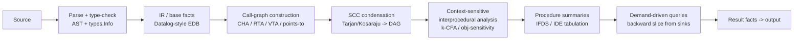
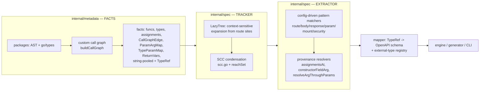
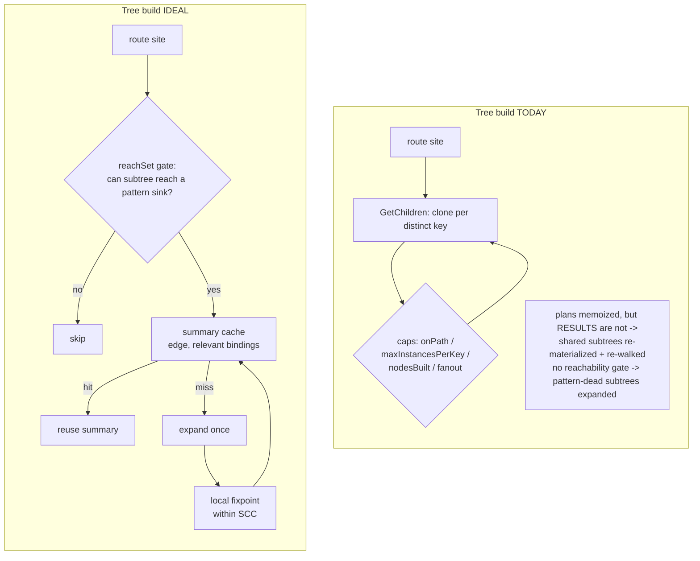

# apispec — Code Analysis: Theory vs. Practice

A study of **what apispec does today** to extract an OpenAPI surface from Go
source, mapped against **what established static-analysis theory prescribes** for
this class of problem. The goal is to see, per stage, where the implementation
already meets high standards, where it deliberately trades precision for honesty,
and where there is a real gap worth closing.

This document is a *lens*, not a redesign. It cross-references the design docs
that already exist and should be read alongside them:

- [`TRACKER_REDESIGN.md`](./TRACKER_REDESIGN.md) — the deepest treatment of the
  tree-build problem (fixpoint resolution, SSA+VTA, SCC condensation, function
  summaries, memoization). Most "should be done" items here point back to it.
- [`TYPE_MODEL.md`](./TYPE_MODEL.md) — the structured type model (`TypeRef`).
- [`INTERFACE_RESOLUTION.md`](./INTERFACE_RESOLUTION.md) — interface→concrete.
- [`GAP_ANALYSIS.md`](./GAP_ANALYSIS.md) — feature/correctness gap list.

---

## 0. The problem, stated in analysis terms

Extracting an API spec is a **context-sensitive, inter-procedural static
analysis**. From each route-registration site we must follow the call graph —
resolving interfaces, generics, aliases, parameters, and method chains — to the
program points that reveal HTTP facts (verb, path, request body, response body,
parameters, security), then translate the Go types found there into OpenAPI
schemas.

Two properties make it hard, and they are the same two the theory warns about:

1. **The call graph is not a DAG or a tree.** Direct and mutual recursion make
   it a general cyclic digraph.
2. **The useful structure is context-sensitive.** The *same* function reached
   from two different call sites can resolve to different concrete types,
   type-arguments, and bindings — so a single graph vertex corresponds to
   *many* distinct analysis contexts. That is what turns a `V`-vertex graph into
   a potentially exponential tree.

Everything below is a consequence of managing those two facts well.

---

## 1. The reference pipeline (what theory prescribes)

The canonical disciplines this pipeline embodies:

| Concern | Established technique |
|---|---|
| Sound call targets | CHA → RTA → **VTA** → points-to (increasing precision) |
| Recursion | **SCC condensation**, reverse-topological evaluation, local fixpoint within each SCC |
| Context sensitivity | k-CFA (call-site), object-sensitivity, truncated by a budget |
| Scaling the above | **Procedure summaries** — analyze a callee once per relevant input context, reuse (IFDS/IDE tabulation, Reps–Horwitz–Sagiv) |
| Only compute what's asked | **Demand-driven** / backward slicing from sinks |
| Base vs derived facts | Datalog discipline (EDB facts immutable, IDB derived by rules) |
| Termination & honesty | Well-founded bound; **bounded ≠ silent**; soundness (may/must) declared |

---

## 2. apispec as built (what is done)

The mapping to theory is genuinely good in most places — apispec is not naive.
The differences are concentrated in **one stage** (the tree build) and **one
fact** (return values).

---

## 3. Stage-by-stage: done vs. ideal

### 3.1 Fact extraction — `internal/metadata`

- **Done.** Loads packages with AST + `go/types`, records *base facts* only
  (functions, types, assignments, call-graph edges), string-pooled; types parse
  once into a memoized `TypeRef` ([`TYPE_MODEL.md`](./TYPE_MODEL.md)). No spec
  decisions happen here — a clean **base-vs-derived** separation (the Datalog EDB
  discipline, `TRACKER_REDESIGN.md` §8.1).
- **Theory.** This *is* the best practice: immutable extensional facts, derived
  facts computed later by rules/queries.
- **Gap.** `Function.ReturnVars` records **only the maximum-arity return
  statement** and drops the rest — a lossy fact. This blocks resolving
  return-value provenance across a function with several `return`s (the #187
  mapper-field pattern). Filed as **#192**. *A base fact that silently
  under-records is the most dangerous kind of gap, because every downstream rule
  inherits the loss.*

### 3.2 Call-graph construction — `buildCallGraph`

- **Done.** A **custom syntactic call graph**: walk call expressions, resolve
  callees with `go/types`. Records per-edge bindings (`ParamArgMap`,
  `TypeParamMap`, chain parent/root/depth, `ParentFunction`).
- **Theory.** The precision ladder is CHA → RTA → **VTA** → points-to. apispec's
  name+type resolution sits around RTA-level precision. A validated **SSA+VTA**
  spike exists (`TRACKER_REDESIGN.md` §3.1; memory: "VTA spike validated") that
  would give sound, more precise indirect/interface targets "for free" from
  `golang.org/x/tools`.
- **Gap.** Indirect calls and interface dispatch are resolved heuristically and
  kept **honest-general** when ambiguous (see §3.9). VTA remains a spike, not the
  shipped path.

### 3.3 Recursion / cycles — `scc.go`, `reachability.go`

- **Done.** `BuildCallGraphSCC` computes the **SCC condensation**; `reachSet`
  answers transitive reachability in one bottom-up pass over the condensation,
  treating each recursion cluster as a single unit (no depth limit). This is
  textbook and correct.
- **Theory.** SCC condensation + reverse-topological order + **local fixpoint
  within each SCC** (`TRACKER_REDESIGN.md` §4–5).
- **Gap.** The condensation is used for **reachability queries only**. The
  **tree build itself does not use it** — it bounds recursion with a per-path
  cycle guard and node caps instead of a condensed-DAG fixpoint (§3.4).

### 3.4 Context-sensitive tree build — `lazytree.go` (the hot spot)

- **Done.** `LazyNode.GetChildren` expands on first access. **Context = the
  actual ancestor path, materialized as distinct `LazyNode` copies** — a node is
  `(content, parent)` and objects are never shared, so the same function reached
  two ways becomes two nodes (per-path cloning ≈ unbounded call-site sensitivity,
  truncated by a budget; the callee ID already encodes generic bindings as
  `fn[T=User]@pos`, so binding-distinct instances get distinct keys). The
  **shape** of the walk is memoized: expansion *plans* are computed once per
  content identity (`plans map[planKey][]childSpec`), and `calleeEdges`, the
  query-time relations (`buildRelations`), `genericTypesOf`, and `traceOrigin`
  are all cached. Bounds:
  - `onPath(key)` — per-path cycle guard;
  - `maxInstancesPerKey` (=10) — diamond cap **per instance scope** (≈ per
    handler), a *skip* not a reuse (reuse would make the tree cyclic);
  - `nodesBuilt >= MaxNodesPerTree` — global budget (`nodesBuilt` counts
    *globally distinct keys*, shared nodes counted once);
  - `MaxChildrenPerNode` / `MaxArgsPerFunction` — fan-out caps.
- **Theory.** Context sensitivity is right, and memoizing the *plan* is a real
  optimization. But the scaling tool the theory prescribes is a **procedure
  summary** — cache the *analysis result* of a callee (its value-flow / extracted
  facts) keyed by `(edge, relevant bindings)` and reuse it, not just the
  structural plan (`TRACKER_REDESIGN.md` §7).
- **Gap — be precise about what is and isn't reused.** The *plan* (child spec)
  is shared per content identity, but every path still **materializes its own
  nodes and re-runs the ancestry-dependent extraction walk** over them. There is
  no *result-level* summary: a subtree reached via two distinct ancestor paths is
  re-traversed and re-matched. The per-edge `MatchNode` memo (§3.7) and the chain
  interner cushion the *edge-only* part of that cost, but ancestry-dependent
  extraction is genuinely repeated. This is the structural reason lazy can fail
  to *beat* eager on dense, diamond-heavy graphs; the budget bounds the worst
  case but does not make it cheap. **Closing this — result summaries keyed by
  `(edge, relevant bindings)` — is the single highest-value gap.**

### 3.5 The five inter-procedural resolutions — extractor provenance

Interface, generics, assignment, parameter, and chain resolution are what turn
the raw graph into a *correct* parent-child tree.

- **Done.** Two families of resolution run during the walk, each mirroring the
  eager tree:
  - *In the tracker, while planning children* (`buildRelations` / `buildPlan`):
    **interface** → fan out over `Type.ImplementedBy` to each implementer's
    method (`implementerKeys`); **generics** → merge each ancestor's
    `TypeParamMap` + `arg.TypeParams()` (nearest binding wins) and filter
    instantiations by a type-argument subset test (`IsSubset`); **assignment** →
    a prebuilt `assignIndex` maps a var/field argument to its producing callee
    (`producersFor`), whose subtree is grafted in; **parameter** → for each
    `ParamArgMap` edge, trace the caller argument back (`traceOrigin`) to its
    producer and graft the calls made on that parameter; **chain** → group
    `ChainParent` edges into `chainChildren` and re-parent them to call-site
    scope so `.Methods("GET")` is both visible and correctly bound.
  - *In the extractor, resolving a value's origin*: `assignmentsAt` /
    `latestAssignment` (call-site scope, edge→function), `callerAssignmentMap`
    (function scope), `resolveArgThroughParams` (callee param → caller argument,
    multi-hop), `constructorFieldArg` (constructor return field → bound
    argument). Consolidated behind canonical entry points in #182/#188/#191.
- **Theory.** These are **reaching-definitions** and **value-flow** queries;
  best practice computes them as reusable **summaries** rather than re-walking.
- **Gap.** *Return-value* flow is the weak link (limited by §3.1's `ReturnVars`).
  Ambiguity is resolved **honest-over-wrong** (§3.9), not by points-to.

### 3.6 Reachability pruning — present but not wired to expansion

- **Done.** `reachSet` (backward-reachability-style summary) exists and is used
  for two extraction sub-queries: `handlerReachesAccessor` (param map-key
  accessor) and `middlewareMatchesThrough` (middleware).
- **Theory.** In a demand-driven analysis, the first thing you do before
  expanding a node is ask *can this subtree reach a sink at all?* — a backward
  slice from the pattern sinks. If not, never expand it.
- **Gap.** **Expansion is not gated on `reachSet`.** `GetChildren` builds every
  reachable child within the caps, including handler subtrees that dive into
  domain/repository layers and never touch a config pattern. This is the
  cheapest available win — but it demands a **sound** viability predicate (a
  false prune = a dropped route/body, violating honest-over-wrong), so it must
  ship behind a no-route-lost fixture. *Measure the pattern-dead fraction before
  building it.*

### 3.7 Pattern extraction — `extractor.go`, `config_<framework>.go`

- **Done.** Fully **config-driven** pattern matchers over route/body/response/
  param/mount/security; framework-agnostic. `MatchNode` verdicts are **memoized
  per edge** (matching depends only on edge facts). This is a clean **query
  layer over derived facts** (Datalog IDB / query API, `TRACKER_REDESIGN.md`
  §8.2).
- **Theory.** Matches best practice: declarative rules, not hardcoded framework
  logic (golden rule #5).
- **Gap.** None structural; the matchers are only as good as the tree and facts
  they run over.

### 3.8 Type → schema mapping — `mapper.go`, `schema_mapper.go`

- **Done.** Resolves `TypeRef` → OpenAPI schema at the output boundary;
  external-type registry, config overrides, and marshaler decisions live here
  (spec layer), never at fact time — the correct layering (golden rule #4;
  `TYPE_MODEL.md`).
- **Theory.** Type-directed translation performed *only* at the boundary, with a
  render-to-string step, is exactly right.
- **Gap.** None structural.

### 3.9 Soundness, termination, determinism — cross-cutting

- **Done.** Termination via a well-founded budget; **bounded ≠ silent** (the
  cap warns on truncation); **determinism** enforced by sorting every map
  iteration that reaches output (guarded by determinism tests). Ambiguity is
  handled **honest-over-wrong**: two concrete types on one interface, or a
  type-argument erased to `any`, keep the honest general type rather than
  guessing (golden rules #6/#7/#9).
- **Theory nuance — declare the soundness direction.** A doc generator generally
  wants **soundness for routes** (never *miss* a real endpoint) and can tolerate
  imprecision in schemas. apispec's honesty policy avoids *wrong* output but is a
  **may-under-approximate** analysis: at a cap or an ambiguous resolution it can
  *miss* (e.g. a truncated subtree, or a `default` where a concrete status
  exists — the #187 case). That is a defensible posture *provided* the misses
  are surfaced (bounded≠silent, and gaps filed as issues rather than papered
  over — golden rule #9).

---

## 4. Scorecard

| Stage | Technique (theory) | apispec today | Standard met? | Where to improve |
|---|---|---|---|---|
| Fact extraction | Datalog EDB, immutable base facts | AST+types, string pool, `TypeRef` | ✅ strong | `ReturnVars` lossy (#192) |
| Call graph | CHA→RTA→VTA→points-to | custom name+type (~RTA) | 🟡 adequate | ship VTA spike (`TRACKER_REDESIGN` §3.1) |
| Recursion | SCC + reverse-topo + fixpoint | SCC used for reachability only | 🟡 partial | condense the **tree build** too |
| Context sensitivity | k-CFA + **summaries** | per-path cloning + budget; *plans* memoized, *results* not | 🟡 partial | **result summaries** keyed by `(edge, bindings)` (§3.4) — top gap |
| Value flow | reaching defs / summaries | provenance resolvers (consolidated) | ✅ good | return-value flow (#192) |
| Demand pruning | backward slice from sinks | `reachSet` exists, **not gating** | 🔴 missing | gate expansion on viability (§3.6) |
| Pattern match | declarative query over IDB | config-driven + per-edge memo | ✅ strong | — |
| Type→schema | boundary translation | `TypeRef`→OpenAPI | ✅ strong | — |
| Soundness/determinism | may/must + termination + stable | budget + honest + sorted | ✅ strong | keep bounded≠silent |

---

## 5. Prioritized gaps (highest leverage first)

1. **Measure before rearchitecting.** Instrument the tree build: `nodesBuilt`
   vs static graph size `V`, key cache-hit rate, and the **fraction of expanded
   nodes that never contribute to a match**. This decides whether §3.4 and §3.6
   are worth it, and turns "20% faster than eager" into evidence. (Behavior-
   neutral, metrics-only.)
2. **Reachability-gated expansion** (§3.6). Cheapest structural win *if* the
   dead fraction is large; requires a sound viability predicate + a no-route-lost
   fixture. Prune subtrees that cannot reach any pattern sink.
3. **Procedure summaries** (§3.4; `TRACKER_REDESIGN.md` §7). Memoize a subtree's
   result keyed by `(edge, relevant bindings)` so shared subtrees are analyzed
   once. This is what makes lazy provably ≤ eager in the worst case.
4. **`ReturnVars`: record all returns** (#192). Unblocks #187 (mapper-field
   status resolution) and any future return-value provenance.
5. **SCC-bounded fixpoint for the tree** (§3.3–3.4). Replace the blunt global
   budget with local fixpoint iteration inside each SCC over the condensed DAG.
6. **VTA-based call graph** (optional, §3.2). Sound, more precise call targets
   from `golang.org/x/tools`; largest change, evaluate after 1–3.

---

## 6. The one honest caveat

Most of the "should be done" list is **average-case** optimization and precision
— it makes the analysis faster and lets it resolve more (fewer `default`s, more
concrete schemas). None of it changes the fundamental posture: extracting a
context-sensitive API surface is **worst-case exponential**, so the budget cap is
a permanent safety net, not a failure. The measure of success is not "prove it is
polynomial" (it isn't, in general) but **"the common case shares and prunes
well, and every truncation or ambiguity is surfaced, never guessed."** That is
the standard apispec already holds itself to; the gaps above are about holding it
more cheaply and resolving more before honesty forces a `default`.

---

## Glossary

- **CHA / RTA / VTA** — Class/Rapid/Variable-Type Analysis: increasingly precise
  call-graph construction algorithms.
- **k-CFA** — k-call-site-sensitive control-flow analysis (context sensitivity).
- **IFDS/IDE** — a framework for a restricted class of inter-procedural dataflow
  problems solved efficiently by *procedure summaries* (tabulation).
- **SCC condensation** — collapse each maximal strongly-connected component to a
  single vertex, yielding a DAG that can be evaluated in topological order.
- **Demand-driven** — compute a result only when a query asks for it (lazy).
- **EDB / IDB** — extensional (base) / intensional (derived) database — the
  Datalog base-vs-derived-facts discipline.
- **Sound / may / must** — a *sound* analysis never misses a real fact; *may*
  (over-approximate) vs *must* (under-approximate) describe the error direction.
