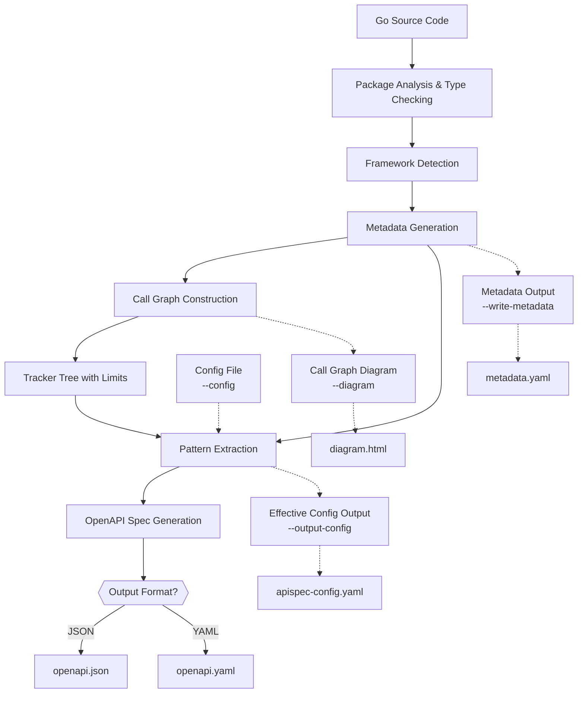

# The APISpec pipeline

APISpec turns Go source into an OpenAPI document through a fixed sequence of
stages. Each stage consumes the output of the previous one, so a weakness early
on shows up as a missing route or a dangling `$ref` at the end.

## 1. Locate the module and select sources

- *Role:* Resolve the input directory, walk up to the enclosing `go.mod` to find the module root and import path, then apply include/exclude package and file filters.
- *Purpose:* Fix the analysis boundary (what to read) and the module import path (used to fully-qualify every type name in the output).
- *Importance:* The module path is the namespace for every schema `$ref`; get it wrong and types resolve to the wrong package or dangle. Filters keep large monorepos analyzable by excluding code that can't contain routes.

## 2. Load and type-check the packages

- *Role:* Load every in-scope package with `go/packages` requesting full syntax **and** type information, so the Go type checker (`go/types`) runs over the whole set.
- *Purpose:* Give every expression, field, and call a *resolved* type — the ground truth the rest of the pipeline reads instead of guessing from names.
- *Importance:* This is why APISpec understands real Go semantics — generics, type aliases, embedded fields, interface implementations, and cross-package types — rather than pattern-matching strings. Packages that fail to type-check are skipped (and reported) so one broken dependency doesn't abort the run.

## 3. Detect the framework

- *Role:* Inspect the module's dependencies to identify the web framework in use (Gin, Echo, Chi, Fiber, Gorilla Mux, or plain `net/http`).
- *Purpose:* Choose the default pattern set that describes how *that* framework registers routes, params, bodies, and responses.
- *Importance:* Every framework expresses the same concept ("GET /users/{id} → handler") with different API calls. Detection picks the config that already knows those idioms, so the common case needs zero hand-written patterns.

## 4. Load and merge the configuration

- *Role:* Layer configuration deterministically: framework default → `--config` file → CLI/programmatic overrides → auto-applied security/auth presets (selected from the project's imports, e.g. `golang-jwt`). Later layers win.
- *Purpose:* Produce a single **effective, framework-agnostic** config that drives extraction — route/param/body/response patterns plus OpenAPI `info`, type mappings, external types, and security schemes.
- *Importance:* The engine itself is generic; *all* framework- and project-specific knowledge lives in this config. The layering lets defaults "just work" while allowing surgical overrides without forking the engine. `--output-config` writes this merged result so you can see exactly what ran.

## 5. Generate metadata

- *Role:* Walk the type-checked ASTs into one normalized, string-interned model: packages, types (fields, JSON tags, declared type parameters), functions, a call graph of caller→callee edges, per-variable assignments, and the structured arguments of every call.
- *Purpose:* Collapse scattered AST and `go/types` facts into a single queryable, deterministic, serializable structure that every later stage reads.
- *Importance:* Nothing downstream touches the raw AST again — metadata is the substrate. String-pooling plus sorted iteration at every boundary make the output **deterministic** (clean release diffs and reliable golden tests), and `--write-metadata` dumps this model so a missed route can be debugged.

## 6. Build the tracker tree

- *Role:* Starting from each route-registration call site, expand the call graph down to the actual handler and the calls made inside it — through wrappers, groups, mounts, handler factories, and helper functions — bounded by engine-specific limits (see [PERFORMANCE.md](PERFORMANCE.md)).
- *Purpose:* Connect a route to the concrete code that actually serves it, following real control flow rather than assuming the handler lives where the route is declared.
- *Importance:* In real codebases the handler is rarely at the registration site — it's behind middleware, a group closure, a mounted sub-router, or a factory. This traversal is what makes detection work across those styles. The bounds are the safety brake that turns a pathological (deep or cyclic) call graph into a truncation warning instead of a hang or out-of-memory.

## 7. Extract patterns

- *Role:* Match the configured framework patterns against the tracker tree to identify each route's method and path, its path/query parameters, its request body, and its responses — then resolve every one to a concrete Go type (dereferencing pointers, unwrapping aliases/enums, applying external-type mappings, and substituting generic type arguments).
- *Purpose:* Translate raw calls ("this site registers `GET /users/{id}` and encodes a `Page[User]`") into structured, typed route facts.
- *Importance:* This is where source code becomes API semantics. The fidelity of the final schema is decided here: correct path-parameter names, truthful response status codes, and fully-resolved types.

## 8. Map to OpenAPI

- *Role:* Assemble the OpenAPI 3.1 object from the route facts and resolved types — paths and operations, request/response content, reusable component schemas (promoting named types to `$ref`s), and security requirements/schemes — while deduplicating and merging (e.g. dropping mount prefixes subsumed by a longer path, pairing status codes to bodies).
- *Purpose:* Convert typed route facts into a single valid, well-formed specification document.
- *Importance:* This stage produces the deliverable. Schema promotion and `$ref` handling, security wiring, and dedup here are what make the spec valid (no dangling references), clean (no duplicate or placeholder schemas), and non-redundant.

## 9. Serialize the specification

- *Role:* Marshal the OpenAPI object to YAML or JSON, chosen by the `--output` file extension.
- *Purpose:* Emit the file that downstream tools consume — Redoc/Swagger UI, client/server code generators, and contract tests.
- *Importance:* Serialization is deterministic (stable key ordering), so regenerating an unchanged project yields a byte-identical file — the foundation for meaningful diffs and golden-file CI.

## 10. Emit side outputs and diagnostics

- *Role:* On request, write the interactive call-graph diagram (`--diagram`), the effective merged config (`--output-config`), and/or the metadata dump (`--write-metadata`); always surface diagnostics — middleware detected but not mapped to a security scheme, path-parameter key mismatches, and packages skipped due to errors.
- *Purpose:* Make the analysis inspectable and its gaps visible instead of silent.
- *Importance:* This is the debuggability layer. When a route is missed or a type won't resolve, these artifacts are how you find out *why* — see [DEBUGGING.md](DEBUGGING.md).
